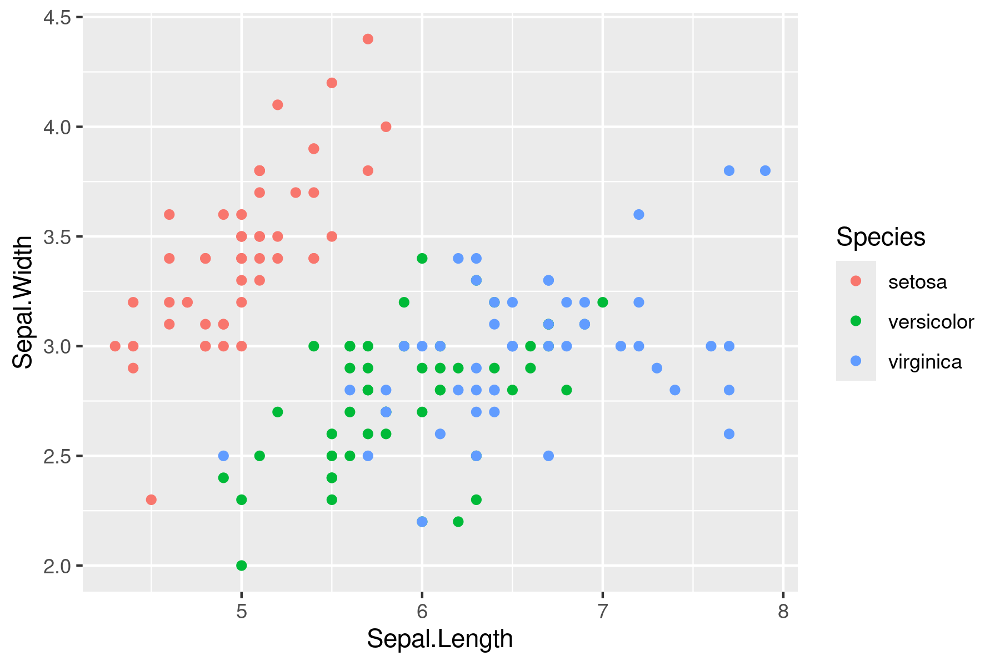

# Setup:
#### Library
```{r, message=FALSE, warning=FALSE, echo=FALSE}
library(zoo)
library(viridisLite)
library(tidyverse)
library(knitr)
library(ggtree)
library(TDbook) #A Companion Package for the Book "Data Integration, Manipulation and Visualization of Phylogenetic Trees" by Guangchuang Yu (2022, ISBN:9781032233574).
library(ggimage)
library(rphylopic)
library(treeio)
library(tidytree)
library(ape)
library(TreeTools)
library(phytools)
library(ggnewscale)
library(ggtreeExtra)
library(ggstar)
#library(ggeasy) #https://jonocarroll.github.io/ggeasy/
library(DT)
```
#### NEON MAGs
```{r, message=FALSE, warning=FALSE, echo=FALSE}
NEON_MAGs <- read_csv("data/NEON/GOLD_Study_ID_Gs0161344_NEON_2024_4_21.csv") %>% 
  # remove columns that are not needed for data analysis
  select(-c(`GOLD Study ID`, `Bin Methods`, `Created By`, `Date Added`, `Bin Lineage`)) %>% 
  # create a new column with the Assembly Type
  mutate("Assembly Type" = case_when(`Genome Name` == "NEON combined assembly" ~ `Genome Name`,
                            TRUE ~ "Individual")) %>% 
  mutate_at("Assembly Type", str_replace, "NEON combined assembly", "Combined") %>% 
  mutate_at("GTDB-Tk Taxonomy Lineage", str_replace, "d__", "") %>%  
  mutate_at("GTDB-Tk Taxonomy Lineage", str_replace, "p__", "") %>% 
  mutate_at("GTDB-Tk Taxonomy Lineage", str_replace, "c__", "") %>% 
  mutate_at("GTDB-Tk Taxonomy Lineage", str_replace, "o__", "") %>% 
  mutate_at("GTDB-Tk Taxonomy Lineage", str_replace, "f__", "") %>% 
  mutate_at("GTDB-Tk Taxonomy Lineage", str_replace, "g__", "") %>% 
  mutate_at("GTDB-Tk Taxonomy Lineage", str_replace, "s__", "") %>%
  separate(`GTDB-Tk Taxonomy Lineage`, c("Domain", "Phylum", "Class", "Order", "Family", "Genus", "Species"), ";", remove = FALSE) %>% 
  mutate_at("Domain", na_if,"") %>% 
  mutate_at("Phylum", na_if,"") %>% 
  mutate_at("Class", na_if,"") %>% 
  mutate_at("Order", na_if,"") %>% 
  mutate_at("Family", na_if,"") %>% 
  mutate_at("Genus", na_if,"") %>% 
  mutate_at("Species", na_if,"") %>% 
  
  # Get rid of the the common string "Soil microbial communities from "
  mutate_at("Genome Name", str_replace, "Terrestrial soil microbial communities from ", "") %>% 
  # Use the first `-` to split the column in two
  separate(`Genome Name`, c("Site","Sample Name"), " - ") %>% 
  # Get rid of the the common string "S-comp-1"
  mutate_at("Sample Name", str_replace, "-comp-1", "") %>%
  # separate the Sample Name into Site ID and plot info
  separate(`Sample Name`, c("Site ID","subplot.layer.date"), "_", remove = FALSE,) %>% 
  # separate the plot info into 3 columns
  separate(`subplot.layer.date`, c("Subplot", "Layer", "Date"), "-")
```


```{r, message=FALSE, warning=FALSE}
NEON_metagenomes <- read_tsv("data/NEON/exported_img_data_Gs0161344_NEON.tsv") %>% 
  select(-c(`Domain`, `Sequencing Status`, `Sequencing Center`)) %>% 
  rename(`Genome Name` = `Genome Name / Sample Name`) %>% 
  filter(str_detect(`Genome Name`, 're-annotation', negate = T)) %>% 
  filter(str_detect(`Genome Name`, 'WREF plot', negate = T)) 

NEON_metagenomes <- NEON_metagenomes %>% 
  # Get rid of the the common string "Soil microbial communities from "
  mutate_at("Genome Name", str_replace, "Terrestrial soil microbial communities from ", "") %>% 
  # Use the first `-` to split the column in two
  separate(`Genome Name`, c("Site","Sample Name"), " - ") %>% 
  # Get rid of the the common string "-comp-1"
  mutate_at("Sample Name", str_replace, "-comp-1", "") %>%
  # separate the Sample Name into Site ID and plot info
  separate(`Sample Name`, c("Site ID","subplot.layer.date"), "_", remove = FALSE,) %>% 
  # separate the plot info into 3 columns
  separate(`subplot.layer.date`, c("Subplot", "Layer", "Date"), "-")

NEON_chemistry <- read_tsv("data/NEON/neon_plot_soilChem1_metadata.tsv") %>% 
  # remove -COMP from genomicsSampleID
  mutate_at("genomicsSampleID", str_replace, "-COMP", "") 

NEON_MAGs_metagenomes_chemistry <- NEON_MAGs %>% 
  left_join(NEON_metagenomes, by = "Sample Name") %>% 
  left_join(NEON_chemistry, by = c("Sample Name" = "genomicsSampleID")) %>%
  rename("label" = "Bin ID")

tree_arc <- read.tree("data/NEON/gtdbtk.ar53.decorated.tree")
tree_bac <- read.tree("data/NEON/gtdbtk.bac120.decorated.tree")

#Gammaproteobacteria
NEON_MAGs_metagenomes_chemistry_Gammaproteobacteria <- NEON_MAGs_metagenomes_chemistry %>%
  filter(str_detect(`Class`,"Gammaproteobacteria"))

#Steroidobacterales
NEON_MAGs_metagenomes_chemistry_Steroidobacterales<- NEON_MAGs_metagenomes_chemistry %>%
  filter(str_detect(`Order`,"Steroidobacterales"))
#Burkholderiales
NEON_MAGs_metagenomes_chemistry_Burkholderiales <- NEON_MAGs_metagenomes_chemistry %>%
  filter(str_detect(`Order`,"Burkholderiales"))
#Novel
NEON_MAGs_metagenomes_chemistry_Gammaproteobacteria_Novel <- NEON_MAGs_metagenomes_chemistry_Gammaproteobacteria %>%
  filter(is.na(Order) | is.na(Family) | is.na(Genus) | is.na(Species))
#almost are novel only two have species names


#Toolik
NEON_MAGs_metagenomes_chemistry_TOOL<- NEON_MAGs_metagenomes_chemistry %>% 
  filter(`Site ID.x` == "TOOL") %>%
  mutate(`Genome Size (Kbp)`=as.integer(`Total Number of Bases`/1000))
NEON_MAGs_metagenomes_chemistry_TOOL_Novel <- NEON_MAGs_metagenomes_chemistry_TOOL %>%
  filter(is.na(Order) | is.na(Family) | is.na(Genus) | is.na(Species))
#almost are novel only two have species names
TOOL_MAGs_label <- NEON_MAGs_metagenomes_chemistry_TOOL$label
tree_bac_TOOL_MAGs <-drop.tip(tree_bac,tree_bac$tip.label[-match(TOOL_MAGs_label, tree_bac$tip.label)])

# Make a vector with the internal node lables
node_vector_bac_TOOL_MAGS = c(tree_bac_TOOL_MAGs$tip.label,tree_bac_TOOL_MAGs$node.label)

NEON_MAGs_metagenomes_chemistry_Gamma_noblank <- NEON_MAGs_metagenomes_chemistry_Gammaproteobacteria %>% 
  rename("Orders" = "Order") %>% 
  rename("Phyla" = "Phylum") %>% 
  rename("AssemblyType" = "Assembly Type") %>% 
  rename("WaterpH" ="soilInWaterpH") %>% 
  rename("Temp" ="soilTemp") %>% 
  rename("BinCompleteness" = "Bin Completeness") %>% 
  rename("BinContamination" = "Bin Contamination") %>% 
  rename("TotalNumberofBases" = "Total Number of Bases") %>% 
  rename("EcosystemSubtype" = "Ecosystem Subtype") %>%
  rename("GeneCount" = "Gene Count") %>% 
  rename("GCassembled" = "GC  * assembled")


NEON_MAGs_metagenomes_chemistry_TOOL_noblank <- NEON_MAGs_metagenomes_chemistry_TOOL %>% 
  rename("Phyla" = "Phylum") %>% 
  rename("AssemblyType" = "Assembly Type") %>% 
  rename("WaterpH" ="soilInWaterpH") %>% 
  rename("Temp" ="soilTemp") %>% 
  rename("BinCompleteness" = "Bin Completeness") %>% 
  rename("BinContamination" = "Bin Contamination") %>% 
  rename("TotalNumberofBases" = "Total Number of Bases") %>% 
  rename("EcosystemSubtype" = "Ecosystem Subtype") %>%
  rename("GeneCount" = "Gene Count") %>% 
  rename("GCassembled" = "GC  * assembled")

NEON_MAGs_bact <- NEON_MAGs %>% 
  filter(Domain=="Bacteria")
NEON_MAGs_bact_ind <- NEON_MAGs %>% 
  filter(Domain=="Bacteria") %>% 
  filter(`Assembly Type`=="Individual")
NEON_MAGs_bact_co <- NEON_MAGs %>% 
  filter(Domain=="Bacteria") %>% 
  filter(`Assembly Type`=="Combined")

NEON_MAGs_bact_ind_Novel <- NEON_MAGs_bact_ind %>% 
  filter(is.na(Class) | is.na(Order) | is.na(Family) | is.na(Genus) )
NEON_MAGs_bact_co_Novel <- NEON_MAGs_bact_co %>% 
  filter(is.na(Class) | is.na(Order) | is.na(Family) | is.na(Genus) )

NEON_MAGs_metagenomes_chemistry_TOOL_Xanthomonadales <- NEON_MAGs_metagenomes_chemistry_TOOL %>%
  filter(str_detect(`Order`,"Xanthomonadales"))
NEON_MAGs_metagenomes_chemistry_TOOL_Burkholderiales <- NEON_MAGs_metagenomes_chemistry_TOOL %>%
  filter(str_detect(`Order`,"Burkholderiales"))
NEON_MAGs_metagenomes_chemistry_TOOL_Steroidobacterales <- NEON_MAGs_metagenomes_chemistry_TOOL %>%
  filter(str_detect(`Order`,"Steroidobacterales"))

NEON_MAGs_metagenomes_chemistry_Alaska <-NEON_MAGs_metagenomes_chemistry %>%
  filter(str_detect(Site.x,"Alaska"))


```
#### Tree Nodes
```{r, message=FALSE, warning=FALSE}

# Make a vector with the internal node labels
node_vector_bac = c(tree_bac$tip.label,tree_bac$node.label)

# Search for your Phylum, dont sort differently it will mess up nodes
#NEON
phylumss <-NEON_MAGs_metagenomes_chemistry %>%
            count(Phylum, sort=TRUE)
n=1
while (n!=29) {
  if (length(grep(phylumss[n,1], node_vector_bac, value = TRUE))==2) {
       phylumss[n,3] <-match(grep(phylumss[n,1], node_vector_bac, value = TRUE), node_vector_bac)[2]
       }
else {
  phylumss[n,3] <-match(grep(phylumss[n,1], node_vector_bac, value = TRUE), node_vector_bac)[1]
}
  n=n+1
} 
# for some reason they didnt name phylum subpopulations the same way for each, so we have to correct for Desulfobacterota
# grep("Desulfobacterota", node_vector_bac, value = TRUE)
# match(grep("Desulfobacterota", node_vector_bac, value = TRUE), node_vector_bac)
# match(grep("Desulfobacterota_B", node_vector_bac, value = TRUE), node_vector_bac)
phylumss[16,3] <- match(grep(phylumss[16,1], node_vector_bac, value = TRUE), node_vector_bac)[1]

phylumss <-phylumss %>%
    arrange(desc(`...3`))
colortest <-viridis(29)
n=1
while (n!=29) {
  phylumss[n,4] <- colortest[n]
  n=n+1
} 

#Gamma
tree_bac_node_Gammaproteobacteria <- Preorder(tree_bac)
tree_Gammaproteobacteria <- Subtree(tree_bac_node_Gammaproteobacteria, 3048)

# grep("Thermoproteota", node_vector_bac, value = TRUE)
# match(grep("Thermoproteota", node_vector_bac, value = TRUE), node_vector_bac)
# 
# grep("Actinomycetota", node_vector_bac, value = TRUE)
# match(grep("Actinomycetota", node_vector_bac, value = TRUE), node_vector_bac)
# 
# grep("Desulfobacterota", node_vector_bac, value = TRUE)
# match(grep("Desulfobacterota", node_vector_bac, value = TRUE), node_vector_bac)
# match(grep("Desulfobacterota_B", node_vector_bac, value = TRUE), node_vector_bac)
# 
# grep("Bacteroidota", node_vector_bac, value = TRUE)
# match(grep("Bacteroidota", node_vector_bac, value = TRUE), node_vector_bac)
# 
# grep("Verrucomicrobiota", node_vector_bac, value = TRUE)
# match(grep("Verrucomicrobiota", node_vector_bac, value = TRUE), node_vector_bac)
# 
# grep("Chloroflexota", node_vector_bac, value = TRUE)
# match(grep("Chloroflexota", node_vector_bac, value = TRUE), node_vector_bac)
# 
# grep("Eremiobacterota", node_vector_bac, value = TRUE)
# match(grep("Eremiobacterota", node_vector_bac, value = TRUE), node_vector_bac)
# 
# grep("Patescibacteria", node_vector_bac, value = TRUE)
# match(grep("Patescibacteria", node_vector_bac, value = TRUE), node_vector_bac)
# 
# grep("Pseudomonadota", node_vector_bac, value = TRUE)
# match(grep("Pseudomonadota", node_vector_bac, value = TRUE), node_vector_bac)

# grep("Phycisphaerae", node_vector_bac_TOOL_MAGS, value = TRUE)
# match(grep("Phycisphaerae", node_vector_bac_TOOL_MAGS, value = TRUE), node_vector_bac_TOOL_MAGS)
# 
# grep("Acidobacteriota", node_vector_bac_TOOL_MAGS, value = TRUE)
# match(grep("Acidobacteriota", node_vector_bac_TOOL_MAGS, value = TRUE), node_vector_bac_TOOL_MAGS)
# 
# grep("Actinomycetota", node_vector_bac_TOOL_MAGS, value = TRUE)
# match(grep("Actinomycetota", node_vector_bac_TOOL_MAGS, value = TRUE), node_vector_bac_TOOL_MAGS)
# 
# grep("Myxococcota", node_vector_bac_TOOL_MAGS, value = TRUE)
# match(grep("Myxococcota", node_vector_bac_TOOL_MAGS, value = TRUE), node_vector_bac_TOOL_MAGS)
# 
# grep("Bacteroidota", node_vector_bac_TOOL_MAGS, value = TRUE)
# match(grep("Bacteroidota", node_vector_bac_TOOL_MAGS, value = TRUE), node_vector_bac_TOOL_MAGS)
# 
# grep("Verrucomicrobiota", node_vector_bac_TOOL_MAGS, value = TRUE)
# match(grep("Verrucomicrobiota", node_vector_bac_TOOL_MAGS, value = TRUE), node_vector_bac_TOOL_MAGS)
# 
# grep("Chloroflexota", node_vector_bac_TOOL_MAGS, value = TRUE)
# match(grep("Chloroflexota", node_vector_bac_TOOL_MAGS, value = TRUE), node_vector_bac_TOOL_MAGS)
# 
# grep("Eremiobacterota", node_vector_bac_TOOL_MAGS, value = TRUE)
# match(grep("Eremiobacterota", node_vector_bac_TOOL_MAGS, value = TRUE), node_vector_bac_TOOL_MAGS)
# 
# grep("Patescibacteria", node_vector_bac_TOOL_MAGS, value = TRUE)
# match(grep("Patescibacteria", node_vector_bac_TOOL_MAGS, value = TRUE), node_vector_bac_TOOL_MAGS)
# 
# grep("Patescibacteria", node_vector_bac_TOOL_MAGS, value = TRUE)
# match(grep("Patescibacteria", node_vector_bac_TOOL_MAGS, value = TRUE), node_vector_bac_TOOL_MAGS)

# grep("Gammaproteobacteria", node_vector_bac_TOOL_MAGS, value = TRUE)
# match(grep("Gammaproteobacteria", node_vector_bac_TOOL_MAGS, value = TRUE), node_vector_bac_TOOL_MAGS)

# grep("Gammaproteobacteria", node_vector_bac_TOOL_MAGS, value = TRUE)
# match(grep("Gammaproteobacteria", node_vector_bac_TOOL_MAGS, value = TRUE), node_vector_bac_TOOL_MAGS)

```
### Sankey Setup
```{r,echo=FALSE,message=FALSE,warning=FALSE}
NEON_MAGs_ind <- NEON_MAGs %>% 
  filter(`Assembly Type` == "Individual") 
NEON_MAGs_co <- NEON_MAGs %>% 
  filter(`Assembly Type` == "Combined") 

# Select the GTDB Taxonomic lineage and separate into taxonomic levels
sankey_data <- NEON_MAGs_co %>% 
  select(`GTDB-Tk Taxonomy Lineage`) %>% 
  # NAs are likely Archaea
  replace_na(list(`GTDB-Tk Taxonomy Lineage` = 'Archaea')) %>% 
  # Pavian format requires p__ etc
  separate(`GTDB-Tk Taxonomy Lineage`, c("Domain", "Phylum", "Class", "Order", "Family", "Genus", "Species"), "; ")

# Fill in the NAs with the taxonomic the higher taxonomic level to the left
sankey_data[] <- t(apply(sankey_data, 1, zoo::na.locf))

# Put the data into a format that can be read by the Sankey App

sankey_data <- sankey_data %>% 
  unite(col = "classification", c(Domain, Phylum, Class, Order, Family, Genus, Species), sep='; ') %>% 
  mutate_at("classification", str_replace, "Archaea", "d__Archaea") %>% 
  mutate_at("classification", str_replace, "Bacteria", "d__Bacteria") %>%  
  mutate_at("classification", str_replace, "; ", "|p__") %>% 
  mutate_at("classification", str_replace, "; ", "|c__") %>% 
  mutate_at("classification", str_replace, "; ", "|o__") %>% 
  mutate_at("classification", str_replace, "; ", "|f__") %>% 
  mutate_at("classification", str_replace, "; ", "|g__") %>% 
  mutate_at("classification", str_replace, "; ", "|s__")  

# Create format for Pavian with counts for each taxonomic level
sankey_data_s <- sankey_data
sankey_data_g <- sankey_data
sankey_data_f <- sankey_data
sankey_data_o <- sankey_data
sankey_data_c <- sankey_data
sankey_data_p <- sankey_data
sankey_data_d <- sankey_data

sankey_data_g$classification <- sub("\\|s__.*", "", sankey_data_g$classification)  
sankey_data_f$classification <- sub("\\|g__.*", "", sankey_data_f$classification)  
sankey_data_o$classification <- sub("\\|f__.*", "", sankey_data_o$classification)  
sankey_data_c$classification <- sub("\\|o__.*", "", sankey_data_c$classification)  
sankey_data_p$classification <- sub("\\|c__.*", "", sankey_data_p$classification)  
sankey_data_d$classification <- sub("\\|p__.*", "", sankey_data_d$classification)  

sankey_data_allTaxa <- bind_rows(sankey_data_s, sankey_data_g, sankey_data_f, sankey_data_o, sankey_data_c, sankey_data_p, sankey_data_d) %>% 
  mutate(classification = as.factor(classification)) %>% 
  count(classification) %>% 
# rename for Pavian format
  rename(`#SampleID` = `classification`) %>% 
  rename(`Metaphlan2_Analysis` = `n`) 

# Write file to input to Pavian Sankey
write_tsv(sankey_data_allTaxa, "data/NEON/NEON_MAG_co_pavian.txt")
```

#### Plot theme
```{r}
# theme_classic(axis.text.x = element_text(color="grey20", size = 12,angle = 90, hjust = 0.5, vjust = 0.5), 
#                             axis.text.y = element_text(color = "grey20", size = 12), text=element_text(size = 16))

John_theme <-theme(axis.text.x=element_text(angle=45, vjust=1, hjust=1, color="black", face='italic'),axis.title.x=element_text(size = 15),
                   axis.text.y=element_text(color="black"),axis.title.y=element_text(size = 15))

```


# Abstract:

# Introduction:

&nbsp;&nbsp;&nbsp;&nbsp;Carbon emissions from industrial activity has led to numerous changes to the global climate that threaten the ecosystems humanity depends on for industrial agriculture. Rising temperatures has caused the melting of glaciers and permafrost releasing bacterial species that have been dormant for millennium (source). Additionally, The higher green house gas atmospheric content has lead to the acidification of both ocean and ground water (source). The changing climate has also lead to species migration. With the recent passing of the 1.5 Celsius average global temperature milestone set by ORG, it is imperative that society adapt to our changing world. 

&nbsp;&nbsp;&nbsp;&nbsp;In the face of climate and antibiotic challenges, plants have developed symbiotic relationships with bacteria. PLANT BACTERIA BIOCONTROL EX. PLANT NITROGEN RELATION. Thus, it has been proposed that humanity's crops could be better insulated to ecological changes by exploiting these relationships. While several beneficial bacterial species have identified, the vast majority of the bacterial kingdom remains sequenced. Additionally, with their ability to rapidly evolve in the face of ecological challenges, new species with more robust tolerances to climate change influences will only grow with time. Thus, soil bacterium represent a vast untapped resource of climate change resistant proteins, biocontrol agents, and nitrogen fixators. Data collection effort by organizations like the National Ecological Observatory Network, provide a valuable genomic resource for phylogenetic analyses to determine the identities potential beneficial bacteria as well as monitoring the population changes caused by a changing climate.

&nbsp;


&nbsp;&nbsp;&nbsp;&nbsp;This study's genomic data set was collected from soil samples by the National Ecological Observatory Network (NEON) from locations across the United States in GOLD Study ID  Gs0161344. There were 1710 total bacterial MAGs with 22% being individual or combined assemblies of novel species of bacteria. To make analyses more feasible, this report will only comment on two data subsets, MAGs belonging to the class *Gammaproteobacteria*, and MAGs belonging found at Toolik Field Station, Alaska USA. 

&nbsp;

### Figure 1:
![**Figure 1:** Uprooted maximum-likelyhood phylogentic tree of gammaproteobactria based on 120 concatenated single copy proteins sequences from 780 reference genomes [@liao_reclassification_2020]. Figure adapted from Figure 2 of Liao et al.](/cloud/project/liaoFig2(1).png)

&nbsp;

&nbsp;&nbsp;&nbsp;&nbsp;The class Gammaproteobacteria, under the phylum Pseudomondata, is made up of around 381 genera that thrive in marine, terrestial, and eukaryotic host ecosystems [@liao_reclassification_2020]. Historically, this class has be defined phylogenetically by 16s rRNA sequence homology [@williams_proposal_2013]. Some notable members of this class include *Escherichia coli*, *Vibrio fischeri*, and *Pseudomonas aeruginosa*. INSERT SOIL EXAMPLES. This class has great diversity of morphologies with rod, cocci, spirilla, and filaments all represented [@williams_phylogeny_2010]. Additionally, species in class display a variety of trophisms including chemoautotrophs and photoautotrophs [@gao_phylogenomics_2009].

&nbsp;

### Figure 2:

<center>
![**Figure 2:** Toolik Field Station, Alaska USA [@noauthor_photo_nodate]](/cloud/project/Toolik_Field_Station.png)
</center>

&nbsp;

&nbsp;&nbsp;&nbsp;&nbsp;Located 400 miles north from Fairbanks, Alaska at the foot of the Brooks mountain range, biodiversity at Toolik Field Station is heavily influenced by its harsh winters where temperatures can reach -50⁰F. It is home to a variety of fauna including caribou, loons, voles, and polar bears. Located above the northern tree line, the vegetation in the tundra here mainly consists of birch, willow, sedges and grass. The site contains a large range of soil conditions, including layers of permafrost, created by glacial action [@NEON_collection_2023].   

&nbsp;&nbsp;&nbsp;&nbsp;This study examines the genomic content and environmental conditions of bacteria found at the Toolik Field station to help establish a reference population for future comparisons of bacterial population changes.  

# Methods:

## Data Processing:
&nbsp;&nbsp;&nbsp;&nbsp;Microbial samples analyzed in this study were collected from soil samples taken from NEON observation sites across the United States and sequenced via high throughput Illumina sequencing. Sequence results were then processed and annotated by the DOE JGI Metagenome Workflow for its inclusion in the Integrated Microbial Genomes and Microbiomes (IGM/M) Database and Joint Genomic Institute 's Genomes Online Database (JGI GOLD). Briefly this workflow consists of the following steps: (1) Assembly of contigs and read alignment to assembled contigs. Contigs are additionally processed for quality control. (2) Feature prediction of coding and non-coding genes, as well as CRISPR sequences. (3) Functional annotation, in which predicted features are assigned identifiers based on sequence similarity. (4) Taxonomic annotation in which contig-level phylogenetic assignments are made based on functional annotations. (5) Binning by high- and medium-quality genome bins. Bins are additionally screened for contamination. A detailed explanation of the workflow can be found in Clum et al., *ASM mSystems*, 2021.

## Figure Preparation: 
&nbsp;&nbsp;&nbsp;&nbsp;The figures of this study were formatted with the following packages in R: 
tidyverse,knitr, ggtree, TDbook #A Companion Package for the Book "Data Integration, Manipulation and Visualization of Phylogenetic Trees" by Guangchuang Yu (2022, ISBN:9781032233574).
, ggimage, rphylopic, treeio, tidytree, ape, TreeTools, phytools, ggnewscale, ggtreeExtra, ggstar, DT (GGTREE SOURCES)

# Results:
## GOLD Study

### Figure 3:
```{r,fig.height=14, fig.width=12, fig.align='center'}
plottttttt <-ggtree(tree_bac, layout="circular", branch.length="none")
n=1
while (n!=29) {
  if (is.na(phylumss[n,3])) {
    
  } else {
  plottttttt <-plottttttt + geom_cladelab(node=as.integer(phylumss[n,3]), label=as.character(phylumss[n,1]),size=10, align=TRUE, angle='auto', offset.text=1, textcolor=phylumss[n,4] ,barsize=1.5, fontsize=5, barcolor=as.character(phylumss[n,4]))+geom_hilight(node=as.integer(phylumss[n,3]), fill=as.character(phylumss[n,4], alpha=.6))
  }
  n=n+1
}
plottttttt
```
**Figure 3:** **Phylogenetic Tree of all bacterial MAGs.** Tree constructed from samples collected in GOLD Study ID Gs0161344 by the National Ecological Observatory Network.

&nbsp;
### Figure 4:
```{r,fig.height=20, fig.width=8,fig.align='center'}
knitr::include_url("data/lab14/sankey-NEON_MAG_ind_pavian.txt.html")
```
**Figure 4:** Sankey plot of all NEON Individual assembly MAGs.

&nbsp;


### Figure 5:
```{r, fig.height=12, fig.width=12, fig.align='center'}
NEON_MAGs_bact_ind %>%
  ggplot(aes(x=fct_rev(fct_infreq(Phylum)), fill=`Site ID`))+geom_bar(position="dodge")+coord_flip()+labs(x="Phylum", y="NEON MAGs (n)")+theme_classic()+theme(axis.text.x=element_text(color="black"),axis.title.x=element_text(size = 15), axis.text.y=element_text(color="black",face = 'italic'),axis.title.y=element_text(size = 15), legend.title=element_text(size=15), legend.text=element_text(size=10))+ scale_y_continuous(limits=c(0,100),breaks = c(0,10,20,30,40,50,60,70,80,90,100))                                                                                                                                 
```
**Figure 5:** **NEON MAG distribution by phylum.** NEON site distribution of MAGs collected in GOLD Study ID Gs0161344 organized by phylum.
&nbsp;

&nbsp;&nbsp;&nbsp;&nbsp;The three phyla with the lionshare of bacteria found in this study were *Actinomycetota*, *Pseusdomonadota*, and *Acidobacteriota* (Fig. 3,4,5). National Grasslands LBJ, Texas USA (CLBJ) accounted for the greatest portion of bacteria(Fig. 5). A majority of phyla found in this study contained MAGs collected in at least two locations but quite a few of phyla with few MAGs were found in a single location. For example, MAGs belonging to the  *Desulfobacterota*, *Myxococcota_A*, *Eisenbacteria*, *Krumholzibacteriota*, and *Nitrospirota* phyla were only found in Chase Lake Wetlands, North Dakota, USA (Fig. 5).  


### Figure 6:
```{r,, fig.width = 6, fig.height = 4,fig.align='center'}
NEON_MAGs_bact_ind_Novel %>% 
  ggplot(aes(x=fct_rev(fct_infreq(`Site ID`)), fill=`Site ID`))+geom_bar(show.legend=FALSE)+coord_flip()+labs(x="Site ID", y="Total Novel Bacteria (n)")+theme_classic()+theme(axis.text.x=element_text(color="black"),axis.title.x=element_text(size = 15), axis.text.y=element_text(color="black"))
```
**Figure 6:** **Novel Bacteria MAG NEON Site Distribution.** Novel Bacteria were determined from MAGs constructed from individual assemblies. Novel indicates the MAGs could not be placed in an existing group at the species, genus or family level.
&nbsp;


&nbsp;
### Figure 7:
```{r,, fig.width = 12, fig.height = 6, fig.align='center'}
NEON_MAGs_bact_ind %>% 
  filter(is.na(Class) | is.na(Order) | is.na(Family) | is.na(Genus) ) %>%
  ggplot(aes(x=fct_rev(`Phylum`), fill=`Phylum`))+geom_bar(show.legend=FALSE)+coord_flip()+labs(x="Phylum", y="Novel Species MAGs (n)")+theme_classic()+theme(axis.text.x=element_text(color="black"),axis.title.x=element_text(size = 15), axis.text.y=element_text(color="black",face = 'italic'))+scale_y_continuous(limits = c(0,150), breaks = c(0,10,20,30,40,50,60,70,80,90,100,110,120,130,140,150))
```
**Figure 7:** **Novel bacteria predominately found in the phylum** ***Actinomycetota.*** Novel bacteria were determined from MAGs constructed from individual assemblies in GOLD Study ID Gs0161344. Novel indicates the MAGs could not be placed in an existing group at the species, genus or family level.
&nbsp;

&nbsp;&nbsp;&nbsp;&nbsp;There were 243 and 129 novel species of bacteria annotated in GOLD Study ID Gs0161344's individual and combined assembly MAGs, respectively. The majority of the novel individual assembly MAGs were found in the phylum *Actinomycetota* (Fig. 7). Novel individual assembly MAGs were spread out over all NEON collection sites with the top three sites for novel individual assemblies being National Grasslands LBJ, Texas USA (CLBJ),
Great Basin, Onaqui, Utah USA (ONAQ), Konza Prairie Bio Station, Kansas USA (KONZ) (Fig.6)


### Figure 8:
```{r, fig.width = 12, fig.height = 8, fig.align='center'}
NEON_MAGs_metagenomes_chemistry_Bacteria <-NEON_MAGs_metagenomes_chemistry %>%
  filter(Domain=="Bacteria") %>% 
  mutate(`Genome Size (Kbp)`=as.integer(`Total Number of Bases`/1000)) 

NEON_MAGs_metagenomes_chemistry_Bacteria %>%
  ggplot(aes(x=`Phylum`,y=`Genome Size (Kbp)`,color=`Phylum`))+geom_boxplot(show.legend = FALSE)+scale_y_continuous(limits=c(0,15000), breaks=c(0,2500,5000,7500,10000,12500,15000))+theme_classic()+labs(title="A", x="Phylum", y="Genome Size (Kbp)")+John_theme+theme(title=element_text(size=20))+
  ggplot(data=NEON_MAGs_metagenomes_chemistry_Bacteria, aes(x=`Gene Count`, y=`Genome Size (Kbp)`, color=`Phylum`))+geom_point()+labs(title="B", x="Gene Count (n)", y="")+scale_y_continuous(limits=c(0,15000), breaks=c(0,2500,5000,7500,10000,12500,15000))+scale_x_continuous(limits=c(0,15000), breaks=c(0,2500,5000,7500,10000,12500,15000))+theme_classic()+theme_classic()+theme(axis.text.x=element_text(color="black"),axis.title.x=element_text(size = 15), axis.text.y=element_text(color="black"), legend.title=element_text(size=15),legend.text=element_text(size=10),title=element_text(size=20))
```
**Figure 8:** **Overall linear trend in gene count vs genome size for MAGs found across NEON sites.** A) Boxplot of MAG genome size (kbp) for all bacterial phyla. B) Scatter plot of MAG Gene count vs genome size (kbp) for all bacterial MAGs. MAGs are colored by phylum. All samples found in GOLD Study ID Gs0161344.

&nbsp;

&nbsp;&nbsp;&nbsp;&nbsp;Terrestrial bacteria are known to have large genomes encoding thousands genes. This is due in larger part to the diverse environment they are exposed to. Their larger genomes allow for the expression of multiple metabolic phenotypes that allow them to adapt to environmental challenges. NEON samples analyzed in this study had a broad spread of genome sizes with the minimum genome and maximum genomes sizes being 753 from the phylum Chloroflexota and 12,584 kbp from the phylum Actinomycetota, respectively (Fig. 8). There was a linear relationship between gene count and genome for all NEON samples, with a rough 1,000 bp per gene ratio (Fig. 8B).

&nbsp;

## *Gammaproteobacteria* Samples 

### Figure 9: 
```{r, , fig.height=14, fig.width=12, fig.align='center'}
ggtree(tree_bac, layout="circular", branch.length="none") +
    geom_hilight(node=as.integer(phylumss[1,3]), fill=as.character(phylumss[1,4], alpha=.6)) +
    geom_cladelab(node=as.integer(phylumss[1,3]), label=as.character(phylumss[1,1]),size=10, align=TRUE, angle='auto', offset.text=1, textcolor=phylumss[1,4] ,barsize=1.5, fontsize=5, barcolor=as.character(phylumss[1,4]))+
    geom_hilight(node=3048, fill="steelblue", alpha=.6) +
    geom_cladelab(node=3048, label="Gammaproteobacteria", align=TRUE, angle='auto', offset=1,  
                  offset.text=0.5 , textcolor='steelblue', barcolor='steelblue',barsize=1.5, fontsize=5)
```
**Figure 9:** **Phylogenetic tree of all bacterial MAGs.** Tree contails all bacterial samples collected in GOLD Study ID Gs0161344 by the National Ecological Observatory Network with the *Gammaproteobacteria* class of *Pseudomondata* highlighted in blue.

### Figure 10:
```{r,fig.height=20, fig.width=8,fig.align='center'}
knitr::include_url("data/lab14/sankey-NEON_MAG_ind_Gpro(2).html")
```
**Figure 10:** **Sankey plot of individual assembly *Gammmaproteobacteria* MAGs** All samples found in GOLD Study ID Gs0161344.
&nbsp;

### Figure 11: 
```{r, fig.height=12, fig.width=12,fig.align='center',message=FALSE,echo=FALSE,warning=FALSE}
ggtree(tree_Gammaproteobacteria, layout="circular")  %<+%
  NEON_MAGs_metagenomes_chemistry_Gammaproteobacteria + 
  geom_point2(mapping=aes(color=`Ecosystem Subtype`, size=`Total Number of Bases`))+theme( legend.title=element_text(size=15),legend.text=element_text(size=10))
```
**Figure 11:** **Phylogenetic Tree of** ***Gammaproteobacteria.*** Marker size is based on total number of bases in MAG. Markers colored by ecosystem subtype.Tree includes MAGs in GOLD Study ID Gs0161344 filtered to those annotated as belonging to the class *Gammaproteobacteria*.

&nbsp;

### Figure 12:
```{r, fig.height=12, fig.width=12, fig.align='center'}
NEON_MAGs_metagenomes_chemistry_Gammaproteobacteria %>%
  ggplot(aes(x=Family))+geom_bar(aes(fill=Family),position=position_dodge2(width=0.9, preserve="single"),show.legend=FALSE)+coord_flip()+facet_wrap(vars(Order), scales="free_y", ncol=4)+labs(x="Family", y="MAGs (n)")+theme_classic()+theme(axis.text.x=element_text(color="black"),axis.title.x=element_text(size = 15), axis.text.y=element_text(color="black",face = 'italic'), legend.title=element_text(size=15),legend.text=element_text(size=10),strip.text = element_text(size=15, face = "italic"))+scale_y_continuous(limits=c(0,75), breaks=c(0,15,30,45,60))
```
**Figure 12:** **Distribution of *Gammaproteobacteria* MAGs by order.** Barplot of *Gammaproteobacteria* families organized into panels by order. Barplot includes MAG reads from all NEON sites in GOLD Study ID Gs0161344 filtered to those annotated as belonging to the class *Gammaproteobacteria*.

&nbsp;

### Figure 13:
```{r, fig.height=8, fig.width=6, fig.align='center'}
NEON_MAGs_metagenomes_chemistry_Gammaproteobacteria %>%
  mutate(`Genome Size (Kbp)`=as.integer(`Total Number of Bases`/1000)) %>%
  ggplot(aes(x=`Order`,y=`Genome Size (Kbp)`,color=`Order`))+geom_boxplot(show.legend = FALSE)+scale_y_continuous(limits=c(0,15000), breaks=c(2500,5000,7500,10000,12500,15000))+theme_classic()+labs(x="Order", y="Genome Size (Kbp)")+John_theme
```
**Figure 13:** **Genome Size (kbp) of *Gammaproteobacteria* Members between 2500-5000 Kbp with large variation in *Burkholderiales*.** Boxplots includes MAG reads from all NEON sites filtered to those annotated as belonging to the class *Gammaproteobacteria*.
&nbsp;

&nbsp;&nbsp;&nbsp;&nbsp;NEON MAGs assigned to the *Gammaproteobacteria* class were found in all ecosystem subtypes (Fig. 11). Unlike the larger NEON data set, the distribution of genome size of *Gammaproteobacteria* members was fairly narrow with members averaging between 2000 and 5000 kbp (Fig. 13). With the exception of *Burkholderiales*,*Steroidobacterales*, and *Xanthomonadales*, this was largely due to the fewer MAGs in each order(Fig.12). The vast majority of *Gammaproteobacteria* annotated in this study were novel species with only two bacteria belonging to the *Xanthomonadales* order assigned as *Stenotrophomonas stenotrophomonas* sp024519465. *Steroidobacterales* had by far the most annontated members, while *Burkholderiales* had the most family member groups (Fig. 10,12).        
&nbsp;

### Figure 14:
```{r, fig.height=12, fig.width=12, fig.align='center', echo=FALSE,message=FALSE,warning=FALSE}
NEON_MAGs_metagenomes_chemistry_Gammaproteobacteria %>%
     ggplot(aes(y=`soilTemp`,x=`Family`, color=`Order`), size=1)+geom_point(show.legend=FALSE)+scale_y_continuous(limits=c(0,50)) +labs(title="A", y="Soil Temperature (Celsius)", x="")+theme_classic()+John_theme+theme(title=element_text(size=20))+
  
  ggplot(data=NEON_MAGs_metagenomes_chemistry_Gammaproteobacteria,aes(y=`soilInWaterpH`,x=`Family`, color=`Order`))+geom_point()+scale_y_continuous(limits=c(0,14),breaks =rep(0:14) )+labs(title="B", y="pH", x="")+theme_classic()+theme(title=element_text(size=20),legend.text = element_text(size=10,face = 'italic'),legend.title = element_text(size=15))+John_theme+
  
  ggplot(data=NEON_MAGs_metagenomes_chemistry_Gammaproteobacteria,aes(y=`nlcdClass`,x=`Family`, color=`Order`))+geom_point(show.legend=FALSE)+labs(title="C", y="Vegetation Class", x="Family")+theme_classic()+John_theme+theme(title=element_text(size=20))+
  
  ggplot(data=NEON_MAGs_metagenomes_chemistry_Gammaproteobacteria,aes(y=`Ecosystem Subtype`,x=`Family`, color=`Order`,))+geom_point()+labs(title="D", y="Ecosystem Subtype", x="Family")+theme_classic()+theme(title=element_text(size=20), legend.title=element_text(size=15), legend.text=element_text(size=10))+John_theme
```
**Figure 14:** **Ecological Conditions of Gammaproteobacteria Samples.** A) Scatterplot of sample soil temperature vs *Gammaproteobacteria* families found in GOLD Study ID Gs0161344. Points are colored by order group. B) Scatterplot of sample soil pH in water vs *Gammaproteobacteria* families found in GOLD Study ID Gs0161344. Points are colored by order group. C) Scatterplot of sample National Land Cover Database Vegetation Type vs *Gammaproteobacteria* families found in GOLD Study ID Gs0161344. Points are colored by order group. D) Scatterplot of sample ecosystem subtype vs *Gammaproteobacteria* families found in GOLD Study ID Gs0161344. Points are colored by order group. 
&nbsp;

&nbsp;&nbsp;&nbsp;&nbsp;Members of *Gammaproteobacteria* were found in a variety of ecosystem conditions. Gammabacteria were found in temperatures spanning 2-28 Celsius (Fig. 14A). The soil pH of all *Gammaproteobacteria* samples was largely neutral to mildly acidic with lowest pH around 4 (Fig. 14B). Overall, the vegetation class of sedge and grassland herbaceous and contained the least amount of family groups in *Gammproteobacteria* (Fig. 14C). This is not too surprising for sedge herbaceous as this vegetation class is only found in one Alaskan NEON site (Sup. Fig. 1). However, grassland herbaceous vegetation is present in 5 out of the 13 sample sites (Sup. Fig 2). Interestingly, despite being the *Gammaproteobacteria* order with the most MAGs and existing in a variety of vegetation classes, soil pH and temperatures, no members of the *Steroidobacterales* order were found in tropical forest or desert ecosystems sampled in this study(Fig. 14). These ecosystem subtypes correspond to NEON sites in Puerto Rico and Arizona, USA, respectively (Sup.Fig 2).    

&nbsp;

### Figure 15:
```{r,fig.height=10, fig.width=6, fig.align='center'}
NEON_MAGs_metagenomes_chemistry_Steroidobacterales <-NEON_MAGs_metagenomes_chemistry_Steroidobacterales  %>%
  mutate(`Genome Size (Kbp)`=as.integer(`Total Number of Bases`/1000))
#Ecosubtype
NEON_MAGs_metagenomes_chemistry_Steroidobacterales  %>%
  ggplot(aes(x=Genus, y=`Ecosystem Subtype`,color=Genus))+geom_point(show.legend=FALSE)+labs(title="A", x="", y="Ecosystem Subtype")+theme_classic()+John_theme+theme(title=element_text(size=20))+
#siteID  
  ggplot(data=NEON_MAGs_metagenomes_chemistry_Steroidobacterales,aes(x=Genus, `Site ID.x`,color=Genus))+geom_point(show.legend=FALSE)+labs(title="B", x="", y="Site ID")+theme_classic()+John_theme+theme(title=element_text(size=20))+
#genomesize  
  ggplot(data=NEON_MAGs_metagenomes_chemistry_Steroidobacterales, aes(x=`Genus`,y=`Genome Size (Kbp)`,color=Genus))+geom_boxplot(show.legend = FALSE)+scale_y_continuous(limits=c(0,15000), breaks=c(2500,5000,7500,10000,12500,15000))+theme_classic()+labs(title="C", x="Genus", y="Genome Size (kbp)")+John_theme+theme(title=element_text(size=20))+
#genus count
  ggplot(data=NEON_MAGs_metagenomes_chemistry_Steroidobacterales,aes(x=Genus,fill=Genus))+geom_bar(show.legend=FALSE)+labs(title="D", x="Genus", y="MAGs (n)")+theme_classic()+scale_y_continuous(limits=c(0,50), breaks=c(0,10,20,30,40,50))+John_theme+theme(title=element_text(size=20))
  
```
**Figure 15:** ***Steroidobacteraceae*** **members are found in a variet of ecosystems but are overwhelmimg represented by the genus** ***Bog-1198***. A) Dotplot of ecosystem subtype each genus of *Steroidobacteraceae* was found in. B) Dotplot of the NEON sites each genus of *Steroidobacteraceae* was found in. C) Boxplot of MAG genome sizes (kbp) for *Steroidobacteraceae* genera. D) Barplot of *Steroidobacteraceae* genera MAGs. All samples belong to the GOLD Study ID Gs0161344.

&nbsp;
### Figure 16:
```{r,fig.height=8, fig.width=8, fig.align='center',echo=FALSE,message=FALSE,warning=FALSE}
NEON_MAGs_metagenomes_chemistry_Bog <-NEON_MAGs_metagenomes_chemistry_Steroidobacterales  %>%
  filter(str_detect(Genus,"Bog-1198"))

NEON_MAGs_metagenomes_chemistry_Bog %>%         
         ggplot(aes(x=`Ecosystem Subtype`))+geom_bar(show.legend=FALSE,fill='black')+labs(title="A", x="Ecosystem Subtype", y=" MAGs (n)")+theme_classic()+theme(axis.text.x=element_text(angle=45, vjust=1, hjust=1, color="black"),axis.title.x=element_text(size = 15),
                   axis.text.y=element_text(color="black"),axis.title.y=element_text(size = 15), title=element_text(size=20))+scale_y_continuous(limits=c(0,10), breaks=c(0,1,2,3,4,5,6,7,8,9,10))+
  
  ggplot(data=NEON_MAGs_metagenomes_chemistry_Bog, aes(x=`Site ID.x`))+geom_bar(show.legend=FALSE,fill='black')+labs(title="B", x="Site ID", y=" MAGs (n)")+theme_classic()+theme(axis.text.x=element_text(color="black"),axis.title.x=element_text(size = 15),
                   axis.text.y=element_text(color="black"),axis.title.y=element_text(size = 15), title=element_text(size=20))+scale_y_continuous(limits=c(0,10), breaks=c(0,1,2,3,4,5,6,7,8,9,10))
```
**Figure 16:** ***Steroidobacteraceae BOG-1198*** **is found predominately in the northern USA** A) Barchart of *BOG-1198 MAGs* found in NEON ecosystem subtypes. B) Barchart of *BOG-1198* MAGs found at NEON sites. All samples belong to the GOLD Study ID Gs0161344.   

&nbsp;

&nbsp;&nbsp;&nbsp;&nbsp;Members in the order *Steriobacterales* were further examined to see if their high population is correlated with genome size or sample location. Only the *Steroidobacteraceae* family was found under the order. This family contain 7 genera with the genus *BOG-1198* accounting for 30 of the 50 of *Steriobacterales* MAGs (figs. 15A). Once again the distribution of genome size appears correlated to the total MAG counts for each genera in the *Steroidobacteraceae* family, with the higher populations corresponding to larger deviation in genome size (Fig. 15C,D). Given that *BOG-*1198* accounted for a majority of *Steriobacterales* MAGs, the genus was further examined. Members of this genus were found in several ecosystem subtypes and sample sites located in the northern United States (Fig. 16). The majority individual Assemblies of *Steroidobacteraceae BOG-1198* MAGs were found at one of the three Alaskan sample sites (Fig. 16B). Note that all combined assembly MAGs were given the shrubland ecosystem subtype. A third of all *BOG-1198* MAGs were combined assemblies.    


&nbsp;

### Figure 17:
```{r,fig.height=10, fig.width=10, fig.align='center'}
NEON_MAGs_metagenomes_chemistry_Burkholderiales <-NEON_MAGs_metagenomes_chemistry_Burkholderiales  %>%
  mutate(`Genome Size (Kbp)`=as.integer(`Total Number of Bases`/1000))

NEON_MAGs_metagenomes_chemistry_Burkholderiales  %>%
  ggplot(aes(x=Genus, y=`Ecosystem Subtype`,color=`Family`))+geom_point(show.legend=FALSE)+labs(title="A", x="", y="Ecosystem Subtype")+theme_classic()+John_theme+theme(title=element_text(size=20))+
  
  ggplot(data=NEON_MAGs_metagenomes_chemistry_Burkholderiales,aes(x=Genus,y= `Site ID.x`,color=`Family`))+geom_point()+labs(title="B", x="", y="Site ID")+theme_classic()+John_theme+theme(title=element_text(size=20), legend.text = element_text(size=10, face='italic'),legend.title = element_text(size=15))+
  
  ggplot(data=NEON_MAGs_metagenomes_chemistry_Burkholderiales, aes(x=`Genus`,y=`Genome Size (Kbp)`,color=`Family`))+geom_boxplot(show.legend = FALSE)+scale_y_continuous(limits=c(0,15000), breaks=c(2500,5000,7500,10000,12500,15000))+theme_classic()+labs(title="C", x="Genus", y="Genome Size (Kbp)")+John_theme+theme(title=element_text(size=20))+
  ggplot(data=NEON_MAGs_metagenomes_chemistry_Burkholderiales,aes(x=Genus,fill=`Family`))+geom_bar()+labs(title="D", x="Genus", y="MAGs (n)")+theme_classic()+John_theme+theme(title=element_text(size=20),legend.text = element_text(size=10, face='italic'),legend.title = element_text(size=15))
  
```
**Figure 17:** ***Burkholderiales*** **members are found in a variety of ecosystems and have a broad distribution of genome size.** A) Scatter plot of sample ecosystem subtype vs *Burkholderiales* genera. P B) Scatter plot of NEON site ID vs *Burkholderiales* genera. C) Box plot of *Burkholderiales* genera genome sizes (kbp) D) Bar plot of *Burkholderiales* genera MAGs. All plots colored by family group. All samples from GOLD Study ID Gs0161344.

&nbsp;
### Figure 18:
```{r, fig.width=10, fig.align='center'}
NEON_MAGs_metagenomes_chemistry_Burkholderiaceae <- NEON_MAGs_metagenomes_chemistry_Burkholderiales  %>%
   filter(str_detect(Family,"Burkholderiaceae" ))

  
ggplot(data=NEON_MAGs_metagenomes_chemistry_Burkholderiaceae, aes(x=`Ecosystem Subtype`,fill=Genus))+geom_bar(show.legend=FALSE)+labs(title="A", x="Ecosystem Subtype", y="MAGs (n)")+theme_classic()+theme(axis.title=element_text(size = 15),title=element_text(size=20), axis.text.y=element_text(color="black"), axis.text.x=element_text(angle=45, vjust=1, hjust=1, color="black"))+
  
  ggplot(data=NEON_MAGs_metagenomes_chemistry_Burkholderiaceae, aes(x=`Site ID.x`, fill=Genus))+geom_bar()+labs(title="B", x="Site ID", y="MAGs (n)")+theme_classic()+theme(axis.title=element_text(size = 15),axis.text.y=element_text(color="black"), axis.text.x=element_text(color="black", angle=45, vjust=1, hjust=1), title=element_text(size=20),legend.text = element_text(size=10, face='italic'),legend.title = element_text(size=15))
```
**Figure 18:** **Genera of** ***Burkholderiaceae*** **are found in a variety of ecosystems and NEON locations.** A) Barplot of **Burkholderiaceae** genera MAGs found in NEON ecosystem subtypes. B) Barplot of ***Burkholderiaceae*** genera MAGs found at NEON sites. Site labeled NA is for combined assembly MAGS.   Bar colored by genus group. Bars colored as NA represent novel genera in *Burkholderiales*. All samples from GOLD Study ID Gs0161344.


&nbsp;

&nbsp;&nbsp;&nbsp;&nbsp;Members of the order *Burkholderiales* were also examined further at the genus level to determine if their broader diversity corresponded to the variety of ecosystems they were found in. Indeed, members of this order were found across the United States in several different ecosystem subtypes(Fig. 17A,B). Individually assembled members of the *Burkholderiaceae* including the genera *Caballeronia*, *Herbaspirillum*, and *Paraburkholderi*, were found mainly temperate forests with some members also found in tundra and and Boreal forest/Taiga subtypes (Fig. 17, 18A). Interestingly, genera genome size distribution appears not to be correlated to the amount genera members. Despite only having 4 MAGs from the Niwot Ridge site in Colorado the *Herbaspirillum* genera contained a broad range of genome sizes (fig. 17C). The *Caballeronia* genera, containing 5 MAGs, had a much tighter distribution of genome size (Fig. 17C). Also of note is the appearance of the *Trinicki* genera in the Wind River Experimental Forest in Washington (Fig. 17,18). *Trinicki* members have previously been found to form endosymbotic relations with the phyopathgenic fungi *Rhizopus microsporus* (Source). 

&nbsp;

## Toolik Field Station Samples

### Figure 19:
```{r,fig.height=20, fig.width=8,fig.align='center'}
knitr::include_url("data/lab14/sankey-NEON_MAG_Toolik.html")
```
**Figure 19:** **Sankey plot of all MAGs from Toolik Field Station, Alaska USA.** Samples collected in GOLD Study ID Gs0161344.
&nbsp;

### Figure 20:
```{r, fig.height=14, fig.width=12, fig.align='center'}
ggtree(tree_bac_TOOL_MAGs, layout="circular", branch.length="none") +
    geom_hilight(node=258, fill="grey", alpha=.6) +
    geom_cladelab(node=258, label="Pseudomonadota", align=TRUE, angle='auto', 
                  offset.text=0.5 , textcolor='black', barcolor='grey',barsize=1.5, fontsize=5)+
    geom_hilight(node=259, fill="steelblue", alpha=.6) +
    geom_cladelab(node=259, label="Gammaproteobacteria", align=TRUE, angle='auto', offset=0.75,  
                  offset.text=0.5 , textcolor='black', barcolor='steelblue',barsize=1.5, fontsize=5)
```
**Figure 20:** **Phylogenetic tree of all MAGs collected at Toolik Field Station, Alaska USA.** *Gammaproteobacteria* class of *Pseudomondata* highlighted in blue. Samples collected in GOLD Study ID Gs0161344 by the National Ecological Observatory Network at Toolik Field Station, Alaska USA. 

&nbsp;

### Figure 21:
```{r, fig.width = 12, fig.height = 8, fig.align='center',echo=FALSE,message=FALSE,warning=FALSE}
NEON_MAGs_metagenomes_chemistry_TOOL %>% 
  ggplot(aes(x=fct_rev(fct_infreq(Phylum)), fill=Class))+geom_bar()+coord_flip()+labs(x="Phylum", y="MAG Count (n)",fill="Class")+theme_classic()+theme(axis.title=element_text(size = 15),axis.text.y=element_text(color="black",face='italic'), axis.text.x=element_text(color="black"),legend.text = element_text(size=10, face='italic'),legend.title = element_text(size=15))

```
**Figure 21:** **MAGs found at Toolik Field Station dominated by** ***Actinomycetota*** **and** ***Pseudomondota*** **and** ***Acidobacteriota*** **members.** Stacked barplot of bacterial Phlya found at Toolik Field Station, Alaska USA in GOLD Study ID Gs0161344. Bars are colored by Order groups. 

&nbsp;
&nbsp;&nbsp;&nbsp;&nbsp;The majority of MAGs collected at Toolik Field Station belonged to the *Actinomycelota* and *Pseudomonadota* phyla (Fig. 20,21). Inside *Actinomycelota*, MAGs belonging to the order Thermoleophilia dominated (Fig. 21). The phylum* Pseudomonadota* was almost equally divided into *Alpha* and *Gamma* *Proteobacteria* (Fig. 21). The phylum *Acidobacteriota* was also frequently found at Toolik, with the vast majority of its MAGs belonging to the order Terriglobia (Fig. 21).
&nbsp;

### Figure 22:
```{r, fig.align='center', echo=FALSE,message=FALSE,warning=FALSE}
NEON_MAGs_metagenomes_chemistry %>%
     ggplot(aes(y=`soilTemp`,x=`Site ID.x`, color=`Site ID.x`), size=1)+geom_point(show.legend = FALSE)+scale_y_continuous(limits=c(0,50),breaks = c(10,20,30,40,50)) +labs(title="A", y="Soil Temperature (Celcius)", x="Site ID")+theme_classic()+theme(title=element_text(size=15),axis.title=element_text(size = 15),axis.text.y=element_text(color="black"), axis.text.x=element_text(color="black", angle=45, vjust=1, hjust=1))+
     ggplot(data=NEON_MAGs_metagenomes_chemistry,aes(y=`soilInWaterpH`,x=`Site ID.x`, color=`Site ID.x`), size=1)+geom_point(show.legend = FALSE)+scale_y_continuous(limits=c(0,14),breaks=c(1:14)) +labs(title="B", y="Soil pH", x="Site ID")+theme_classic()+theme(title=element_text(size=15),axis.title=element_text(size = 15),axis.text.y=element_text(color="black"), axis.text.x=element_text(color="black", angle=45, vjust=1, hjust=1))
```
**Figure 22:** **Toolik Field Station has some of the lowest sample temperatures but average sample pHs compared to other NEON sites.** A) Scatterplot of sample soil temperatures at each NEON site. B) Scatterplot of sample soil pHs in water at each NEON site. Points colored by Site ID. All samples from GOLD Study ID Gs0161344.

&nbsp;

### Figure 23:
```{r, fig.width=12, fig.height=6, fig.align='center'}
NEON_MAGs_metagenomes_chemistry_Alaska %>%
     ggplot(aes(x=`Phylum`,y=`soilTemp`, color=`Phylum`), size=1)+geom_point(show.legend=FALSE)+facet_wrap(vars(Site.x), scales="free_y", ncol=3)+scale_y_continuous(limits=c(0,10)) +labs(y="Soil Temperature (Celcius)", x="Phylum")+theme_classic()+John_theme+theme(strip.text = element_text(size=13))
```
**Figure 23:** **Similar soil temperature and phyla found at Alaskan NEON Sites** Scatter plot of sample temperature in Celsius vs phyla at Alaskan NEON sites in GOLD Study ID Gs0161344. Left Panel: Caribou Creek Watershed, Alaska USA. Middle Panel: Healy, Denali National Park, Alaska USA. Right Panel: Toolik Field Station, Alaska USA. Points are colored by Phylum.

&nbsp;

### Figure 24:
```{r, fig.width=12, fig.height=6, fig.align='center'}
NEON_MAGs_metagenomes_chemistry_Alaska %>%
     ggplot(aes(x=`Phylum`,y=`soilInWaterpH`, color=`Phylum`), size=1)+geom_point(show.legend = FALSE)+facet_wrap(vars(Site.x), scales="free_y", ncol=3)+scale_y_continuous(limits=c(0,14),breaks =rep(0:14)) +labs(y="Soil pH", x="Phylum")+theme_classic()+John_theme+theme(strip.text = element_text(size=13))
```
**Figure 24:** **Similar soil pH and phyla found at Alaskan NEON Sites** Scatter plot of sample soil pH in water vs phyla at Alaskan NEON sites in GOLD Study ID Gs0161344. Left Panel: Caribou Creek Watershed, Alaska USA. Middle Panel: Healy, Denali National Park, Alaska USA. Right Panel: Toolik Field Station, Alaska USA. Points are colored by Phylum.

&nbsp;

### Figure 25:
```{r, fig.width=12, fig.height=6, fig.align='center'}
NEON_MAGs_metagenomes_chemistry_Alaska %>%
     ggplot(aes(x=`Phylum`,y=`nlcdClass`, color=`Phylum`), size=1)+geom_point(show.legend = FALSE)+facet_wrap(vars(Site.x), scales="free_y", ncol=3)+labs(y="Vegetation Class", x="Phylum")+theme_classic()+John_theme+theme(strip.text = element_text(size=10))
```
**Figure 25:** **Vegetation Class differs but similar phyla found at Alaskan NEON Sites** Scatter plot of National Land Class Vegetation Class vs Phyla at Alaskan NEON Sites in GOLD Study ID Gs0161344. Left Panel: Caribou Creek Watershed, Alaska USA. Middle Panel: Healy, Denali National Park, Alaska USA. Right Panel: Toolik Field Station, Alaska USA. Points are colored by Phylum.   

&nbsp;

### Figure 26:
```{r, fig.width=14, fig.height=6, fig.align='center'}
NEON_MAGs_metagenomes_chemistry_Alaska %>%
     ggplot(aes(x=`Phylum`, fill=`Order`))+geom_bar()+facet_wrap(vars(Site.x), scales="free_y", ncol=3) +labs(y="MAGs (n)", x="Phylum")+theme_classic()+John_theme+theme(strip.text = element_text(size=10), legend.title=element_text(size=15), legend.text=element_text(size=10, face='italic'))
```
**Figure 26:** **Phyla MAGs distribution differs at each Alaskan NEON Site.** Stacked barplot of Phyla at Alaskan NEON Sites in GOLD Study ID Gs0161344 . Left Panel: Caribou Creek Watershed, Alaska USA. Middle Panel: Healy, Denali National Park, Alaska USA. Right Panel: Toolik Field Station, Alaska USA. Bars are colored by Order group.   

&nbsp;
&nbsp;&nbsp;&nbsp;&nbsp;Given the significant distance between the three Alaskan sites and the rest of the NEON collection sites, the ecological conditions of all Alaskan MAGs were first examined together to see if phylogenetic distribution was more correlated with ecological conditions than geographic position in North America. As expected, the three Alaskan sites had the lowest sample temperatures recorded in this study (Fig. 22A).  Similarly, their soil pH was among the lowest in the study (Fig. 22B). However, when examining their phyla side by side at these conditions it became clear at the phyla level that the three sites had similar temperatures, pH, and phyla distribution (Fig 23,24). The Alaskan sites did vary in vegetation class with Toolik consisting of three scrub types, Healy of just dwarf Scrub, and Caribou Creek of forest and scrub.  Toolik Field station had the most MAGs and phyla represented followed by Healy (Fig. 26), indicating that scrub vegetation classes may host greater bacterial populations in Alaska than forest.

&nbsp;
### Figure 27:
```{r, fig.align='center'}
NEON_MAGs_metagenomes_chemistry_TOOL %>%
  mutate(`Genome Size (Kbp)`=as.integer(`Total Number of Bases`/1000)) %>%
  ggplot(aes(x=`Phylum`,y=`Genome Size (Kbp)`,color=`Phylum`))+geom_boxplot(show.legend = FALSE)+scale_y_continuous(limits=c(0,15000), breaks=c(2500,5000,7500,10000,12500,15000))+theme_classic()+labs(x="Phylum", y="Genome Size (Kbp)")+John_theme
```
**Figure 27:** **Genome Size Distributions at Toolik Field Station are inline with those of the wider Gold Study.** Boxplot of Phyla genome sizes (kbp) found at Toolik Field Station, Alaska USA in GOLD Study ID Gs0161344. 

&nbsp;

### Figure 28:
```{r, fig.height=12, fig.width=12, fig.align='center'}
ggtree(tree_bac_TOOL_MAGs)  %<+%
  NEON_MAGs_metagenomes_chemistry + 
  geom_tippoint(aes(colour=`Phylum`)) + 

# For unknown reasons the following does not like blank spaces in the names
  geom_facet(panel = "Gene Count (n)", data = NEON_MAGs_metagenomes_chemistry_TOOL_noblank, geom = geom_point, 
      mapping=aes(x = GeneCount, color=Phyla))+
  geom_facet(panel = "% GC Content ", data = NEON_MAGs_metagenomes_chemistry_TOOL_noblank, geom = geom_col, 
                aes(x = GCassembled,fill=Phyla), orientation = 'y', width = .6, show.legend=FALSE) +
  theme_tree2(legend.position=c(.1, .7),strip.text=element_text(size=15),axis.text=element_text(color = 'black'))

```
**Figure 28:** **Genome content of bacteria found at Toolik Field Station.** Left Panel: Phylogenetic tree of all MAGs found at Toolik Field Station, Alaska USA with markers for MAG phylum. Middle Panel: Gene Count of all Mags found at Toolik Field Station, Alaska USA. Points colored by MAG phylum. Right Panel: % GC Content of all MAGs found at Toolik Field Station, Alaska USA. Bar colored by MAG phylum. All samples from in GOLD Study ID Gs0161344.

&nbsp;
&nbsp;&nbsp;&nbsp;&nbsp;The genome size of MAGs collected at Toolik Field Station reflected those of the overall GOLD study with the trend of greater representation correlating with greater variation in phyla genome size (Fig. 27,28).  This was especially evident for the phyla *Patescibacteria*, *Armatimonadota*, *Gemmatimonadota* and *Verrucomicrobiota* which had low representation in Toolik MAGs (Fig.28). The genomes at Toolik had a spread of gene counts with *Chloroflexota* and *Pseudomonadota* species at the low and high end of the spectrum, respectively (Fig.28). This variation was not reflected in genome GC content with the average %GC around 60% (Fig.28).
&nbsp;
### Figure 29:
```{r, fig.width = 12, fig.height = 8, fig.align='center'}
NEON_MAGs_metagenomes_chemistry_TOOL %>%
  filter(Class=="Gammaproteobacteria") %>%
  ggplot(aes(x=fct_rev(fct_infreq(Order)), fill=Family))+geom_bar()+coord_flip()+labs(x="Order", y="MAG Count (n)",fill="Family")+theme_classic()+theme(axis.text.x=element_text(color="black"),axis.title=element_text(size = 15), axis.text.y=element_text(color="black",face='italic'), legend.title=element_text(size=15),legend.text=element_text(size=10))+scale_y_continuous(limits=c(0,50),breaks = c(0,10,20,30,40,50))

```
**Figure 29:** ***Gammabacteria*** **at Toolik Field Station fall into** ***Steroidobacterales*** **or** ***Burkholderiales*** **families.** Stacked Barplot of *Gammaproteobacteria* MAGs found at Toolik Field Station, Alaska USA in GOLD Study ID Gs0161344. Bars colored by family group.

&nbsp;

### Figure 30:
```{r,fig.height=6, fig.width=6, fig.align='center'}
NEON_MAGs_metagenomes_chemistry_TOOL_Steroidobacterales %>%
ggplot( aes(x=`Genus`,y=`Genome Size (Kbp)`,color=Genus))+geom_boxplot(show.legend = FALSE)+scale_y_continuous(limits=c(0,15000), breaks=c(2500,5000,7500,10000,12500,15000))+theme_classic()+labs(title="A", x="Genus", y="Genome Size (Kbp)")+John_theme+theme(title = element_text(size=15))+
#genus count
  ggplot(data=NEON_MAGs_metagenomes_chemistry_TOOL_Steroidobacterales,aes(x=Genus,fill=Genus))+geom_bar(show.legend=FALSE)+labs(title="B", x="Genus", y="MAGs (n)")+theme_classic()+John_theme+theme(title = element_text(size=15))
  
```
**Figure 30:** **Distribution of** ***Steroidobacterales*** **genera at Toolik Field Station, Alaska USA.** A) Boxplot of sample genome size (kbp) in the *Steroidobacterales* family at Toolik Field Station, Alaska USA. B) Barplot of MAGs for each genus in the *Steroidobacterales* family found at Toolik Field Station, Alaska USA. All samples from GOLD Study ID Gs0161344

&nbsp;

### Figure 31:
```{r,fig.height=6, fig.width=6, fig.align='center'}


NEON_MAGs_metagenomes_chemistry_TOOL_Burkholderiales  %>%
  ggplot(aes(x=Genus,fill=`Family`))+geom_bar()+labs(x="Genus", y="MAGs (n)")+theme_classic()+John_theme+theme(legend.title = element_text(size=15),legend.text = element_text(size=10, face='italic'))+scale_y_continuous(limits=c(0,5),breaks=rep(0:5))
```
**Figure 31:** **Genus distribution of** ***Burkholderiales*** **is wide spread at Toolik Field Station, Alaska USA.** Barplot of MAGs in *Burkholderiales* Genera at Toolik Field Station, Alaska USA. Bars colored by family group. NA represent novel genera in *Burkholderiales*. All samples from GOLD Study ID Gs0161344.
&nbsp;

&nbsp;&nbsp;&nbsp;&nbsp;Only two orders of *Gammaproteobacteria* were found at Toolik Field Station. Similar to the overall GOLD study, the order *Steroidobacterales* had the most MAGs with the majority of them belonging to the *BOG-1198* genus (Fig. 29,30). The order *Burkholderiales* had 6 families found at Toolik Field Station (Fig. 31).  The genera *Caballeronia*, *Herbaspirillum*, *Paraburkholderi*, and *Trinicki* were not found at Toolik (Fig. 18B, 31).


# Discussion:
## Overall GOLD Study

## *Gammaproteobacteria*
&nbsp;&nbsp;&nbsp;&nbsp;As expected for a class with 381 genera, *Gammaprotobacteria* were found in every ecosystem subtype sampled in this study. Members like those in the order *Steroidobacterales* were found at nearly every soil temperature and pH sampled, indicating this class’s diversity allows for members to survive in a variety of environments. 
&nbsp;
&nbsp;&nbsp;&nbsp;&nbsp;Given their wide distribution across environment types, members of the *Steroidobacterales* order warrant further investigation as potential bacterial sources of climate change resistant proteins. Despite their bog naming convention, *Steroidobacteraceae BOG-1198* had the largest representation in this order across multiple ecosystem subtypes, indicating this genus may contain members particularly adept at surviving a variety of environmental challenges. Additionally, the order’s underrepresentation in tropical forest and desert ecosystems is quite curious. These ecosystem subtypes are quite ecologically different from each other, but their unifying higher soil temperatures do not seem to be an issue for *Steroidobacterales* members at other NEON sites. Given that the tropical forest ecosystem is only found at the Puerto Rico NEON site, the absence of *Steroidobacterales* at that location may be related to its geographic isolation as an island. 
&nbsp;
&nbsp;&nbsp;&nbsp;&nbsp;Several notable genera in *Burkholderiales* relevant to bacterial biocontrol were found in this study, *Caballeronia*, *Paraburkholderia*, *Trinickia*. The genera *Caballeronia* and *Paraburkhoderia* have been reported to contain nitrogen fixating bacteria that may be useful for improving crop yields (SOURCE). Agricultural nitrogen sources usually come in the form of chemical fertilizer that can be washed into the local watershed by precipitation. Bacteria like those in the *Caballeronia* and *Paraburkholderia* genera, are being investigated for the possibility of increasing crop nitrogen resources through the augmentation of traditional fertilizing methods with their introduction to crop rhizospheres.  However, these two genera were found in Caribou Creek Alaska and Yellowstone, Wyoming. Temperatures at these locations range from temperate to cold. While this study’s *Caballeronia* and *Paraburkholderia* MAGs may contain species useful for nitrogen fixation, they may also be vulnerable to increases soil temperature caused by climate change. The genera *Trinickia* has been reported to contain both plant growth promoting and pathogenic bacteria species (SOURCE). More investigation into the *Trinickia* population at Wind River, Washington in needed to determine if this study’s MAGs are potentially agriculturally beneficial. 


## Toolik Field Station 

# Code
## Lab 8


<!-- # Examples -->

<!-- ## Example #1 -->
<!-- ```{r} -->
<!--   iris_setosa <- iris %>%  -->
<!--   filter(Species=="setosa") %>%  -->
<!--   filter(Sepal.Length>5) -->
<!-- kable(iris_setosa) -->
<!-- #data table from object -->
<!-- datatable(iris_setosa) -->
<!-- #data table in one piping -->
<!-- datatable( -->
<!--   iris %>%  -->
<!--     filter(Species=="setosa") %>%  -->
<!--     filter(Sepal.Length>5)) -->
<!-- ``` -->

<!-- ## Example #2 NEON -->
<!-- ```{r} -->
<!-- NEON_MAGs <- read_csv("~/Bio 676/Lab8/data/GOLD_Study_ID_Gs0161344_NEON.csv") -->
<!-- head(NEON_MAGs) -->
<!-- str(NEON_MAGs) -->
<!-- #remove combined assembly -->
<!-- NEON_MAGs_Ind <- NEON_MAGs %>%  -->
<!--   filter(`Genome Name`!="NEON combined assembly")#use grave quotes (tilda key) -->
<!-- #count mags -->
<!-- NEON_MAGs_Ind %>% -->
<!--   count(`Bin Quality`,sort=TRUE) -->
<!-- #kabl table -->
<!-- kable(NEON_MAGs_Ind %>% -->
<!--         count(`Bin Quality`)) -->
<!-- #filter HQ bin quality and data table -->
<!-- datatable(NEON_MAGs_Ind %>% -->
<!--             filter(`Bin Quality`=="HQ")) -->
<!-- #Select GTDB taxonomy and the MAGs genome size then filter to all MAGs greater than 10,000,000 bases -->

<!-- kable(NEON_MAGs_Ind%>% -->
<!--         select(c(`GTDB-Tk Taxonomy Lineage`,`Total Number of Bases`)) %>% -->
<!--         filter(`Total Number of Bases`>10000000)) -->
<!-- # datatable filtering on string -->
<!-- datatable(NEON_MAGs_Ind %>% -->
<!--             filter(str_detect(`GTDB-Tk Taxonomy Lineage`, "Bacteroidota"))) -->
<!-- #filter to just Yellowstone -->
<!-- datatable(NEON_MAGs_Ind %>% -->
<!--             filter(str_detect(`Genome Name`, 'Yellowstone NP'))) -->
<!-- #separate taxonomy by ; -->
<!-- NEON_MAGs_Ind_Tax <- NEON_MAGs_Ind %>% -->
<!--   separate(`GTDB-Tk Taxonomy Lineage`, c("Domain", "Phylum", "Class", "Order", "Family", "Genus"),"; ", remove=FALSE) -->
<!-- #count the Phylum contents -->
<!-- datatable(NEON_MAGs_Ind_Tax %>% -->
<!--             count(Phylum, sort=TRUE)) -->
<!-- #separate genome name into columns -->
<!-- NEON_MAGs_Ind_Tax_Sample <- NEON_MAGs_Ind_Tax %>% -->
<!--   mutate_at("Genome Name", str_replace, "Terrestrial soil microbial communities from ", "") %>% #this mutates genome name column data to replace the string with "" -->
<!--   separate(`Genome Name`, c("Site","Sample Name"), " - ") %>% -->
<!--   mutate_at("Sample Name", str_replace, "S-comp-1", "") %>% -->
<!--   separate(`Sample Name`, c("Site ID","subplot.layer.date"), "_", remove = FALSE,) %>% -->
<!--   separate(`subplot.layer.date`, c("Subplot", "Layer", "Date"), "-",)  -->
<!-- #count MAGs at each site -->
<!-- datatable(NEON_MAGs_Ind_Tax_Sample %>%  -->
<!--             count(Site, sort = TRUE)) -->
<!-- ``` -->

<!-- # Challenges -->

<!-- ## Challenge #1 -->
<!-- Use view(iris) to see the whole data table. Subset the table based on a different species than was used in the example. Display the table using DT::datatable -->
<!-- ```{r} -->
<!-- #view(iris) -->
<!-- datatable(iris %>% -->
<!--             filter(Species=="virginica")) -->
<!-- ``` -->

<!-- ## Challenge #2 -->
<!-- Display using DT::datatable the NEON MAGs from the individual assemblies that have at least 1 16S rRNA -->
<!-- ```{r} -->
<!-- datatable(NEON_MAGs_Ind %>% -->
<!--             filter(`16s rRNA`>0)) -->

<!-- ``` -->

<!-- ## Chalenge #3 -->
<!-- Display a table of the MAGs from Lower Teakettle with only the columns for the Genome Name, GTDB-Tk Taxonomy Lineage, and estimated MAG genome size. -->
<!-- ```{r} -->
<!-- datatable(NEON_MAGs_Ind_Tax %>% -->
<!--             filter(str_detect(`Genome Name`, "Lower Teakettle")) %>% -->
<!--             mutate(`Estimated Genome Size (Kbp)`=as.integer(`Total Number of Bases`/(`Bin Completeness`/100)/1000)) %>% -->
<!--             select(c("Genome Name","GTDB-Tk Taxonomy Lineage","Estimated Genome Size (Kbp)"))) -->
<!-- ``` -->

<!-- ## Challenge #4 -->
<!-- Display a table with the Class counts at LBJ National Grasslands -->
<!-- ```{r} -->
<!-- datatable(NEON_MAGs_Ind_Tax_Sample %>% -->
<!--           filter(str_detect(Site, "National Grasslands LBJ")) %>% -->
<!--           count(Class, sort=TRUE)) -->
<!-- ``` -->

<!-- ## Challenge #5 -->
<!-- Display a table with the counts for the Phylum Actinobacteriota at each Site -->
<!-- ```{r} -->
<!-- datatable(NEON_MAGs_Ind_Tax_Sample %>% -->
<!--             filter(Phylum=="Actinobacteriota") %>% -->
<!--             count(Site, sort=TRUE)) -->
<!-- ``` -->


## Lab 9

<!-- # Example -->

<!-- ## Example #1 -->

<!-- ```{r} -->
<!-- ggplot(data=iris,aes(x=Sepal.Length, y=Sepal.Width))+geom_point(aes(color=Species, shape=Species))+labs(title="Iris Sepal Length vs Wide", x="Sepal Length", y="Sepal Width", color="Plant Species", shape="Plant Species")  -->

<!-- ggplot(data=iris,aes(x=Sepal.Length, y=Sepal.Width))+geom_point(aes(color=Species, shape=Species))+labs(title="Iris Sepal Length vs Wide", x="Sepal Length", y="Sepal Width", color="Plant Species", shape="Plant Species") +theme_classic() -->

<!-- ggplot(data=iris,aes(x=Sepal.Length, y=Sepal.Width))+geom_point(aes(color="red", shape=Species))+labs(title="Iris Sepal Length vs Wide", x="Sepal Length", y="Sepal Width", color="Plant Species", shape="Plant Species")  -->

<!-- ggplot(data=iris,aes(x=Sepal.Length, y=Sepal.Width))+geom_point(aes(color="species", shape=Species))+scale_color_manual(values=c("blue", "purple", "red"))+labs(title="Iris Sepal Length vs Wide", x="Sepal Length", y="Sepal Width", color="Plant Species", shape="Plant Species")  -->

<!-- ggplot(data=iris,aes(x=Sepal.Length, y=Sepal.Width))+geom_point(aes(color="species", shape=Species))+scale_color_brewer(palette="dark2")+labs(title="Iris Sepal Length vs Wide", x="Sepal Length", y="Sepal Width", color="Plant Species", shape="Plant Species")  -->

<!-- ggplot(data=iris,aes(x=Sepal.Length, y=Sepal.Width))+geom_point(aes(color="species", shape=Species))+scale_color_viridis_d()+labs(title="Iris Sepal Length vs Wide", x="Sepal Length", y="Sepal Width", color="Plant Species", shape="Plant Species")  -->
<!-- ``` -->

<!-- ## Example #2 -->

<!-- ```{r} -->
<!-- pdf("images/iris_example_plot1.pdf", width=6, height=3) -->
<!-- ggplot(data=iris, aes(x=Sepal.Length, y=Sepal.Width, color=Species))+geom_point()+labs(title="Iris Sepal Length vs Wide", x="Sepal Length", y="Sepal Width")  -->
<!-- dev.off() -->

<!-- ppi <- 300 -->
<!-- png("images/iris_example_plot2.png", width=6*ppi, height=4*ppi, res=ppi) -->
<!-- ggplot(data=iris, aes(x=Sepal.Length, y=Sepal.Width, color=Species))+geom_point() -->
<!-- dev.off() -->

<!-- ``` -->
<!--  -->

<!-- ## Example #3 -->

<!-- ```{r} -->
<!-- ggplotly(ggplot(data=iris, aes(x=Sepal.Length, y=Sepal.Width, color=Species))+geom_point()) -->

<!-- p <- ggplot(data=iris, aes(x=Sepal.Length, y=Sepal.Width, color=Species))+geom_point() -->
<!-- ggplotly(p) -->
<!-- ``` -->

<!-- ## Example #4 NEON Single Bar Plot -->

<!-- ```{r} -->
<!-- #Format data set -->
<!-- NEON_MAGs <- read_csv("data/NEON/GOLD_Study_ID_Gs0161344_NEON_2024_4_21.csv") %>%  -->
<!--   # remove columns that are not needed for data analysis -->
<!--   select(-c(`GOLD Study ID`, `Bin Methods`, `Created By`, `Date Added`, `Bin Lineage`)) %>%  -->
<!--   # create a new column with the Assembly Type -->
<!--   mutate("Assembly Type" = case_when(`Genome Name` == "NEON combined assembly" ~ `Genome Name`, -->
<!--                             TRUE ~ "Individual")) %>%  -->
<!--   mutate_at("Assembly Type", str_replace, "NEON combined assembly", "Combined") %>%  -->
<!--   mutate_at("GTDB-Tk Taxonomy Lineage", str_replace, "d__", "") %>%   -->
<!--   mutate_at("GTDB-Tk Taxonomy Lineage", str_replace, "p__", "") %>%  -->
<!--   mutate_at("GTDB-Tk Taxonomy Lineage", str_replace, "c__", "") %>%  -->
<!--   mutate_at("GTDB-Tk Taxonomy Lineage", str_replace, "o__", "") %>%  -->
<!--   mutate_at("GTDB-Tk Taxonomy Lineage", str_replace, "f__", "") %>%  -->
<!--   mutate_at("GTDB-Tk Taxonomy Lineage", str_replace, "g__", "") %>%  -->
<!--   mutate_at("GTDB-Tk Taxonomy Lineage", str_replace, "s__", "") %>% -->
<!--   separate(`GTDB-Tk Taxonomy Lineage`, c("Domain", "Phylum", "Class", "Order", "Family", "Genus", "Species"), ";", remove = FALSE) %>%  -->
<!--   mutate_at("Domain", na_if,"") %>%  -->
<!--   mutate_at("Phylum", na_if,"") %>%  -->
<!--   mutate_at("Class", na_if,"") %>%  -->
<!--   mutate_at("Order", na_if,"") %>%  -->
<!--   mutate_at("Family", na_if,"") %>%  -->
<!--   mutate_at("Genus", na_if,"") %>%  -->
<!--   mutate_at("Species", na_if,"") %>%  -->

<!--   # Get rid of the the common string "Soil microbial communities from " -->
<!--   mutate_at("Genome Name", str_replace, "Terrestrial soil microbial communities from ", "") %>%  -->
<!--   # Use the first `-` to split the column in two -->
<!--   separate(`Genome Name`, c("Site","Sample Name"), " - ") %>%  -->
<!--   # Get rid of the the common string "S-comp-1" -->
<!--   mutate_at("Sample Name", str_replace, "-comp-1", "") %>% -->
<!--   # separate the Sample Name into Site ID and plot info -->
<!--   separate(`Sample Name`, c("Site ID","subplot.layer.date"), "_", remove = FALSE,) %>%  -->
<!--   # separate the plot info into 3 columns -->
<!--   separate(`subplot.layer.date`, c("Subplot", "Layer", "Date"), "-")  -->

<!-- NEON_MAGs_bact_ind <- NEON_MAGs %>%  -->
<!--   filter(Domain=="Bacteria") %>%  -->
<!--   filter(`Assembly Type`=="Individual") -->
<!-- ``` -->
<!-- ```{r} -->
<!-- NEON_MAGs_bact_ind %>%  -->
<!--   ggplot(aes(x=Phylum))+geom_bar()+coord_flip() -->

<!-- NEON_MAGs_bact_ind %>%  -->
<!-- ggplot(aes(x=fct_infreq(Phylum)))+geom_bar()+coord_flip()+labs(x="Phylum") #order by count -->

<!-- NEON_MAGs_bact_ind %>%  -->
<!--   count(Phylum) %>%  -->
<!-- ggplot(aes(x = reorder(Phylum, n), y = n)) + -->
<!--   geom_col(stat = "identity") + -->
<!--   coord_flip() -->

<!-- NEON_MAGs_bact_ind %>%  -->
<!--   count(Phylum) %>%  -->
<!--   ggplot(aes(x=reorder(Phylum, n), y=n))+geom_col(stat="identity")+coord_flip()+labs(x="Phylum") -->

<!-- ``` -->

<!-- ## Example #5 NEON Multiple Bar plots -->

<!-- ```{r, fig.width = 8, fig.height = 15} -->
<!-- # NEON_MAGs_bact_ind %>% -->
<!-- #   ggplot(aes(x=fct_rev(fct_infreq(Phylum)), fill=Site))+geom_bar()+coord_flip()+labs(x="Phylum") -->

<!-- NEON_MAGs_bact_ind %>% -->
<!--   ggplot(aes(x=fct_rev(fct_infreq(Phylum)), fill=Site))+geom_bar(position="dodge")+coord_flip()+labs(x="Phylum") -->

<!-- ggsave( -->
<!--   "Overall_MAG_Count_per_Class.png", -->
<!--   plot = last_plot(), -->
<!--   device = NULL, -->
<!--   path = "/cloud/project/images/plots", -->
<!--   scale = 1, -->
<!--   width = NA, -->
<!--   height = NA, -->
<!--   units = c("in", "cm", "mm", "px"), -->
<!--   dpi = 300, -->
<!--   limitsize = TRUE, -->
<!--   bg = NULL, -->
<!--   create.dir = FALSE, -->
<!-- ) -->

<!-- NEON_MAGs_bact_ind %>% -->
<!--   ggplot(aes(x=fct_rev(fct_infreq(Phylum)), fill=Site))+geom_bar(position=position_dodge2(width=0.9, preserve= "single"))+coord_flip() -->

<!-- NEON_MAGs_bact_ind %>% -->
<!--   ggplot(aes(x=Phylum))+geom_bar(position=position_dodge2(width=0.9, preserve="single"))+coord_flip()+facet_wrap(vars(Site), scales="free_y", ncol=2) -->

<!-- ``` -->

<!-- ## Example #6 NEON Histogram and Boxplot -->
<!-- ```{r, fig.width = 8, fig.height = 8} -->
<!-- NEON_MAGs_bact_ind %>%  -->
<!--   ggplot(aes(x=`Total Number of Bases`))+geom_histogram(bins=50) -->

<!-- ggsave( -->
<!--   "Overall_MAG_Count_per_Class.png", -->
<!--   plot = last_plot(), -->
<!--   device = NULL, -->
<!--   path = "/cloud/project/images/plots", -->
<!--   scale = 1, -->
<!--   width = NA, -->
<!--   height = NA, -->
<!--   units = c("in", "cm", "mm", "px"), -->
<!--   dpi = 300, -->
<!--   limitsize = TRUE, -->
<!--   bg = NULL, -->
<!--   create.dir = FALSE, -->
<!-- ) -->

<!-- NEON_MAGs_bact_ind %>% -->
<!--   ggplot(aes(x=fct_infreq(Phylum), y=`Total Number of Bases`))+geom_boxplot()+theme(axis.text.x=element_text(angle=45, vjust=1, hjust=1))+labs(x="Phylum") -->

<!-- ggsave( -->
<!--   "Overall_MAG_Count_per_Class.png", -->
<!--   plot = last_plot(), -->
<!--   device = NULL, -->
<!--   path = "/cloud/project/images/plots", -->
<!--   scale = 1, -->
<!--   width = NA, -->
<!--   height = NA, -->
<!--   units = c("in", "cm", "mm", "px"), -->
<!--   dpi = 300, -->
<!--   limitsize = TRUE, -->
<!--   bg = NULL, -->
<!--   create.dir = FALSE, -->
<!-- ) -->

<!-- NEON_MAGs_bact_ind %>% -->
<!--   ggplot(aes(x=fct_infreq(Phylum), y=`Total Number of Bases`))+geom_point()+coord_flip()+labs(x="Phylum") -->

<!-- ggsave( -->
<!--   "Overall_MAG_Count_per_Class.png", -->
<!--   plot = last_plot(), -->
<!--   device = NULL, -->
<!--   path = "/cloud/project/images/plots", -->
<!--   scale = 1, -->
<!--   width = NA, -->
<!--   height = NA, -->
<!--   units = c("in", "cm", "mm", "px"), -->
<!--   dpi = 300, -->
<!--   limitsize = TRUE, -->
<!--   bg = NULL, -->
<!--   create.dir = FALSE, -->
<!-- ) -->
<!-- ``` -->

<!-- # Exercises -->

<!-- ## Exercise #1 -->

<!-- What are the overall class MAG counts? -->
<!-- ```{r, fig.width = 8, fig.height = 8} -->
<!-- NEON_MAGs_bact_ind %>% -->
<!--   ggplot(aes(x=fct_rev(fct_infreq(Class)), fill=Class))+geom_bar(show.legend=FALSE)+coord_flip()+labs(title="Overall MAG Count per Class", x="Class", y="MAG Count")+theme_classic() -->

<!-- ggsave( -->
<!--   "Overall_MAG_Count_per_Class.png", -->
<!--   plot = last_plot(), -->
<!--   device = NULL, -->
<!--   path = "/cloud/project/images/plots", -->
<!--   scale = 1, -->
<!--   width = NA, -->
<!--   height = NA, -->
<!--   units = c("in", "cm", "mm", "px"), -->
<!--   dpi = 300, -->
<!--   limitsize = TRUE, -->
<!--   bg = NULL, -->
<!--   create.dir = FALSE, -->
<!-- ) -->
<!-- ``` -->

<!-- ## Exercise #2 -->

<!-- What are the MAG counts for each subplot. Color by site ID. -->
<!-- ```{r, fig.width = 12, fig.height = 8} -->
<!-- NEON_MAGs_bact_ind %>% -->
<!--   ggplot(aes(x=fct_rev(fct_infreq(Subplot)), fill=`Site ID`))+geom_bar()+coord_flip()+labs(title="Overall MAG Count per Subplot", x="Subplot ID", y="MAG Count")+theme_classic() -->

<!-- ggsave( -->
<!--   "Overall_MAG_Count_per_Subplot.png", -->
<!--   plot = last_plot(), -->
<!--   device = NULL, -->
<!--   path = "/cloud/project/images/plots", -->
<!--   scale = 1, -->
<!--   width = NA, -->
<!--   height = NA, -->
<!--   units = c("in", "cm", "mm", "px"), -->
<!--   dpi = 300, -->
<!--   limitsize = TRUE, -->
<!--   bg = NULL, -->
<!--   create.dir = FALSE, -->
<!-- ) -->
<!-- ``` -->

<!-- ## Exercise #3 -->

<!-- How many novel bacteria were discovered (Show that number of NAs for each taxonomic level)? -->
<!-- ```{r, fig.width = 8, fig.height = 8} -->
<!-- NEON_MAGs_bact_ind %>%  -->
<!--   filter(is.na(Class) | is.na(Order) | is.na(Family) | is.na(Genus) ) %>% -->
<!--   ggplot(aes(x=fct_rev(fct_infreq(Site)), fill=Site))+geom_bar(show.legend=FALSE)+coord_flip()+labs(title="Total Novel Bacteria per Site", x="Site", y="n")+theme_classic() -->

<!-- ggsave( -->
<!--   "Total_Novel_Bacteria_per_Site.png", -->
<!--   plot = last_plot(), -->
<!--   device = NULL, -->
<!--   path = "/cloud/project/images/plots", -->
<!--   scale = 1, -->
<!--   width = NA, -->
<!--   height = NA, -->
<!--   units = c("in", "cm", "mm", "px"), -->
<!--   dpi = 300, -->
<!--   limitsize = TRUE, -->
<!--   bg = NULL, -->
<!--   create.dir = FALSE, -->
<!-- ) -->
<!-- ``` -->

<!-- ## Exercise #4 -->

<!-- How many novel bacterial MAGs are high quality vs medium quality? -->
<!-- ```{r, fig.width = 4, fig.height = 4} -->
<!-- NEON_MAGs_bact_ind %>%  -->
<!--   filter(is.na(Class) | is.na(Order) | is.na(Family) | is.na(Genus) ) %>% -->
<!--   ggplot(aes(x=fct_infreq(`Bin Quality`), fill=`Bin Quality`))+geom_bar()+labs(title="Novel Bacteria MAG Quality", x="Quality", y="MAGs")+theme_classic() -->

<!-- ggsave( -->
<!--   "Novel_Bacteria_MAG_Quality.png", -->
<!--   plot = last_plot(), -->
<!--   device = NULL, -->
<!--   path = "/cloud/project/images/plots", -->
<!--   scale = 1, -->
<!--   width = NA, -->
<!--   height = NA, -->
<!--   units = c("in", "cm", "mm", "px"), -->
<!--   dpi = 300, -->
<!--   limitsize = TRUE, -->
<!--   bg = NULL, -->
<!--   create.dir = FALSE, -->
<!-- ) -->
<!-- ``` -->

<!-- ## Exercise #5 -->
<!-- What phyla have novel bacterial genera? -->
<!-- ```{r, fig.width = 12, fig.height = 8} -->
<!-- NEON_MAGs_bact_ind %>%  -->
<!--   filter(is.na(Class) | is.na(Order) | is.na(Family) | is.na(Genus) ) %>% -->
<!--   ggplot(aes(x=fct_infreq(`Phylum`), fill=`Phylum`))+geom_bar(show.legend=FALSE)+coord_flip()+labs(title="Novel Genera per Phylum", x="Phylum", y="n")+theme_classic() -->

<!-- ggsave( -->
<!--   "Novel_Genera_per_Phylum.png", -->
<!--   plot = last_plot(), -->
<!--   device = NULL, -->
<!--   path = "/cloud/project/images/plots", -->
<!--   scale = 1, -->
<!--   width = NA, -->
<!--   height = NA, -->
<!--   units = c("in", "cm", "mm", "px"), -->
<!--   dpi = 300, -->
<!--   limitsize = TRUE, -->
<!--   bg = NULL, -->
<!--   create.dir = FALSE, -->
<!-- ) -->
<!-- ``` -->

<!-- ## Exercise #6 -->

<!-- Make a stacked bar plot of the total number of MAGs at each site using Phylum as the fill. -->
<!-- ```{r, fig.width = 12, fig.height = 8} -->
<!-- NEON_MAGs_bact_ind %>%  -->
<!--   ggplot(aes(x=fct_rev(fct_infreq(Site)), fill=Phylum))+geom_bar()+coord_flip()+labs(title="Total Number of MAGs per site", x="Site", y="MAG Count",fill="Phylum")+theme_classic() -->

<!-- ggsave( -->
<!--   "Total_Number_of_Mags_per_Phylum_at_Each_Site_Stacked.png", -->
<!--   plot = last_plot(), -->
<!--   device = NULL, -->
<!--   path = "/cloud/project/images/plots", -->
<!--   scale = 1, -->
<!--   width = NA, -->
<!--   height = NA, -->
<!--   units = c("in", "cm", "mm", "px"), -->
<!--   dpi = 300, -->
<!--   limitsize = TRUE, -->
<!--   bg = NULL, -->
<!--   create.dir = FALSE, -->
<!-- ) -->

<!-- ``` -->
<!-- ## Exercise #7 -->

<!-- Using facet_wrap make plots of the total number of MAGs at each site for each phylum (e.g. similar to the example above but using the site ID and separating each graph by phylum.) -->
<!-- ```{r, fig.width = 12, fig.height = 8} -->
<!-- NEON_MAGs_bact_ind %>% -->
<!--   ggplot(aes(x=Phylum))+geom_bar(aes(fill=Phylum),position=position_dodge2(width=0.9, preserve="single"),show.legend=FALSE)+coord_flip()+facet_wrap(vars(`Site ID`), scales="free_y", ncol=4)+labs(title="Total Number of Mags per Phylum at Each Site", x="Phylum", y="n")+theme_classic() -->

<!-- ggsave( -->
<!--   "Total_Number_of_Mags_per_Phylum_at_Each_Site_facet.png", -->
<!--   plot = last_plot(), -->
<!--   device = NULL, -->
<!--   path = "/cloud/project/images/plots", -->
<!--   scale = 1, -->
<!--   width = NA, -->
<!--   height = NA, -->
<!--   units = c("in", "cm", "mm", "px"), -->
<!--   dpi = 300, -->
<!--   limitsize = TRUE, -->
<!--   bg = NULL, -->
<!--   create.dir = FALSE, -->
<!-- ) -->
<!-- ``` -->

<!-- ## Exercise #8 -->

<!-- What is the relationship between MAGs genome size and the number of genes? Color by Phylum. -->
<!-- ```{r, fig.width = 8, fig.height = 8} -->
<!-- NEON_MAGs_bact_ind %>% -->
<!--             mutate(`Estimated Genome Size (Kbp)`=as.integer(`Total Number of Bases`/(`Bin Completeness`/100)/1000)) %>% -->
<!--             ggplot(aes(x=`Gene Count`, y=`Estimated Genome Size (Kbp)`, color=Phylum))+geom_point()+labs(title="Gene Count vs Estimated Mag Genome Size", x="Gene", y="Estimated Genome Size (Kbp)")+theme_classic() -->

<!-- ggsave( -->
<!--   "Gene_Count_vs_Estimated_Mag_Genome_Size.png", -->
<!--   plot = last_plot(), -->
<!--   device = NULL, -->
<!--   path = "/cloud/project/images/plots", -->
<!--   scale = 1, -->
<!--   width = NA, -->
<!--   height = NA, -->
<!--   units = c("in", "cm", "mm", "px"), -->
<!--   dpi = 300, -->
<!--   limitsize = TRUE, -->
<!--   bg = NULL, -->
<!--   create.dir = FALSE, -->
<!-- ) -->
<!-- ``` -->

<!-- ## Exercise #9 -->

<!-- What is the relationship between scaffold count and MAG completeness? -->
<!-- ```{r, fig.width = 8, fig.height = 8} -->
<!-- NEON_MAGs_bact_ind %>% -->
<!--             ggplot(aes(x=`Scaffold Count`, y=`Bin Completeness`, color=Phylum))+geom_point()+labs(title="Scaffold Count vs MAG Completeness", x="Scaffold Count", y="MAG Completeness")+theme_classic() -->

<!-- ggsave( -->
<!--   "Scaffold_Count_vs_MAG_Completeness.png", -->
<!--   plot = last_plot(), -->
<!--   device = NULL, -->
<!--   path = "/cloud/project/images/plots", -->
<!--   scale = 1, -->
<!--   width = NA, -->
<!--   height = NA, -->
<!--   units = c("in", "cm", "mm", "px"), -->
<!--   dpi = 300, -->
<!--   limitsize = TRUE, -->
<!--   bg = NULL, -->
<!--   create.dir = FALSE, -->
<!-- ) -->
<!-- ``` -->


## Lab 10

<!-- # Exercise 1 -->

<!-- ## NEON Site: Toolik Field Station -->

<!-- ![Toolik Field Station [@noauthor_photo_nodate]](Toolik_Field_Station.png) -->

<!-- Located 400 miles north from Fairbanks, Alaska at the foot of the Brooks mountain range, biodiversity at Toolik Field Station is heavily influenced by its harsh winters where temperatures can reach -50⁰F. It is home to a variety of fauna including caribou, loons, voles, and polar bears. Located above the northern tree line, the vegetation in the tundra here mainly consists of birch, willow, sedges and grass. The site contains a large range of soil conditions, including layers of permafrost, created by glacial action [@NEON_collection_2023].    -->

<!-- # Exercise 2 -->

<!-- ## Gammaproteobacteria -->

<!-- ![Uprooted maximum-likelyhood phylogentic tree of gammaproteobactria based on 120 concatenated single copy proteins sequences from 780 reference genomes [@liao_reclassification_2020]. Figure adapted from Figure 2 of Liao et al.](liaoFig2.png) -->

<!-- The class Gammaproteobacteria, under the phylum Proteobacteria, is made up of around 381 genera that thrive in marine, terrestial, and eukaryotic host ecosystems [@liao_reclassification_2020]. Historically, this class has be defined phylogenetically by 16s rRNA sequence homology [@williams_proposal_2013]. Some notable members of this class include *Escherichia coli*, *Vibrio fischeri*, and *Pseudomonas aeruginosa*. This class has great diversity of morphologies with rod, cocci, spirilla, and filaments all represented [@williams_phylogeny_2010]. Additionally, species in class display a variety of trophisms including chemoautotrophs and photoautotrophs [@gao_phylogenomics_2009]. -->

<!-- # Exercise 3 -->

<!-- ```{r} -->
<!-- NEON_MAGs <- read_csv("data/NEON/GOLD_Study_ID_Gs0161344_NEON_2024_4_21.csv") %>%  -->
<!--   # remove columns that are not needed for data analysis -->
<!--   select(-c(`GOLD Study ID`, `Bin Methods`, `Created By`, `Date Added`, `Bin Lineage`)) %>%  -->
<!--   # create a new column with the Assembly Type -->
<!--   mutate("Assembly Type" = case_when(`Genome Name` == "NEON combined assembly" ~ `Genome Name`, -->
<!--                             TRUE ~ "Individual")) %>%  -->
<!--   mutate_at("Assembly Type", str_replace, "NEON combined assembly", "Combined") %>%  -->
<!--   mutate_at("GTDB-Tk Taxonomy Lineage", str_replace, "d__", "") %>%   -->
<!--   mutate_at("GTDB-Tk Taxonomy Lineage", str_replace, "p__", "") %>%  -->
<!--   mutate_at("GTDB-Tk Taxonomy Lineage", str_replace, "c__", "") %>%  -->
<!--   mutate_at("GTDB-Tk Taxonomy Lineage", str_replace, "o__", "") %>%  -->
<!--   mutate_at("GTDB-Tk Taxonomy Lineage", str_replace, "f__", "") %>%  -->
<!--   mutate_at("GTDB-Tk Taxonomy Lineage", str_replace, "g__", "") %>%  -->
<!--   mutate_at("GTDB-Tk Taxonomy Lineage", str_replace, "s__", "") %>% -->
<!--   separate(`GTDB-Tk Taxonomy Lineage`, c("Domain", "Phylum", "Class", "Order", "Family", "Genus", "Species"), ";", remove = FALSE) %>%  -->
<!--   mutate_at("Domain", na_if,"") %>%  -->
<!--   mutate_at("Phylum", na_if,"") %>%  -->
<!--   mutate_at("Class", na_if,"") %>%  -->
<!--   mutate_at("Order", na_if,"") %>%  -->
<!--   mutate_at("Family", na_if,"") %>%  -->
<!--   mutate_at("Genus", na_if,"") %>%  -->
<!--   mutate_at("Species", na_if,"") %>%  -->

<!--   # Get rid of the the common string "Soil microbial communities from " -->
<!--   mutate_at("Genome Name", str_replace, "Terrestrial soil microbial communities from ", "") %>%  -->
<!--   # Use the first `-` to split the column in two -->
<!--   separate(`Genome Name`, c("Site","Sample Name"), " - ") %>%  -->
<!--   # Get rid of the the common string "S-comp-1" -->
<!--   mutate_at("Sample Name", str_replace, "-comp-1", "") %>% -->
<!--   # separate the Sample Name into Site ID and plot info -->
<!--   separate(`Sample Name`, c("Site ID","subplot.layer.date"), "_", remove = FALSE,) %>%  -->
<!--   # separate the plot info into 3 columns -->
<!--   separate(`subplot.layer.date`, c("Subplot", "Layer", "Date"), "-") -->

<!-- NEON_MAGs_Toolik <- NEON_MAGs %>% -->
<!--   filter(str_detect(`Site`, 'Toolik Field Station')) -->

<!-- NEON_MAGs_Toolik_GPROTEO <- NEON_MAGs_Toolik %>% -->
<!--   filter(str_detect(`Class`, 'Gammaproteobacteria')) -->

<!-- NEON_MAGs_GPROTEO <- NEON_MAGs %>% -->
<!--   filter(str_detect(`Class`, 'Gammaproteobacteria')) -->

<!-- ``` -->
<!-- ## Toolik Field Station MAGs -->
<!-- ```{r} -->
<!-- datatable(NEON_MAGs_Toolik) -->
<!-- ``` -->

<!-- ### Taxonomic Breakdown by Phylum of Toolik Field Station MAGs -->
<!-- ```{r} -->
<!-- datatable(NEON_MAGs_Toolik %>% -->
<!--           count(Phylum)) -->
<!-- ``` -->

<!-- ### Taxonomic Breakdown by Class of Toolik Field Station MAGs -->
<!-- ```{r} -->
<!-- datatable(NEON_MAGs_Toolik %>% -->
<!--           count(Class)) -->
<!-- ``` -->

<!-- ### Taxonomic Breakdown by Order of Toolik Field Station MAGs -->
<!-- ```{r} -->
<!-- datatable(NEON_MAGs_Toolik %>% -->
<!--           count(Order)) -->
<!-- ``` -->

<!-- ### Taxonomic Breakdown by Family of Toolik Field Station MAGs -->
<!-- ```{r} -->
<!-- datatable(NEON_MAGs_Toolik %>% -->
<!--           count(Family)) -->
<!-- ``` -->

<!-- ### Taxonomic Breakdown by Genus of Toolik Field Station MAGs -->
<!-- ```{r} -->
<!-- datatable(NEON_MAGs_Toolik %>% -->
<!--           count(Genus)) -->
<!-- ``` -->

<!-- ## Taxonomic Breakdown of Toolik Field Station MAGs in Graphical form -->
<!-- ```{r, fig.width = 12, fig.height = 12} -->
<!-- NEON_MAGs_Toolik %>% #Phylum into Order -->
<!--   ggplot(aes(x=fct_rev(fct_infreq(Phylum)), fill=Class))+geom_bar()+coord_flip()+labs(title="Taxonomic Breakdown by Phylum of Toolik Field Station MAGs", x="Phylum", y="n", fill="Class")+theme_classic() -->

<!-- NEON_MAGs_Toolik %>%   #Class into Order -->
<!--   ggplot(aes(x=Class))+geom_bar(aes(fill=`Order`),position=position_dodge2(width=0.9, preserve="single"))+coord_flip()+facet_wrap(vars(`Phylum`), scales="free_y", ncol=2)+labs(title="Taxonomic Breakdown by Class of Toolik Field Station MAGs", x="Class", y="n", fill="Order")+theme_classic() -->

<!-- NEON_MAGs_Toolik %>%   #Order into family -->
<!--   ggplot(aes(x=Order))+geom_bar(aes(fill=`Family`),position=position_dodge2(width=0.9, preserve="single"))+coord_flip()+facet_wrap(vars(`Class`), scales="free_y", ncol=2)+labs(title="Taxonomic Breakdown by Order of Toolik Field Station MAGs", x="Order", y="n", fill="Family")+theme_classic() -->

<!-- NEON_MAGs_Toolik %>%   #Family into Genus -->
<!--   ggplot(aes(x=Family))+geom_bar(aes(fill=`Genus`),position=position_dodge2(width=0.9, preserve="single"))+coord_flip()+facet_wrap(vars(`Class`), scales="free_y", ncol=2)+labs(title="Taxonomic Breakdown by Family of Toolik Field Station MAGs", x="Family", y="n", fill="Genus")+theme_classic() -->

<!-- ``` -->

<!-- ## Gammaproteobacteria Site Locations: -->

<!-- ```{r, fig.width = 8, fig.height =4} -->
<!-- NEON_MAGs_GPROTEO %>% #Site Locations -->
<!--   filter(!str_detect(`Site`, "NEON combined assembly")) %>% -->
<!--   ggplot(aes(x=fct_rev(fct_infreq(`Site`)), fill=`Order`))+geom_bar()+coord_flip()+labs(title="Gammaproteobacteria MAGs Sample Locations", x="Site", y="n", fill="Order")+theme_classic() -->

<!-- datatable(NEON_MAGs_GPROTEO) -->

<!-- ``` -->

<!-- # Exercise 4 -->
<!-- ```{r} -->
<!-- NEON_metagenomes <- read_tsv("data/NEON/exported_img_data_Gs0161344_NEON.tsv") %>%  -->
<!--   select(-c(`Domain`, `Sequencing Status`, `Sequencing Center`)) %>%  -->
<!--   rename(`Genome Name` = `Genome Name / Sample Name`) %>%  -->
<!--   # filter(str_detect(`Genome Name`, 're-annotation', negate = T)) %>%  -->
<!--   filter(str_detect(`Genome Name`, 'WREF plot', negate = T))  -->

<!-- NEON_metagenomes <- NEON_metagenomes %>%  -->
<!--   # Get rid of the the common string "Soil microbial communities from " -->
<!--   mutate_at("Genome Name", str_replace, "Terrestrial soil microbial communities from ", "") %>%  -->
<!--   # Use the first `-` to split the column in two -->
<!--   separate(`Genome Name`, c("Site","Sample Name"), " - ") %>%  -->
<!--   # Get rid of the the common string "-comp-1" -->
<!--   mutate_at("Sample Name", str_replace, "-comp-1", "") %>% -->
<!--   # separate the Sample Name into Site ID and plot info -->
<!--   separate(`Sample Name`, c("Site ID","subplot.layer.date"), "_", remove = FALSE,) %>%  -->
<!--   # separate the plot info into 3 columns -->
<!--   separate(`subplot.layer.date`, c("Subplot", "Layer", "Date"), "-") -->

<!-- NEON_META_Toolik <- NEON_metagenomes %>% -->
<!--   filter(str_detect(`Sample Name`,'re-annotation')) %>% -->
<!--   filter(str_detect(`Site`,'Toolik')) -->
<!-- datatable(NEON_META_Toolik) -->
<!-- ``` -->

<!-- # References -->

## Lab 12

<!-- # Excerises -->

<!-- ## Tidyverse Excercises -->

<!-- ```{r} -->
<!-- band_members -->

<!-- band_instruments -->
<!-- # drops any row in the second data set that does not match a row in the first data set. -->
<!-- band_members %>% -->
<!--   left_join(band_instruments, by="name") -->
<!-- # drops any row in the first data set that does not match a row in the second data set. -->
<!-- band_members %>% -->
<!--   right_join(band_instruments, by="name") -->
<!-- #drops any row in either data set that does not have a match in both data sets -->
<!-- band_members %>% -->
<!--   inner_join(band_instruments, by="name") -->
<!-- #retains every row from both data sets; it is the only join guaranteed to retain all of the original data -->
<!-- band_members %>% -->
<!--   full_join(band_instruments, by="name") -->
<!-- #join by two specified columns -->
<!-- table1 %>%  -->
<!--   left_join(table3, by = c("country", "year")) -->
<!-- #join by columns with different names -->
<!-- #For each element, -->
<!-- #    Write the name of the column that appears in the first data frame -->
<!-- #    Write an equals sign -->
<!-- #    Write the name of the matching column that appears in the second data set. -->
<!-- band_members %>%  -->
<!--   left_join(band_instruments2, by = c(name = "artist")) -->
<!-- #tables with multiple same name columns that were not joined on will be labeled x,y -->
<!-- table4a %>%  -->
<!--   left_join(table4b, by = "country") -->
<!-- # set suffix -->
<!-- table4a %>%  -->
<!--   left_join(table4b, by = "country", suffix = c("_cases", "_pop")) -->
<!-- ``` -->

<!-- ## Exercise 1 -->
<!-- Create some tables with just a few columns to work on the basics of table joins by making a new data frame selecting -->
<!--     In NEON_MAGs the columns Sample Name, Site ID, GTDB-Tk Taxonomy Lineage -->
<!--     In NEON_metagenomes the columns Sample Name, Site ID, Ecosystem Subtype -->
<!--     In NEON_chemistry the columns genomicsSampleID, siteID, nlcdClass -->
<!-- ```{r} -->
<!-- #In NEON_MAGs the columns Sample Name, Site ID, GTDB-Tk Taxonomy Lineage -->
<!-- NEON_MAGs_Short <- NEON_MAGs %>% -->
<!--   select(c(`Sample Name`,`Site ID`,`GTDB-Tk Taxonomy Lineage`)) -->
<!-- #In NEON_metagenomes the columns Sample Name, Site ID, Ecosystem Subtype -->
<!-- NEON_metagenomes_Short <- NEON_metagenomes %>% -->
<!--   select(c(`Sample Name`, `Site ID`, `Ecosystem Subtype`)) -->
<!-- #In NEON_chemistry the columns genomicsSampleID, siteID, nlcdClass -->
<!-- NEON_chemistry_Short <- NEON_chemistry %>% -->
<!--   select(c(`genomicsSampleID`, `siteID`, `nlcdClass`)) -->
<!-- ``` -->

<!-- ## Excercise 2 -->
<!-- Now filter the above NEON_MAGs, NEON_metagenomes and NEON_chemistry to contain just the data for your project site -->
<!-- ```{r} -->
<!-- NEON_MAGs_Short_TOOL <-NEON_MAGs_Short %>% -->
<!--   filter(str_detect(`Site ID`,"TOOL")) -->
<!-- NEON_metagenomes_Short_TOOL <-NEON_metagenomes_Short %>% -->
<!--   filter(str_detect(`Site ID`,"TOOL")) -->
<!-- NEON_chemistry_Short_TOOL <-NEON_chemistry_Short %>% -->
<!--   filter(str_detect(`siteID`,"TOOL")) -->
<!-- ``` -->

<!-- ## Excercise 3 -->
<!-- Do a left join of the NEON MAGs with NEON metagenomes by the Sample Name and show the resulting table. Notice what happens when 2 columns have the same name. Did you get the number of rows you expected? -->
<!-- ```{r} -->
<!-- NEON_MAGs_Short %>% -->
<!--   left_join(NEON_metagenomes_Short, by="Sample Name" ) -->
<!-- ``` -->
<!-- ## Exercise 4 -->
<!-- Using the data from your site do a left join of the NEON chemistry with NEON metagenomes from above by the Sample Name and genomicsSampleID columns and show the resulting table. Use by = c("Sample Name" = "genomicsSampleID")). Did you get the number of rows you expected? -->
<!-- ```{r} -->
<!-- NEON_metagenomes_Short_TOOL %>% -->
<!--   left_join(NEON_chemistry_Short_TOOL,by = c("Sample Name" = "genomicsSampleID")) -->
<!-- ``` -->

<!-- ## Exercise 5 -->
<!-- Does it matter with these tables if your do a left, right or full join. Show the resulting tables -->
<!-- ```{r} -->
<!-- NEON_metagenomes_Short_TOOL %>% -->
<!--   left_join(NEON_chemistry_Short_TOOL,by = c("Sample Name" = "genomicsSampleID")) -->
<!-- NEON_metagenomes_Short_TOOL %>% -->
<!--   right_join(NEON_chemistry_Short_TOOL,by = c("Sample Name" = "genomicsSampleID")) -->
<!-- NEON_metagenomes_Short_TOOL %>% -->
<!--   full_join(NEON_chemistry_Short_TOOL,by = c("Sample Name" = "genomicsSampleID")) -->
<!-- ``` -->

<!-- ## Exercise 6 -->
<!-- Do a left join of the NEON chemistry with NEON metagenomes by site ID columns and show the resulting table. Did you get the number of rows you expected? -->
<!-- ```{r} -->
<!-- NEON_chemistry_Short %>% -->
<!--   left_join(NEON_metagenomes_Short, by =c("siteID"="Site ID")) -->

<!-- ``` -->

<!-- ## Exercise 7 -->
<!-- Join the NEON MAG, metagenome and chemistry dataframes into a single data frame. What happens to the metagenome and chemistry information on the rows with the NEON coassembly? -->

<!-- Chemistry data for coassembly rows is largely left blank -->
<!-- metagenome data is all the same for coassembly rows -->
<!-- ```{r} -->
<!-- NEON_chemistry_7 <-NEON_chemistry %>% -->
<!--   full_join(NEON_metagenomes, by =c("genomicsSampleID"="Sample Name")) %>% -->
<!--   full_join(NEON_MAGs, by= c("genomicsSampleID"="Sample Name")) -->
<!-- NEON_chemistry_7 -->
<!-- NEON_chemistry_7 %>% -->
<!--   filter(str_detect(`Assembly Type`, "Combined")) -->
<!-- ``` -->

<!-- ## Exercise 8 -->
<!-- Filter the above table to contain data for just your project taxonomic group. Make a boxplot of the soil temperatures for each sample at the sites. -->
<!-- ```{r} -->
<!-- NEON_chemistry_8 <-NEON_chemistry_7 %>% -->
<!--   filter(str_detect(`GTDB-Tk Taxonomy Lineage`,"Gammaproteobacteria")) -->
<!-- NEON_chemistry_8 %>% -->
<!--   ggplot(aes(x=fct_infreq(siteID), y=soilTemp))+geom_boxplot()+labs(title="Sample Soil Temperatures at each site", x="Site ID", y="Soil Temp (C)")+theme_classic() -->
<!-- ``` -->

<!-- ## Exercise 9 -->
<!-- Make a scatterplot of Ecosystem Subtype vs temperature. Use the Order as the color for the points. -->
<!-- ```{r, fig.width = 6, fig.height = 6} -->
<!-- NEON_chemistry_8 %>% -->
<!--    ggplot(aes(x=fct_infreq(`Ecosystem Subtype`), y=soilTemp, color=Order))+geom_point()+labs(title="Sample Soil Temperatures vs Ecosystem Subtype", x="Ecosystem Subtype", y="Soil Temp (C)")+theme_classic()+theme(axis.text.x=element_text(angle=45, vjust=1, hjust=1)) -->
<!-- ``` -->

<!-- ## Exercise 10 -->
<!-- Make a scatterplots of soilInCaClpH vs ncldClass (National Land Cover Database) terms. Use the Family as the color for the points. -->
<!-- ```{r, fig.width = 6, fig.height = 8} -->
<!-- NEON_chemistry_8 %>% -->
<!--    ggplot(aes(x=`nlcdClass`,y=`soilInCaClpH`, color=Family))+geom_point()+labs(title="Sample Soil Temperatures vs National Land Cover Class", x="Land Cover Class", y="Soil pH in CaCl")+theme_classic()+theme(axis.text.x=element_text(angle=45, vjust=1, hjust=1)) -->
<!-- ``` -->

<!-- ## Exercise 11 -->
<!-- Exploring the data is an important part of data analysis. Humans are great at visually recognizing patterns. Make 3 other graphs specific to your project. -->
<!-- ```{r, fig.width = 12, fig.height = 12} -->
<!-- NEON_chemistry_11 <- NEON_chemistry_7 %>% -->
<!--   filter(str_detect(siteID,"TOOL")) -->
<!-- NEON_chemistry_11 -->
<!-- ``` -->

<!-- ### Graph1 -->
<!-- ```{r, fig.width = 12, fig.height = 12} -->
<!-- NEON_chemistry_11 %>% -->
<!--    ggplot(aes(x=`Phylum`, fill=Class))+geom_bar()+coord_flip()+facet_wrap(vars(nlcdClass), scales="free_y", ncol=3)+labs(title="Toolik Field Station Phylogeny vs National Land Cover Class", x="Land Cover Class", y="n")+theme_classic() -->
<!-- ``` -->

<!-- ### Graph2 -->
<!-- ```{r} -->
<!-- NEON_chemistry_8 %>% -->
<!--      ggplot(aes(y=`soilTemp`,x=`soilInWaterpH`, color=Order))+geom_point()+labs(title="Gammaproteobacteria Sample Soil Temperature vs pH in Water", y="Soil Temperature", x="Soil pH in Water")+theme_classic() -->
<!-- ``` -->

<!-- ### Graph3 -->
<!-- ```{r, , fig.width = 6, fig.height = 8} -->
<!-- NEON_chemistry_8 %>% -->
<!--    ggplot(aes(y=`Elevation In Meters`, x=Order, color=Order))+geom_boxplot(show.legend = FALSE)+labs(title="Gammaproteobacteria MAGs vs Elevation", x="Order", y="Elevation (m)")+theme_classic()+theme(axis.text.x=element_text(angle=45, vjust=1, hjust=1)) -->

<!-- ``` -->


## Lab 13

<!-- ```{r} -->

<!-- # added treeio and ggimage library -->

<!-- #library(ggimage) -->


<!-- tree <- read.tree("data/lab13/tree_newick.nwk") -->
<!-- tree -->
<!-- ``` -->
<!-- ## Basic Trees -->
<!-- ```{r} -->
<!-- # build a ggplot with a geom_tree -->
<!-- ggplot(tree) + geom_tree() + theme_tree() -->
<!-- # This is convenient shorthand -->
<!-- ggtree(tree) -->
<!-- ``` -->
<!-- ```{r} -->
<!-- # add a scale -->
<!-- ggtree(tree) + geom_treescale() -->
<!-- # or add the entire scale to the x axis with theme_tree2() -->
<!-- ggtree(tree) + theme_tree2() -->

<!-- ggtree(tree, branch.length="none") -->

<!-- ggtree(tree, branch.length="none", color="blue", size=2, linetype=3) -->
<!-- ``` -->

<!-- ```{r} -->
<!-- ggtree(tree,branch.length="none",layout='circular') -->
<!-- ``` -->

<!-- ```{r} -->
<!-- # create the basic plot -->
<!-- p <- ggtree(tree) -->
<!-- # add node points -->
<!-- p + geom_nodepoint() -->
<!-- # add tip points -->
<!-- p + geom_tippoint() -->
<!-- # Label the tips -->
<!-- p + geom_tiplab() -->
<!-- ``` -->

<!-- ## Tree Annotation: Labeling, Highlights, Connecting Taxa -->

<!-- ```{r} -->
<!-- ggtree(tree) + geom_text(aes(label=node), hjust=-.3) -->
<!-- ``` -->

<!-- ```{r} -->
<!-- ggtree(tree) + geom_tiplab() -->
<!-- MRCA(tree, c("C", "E")) -->
<!-- MRCA(tree, c("G", "H")) -->
<!-- ``` -->

<!-- ```{r} -->
<!-- ggtree(tree) + geom_cladelabel(node=17, label="Some random clade", color="red") -->
<!-- ggtree(tree) + geom_tiplab() + geom_cladelabel(node=17, label="Some random clade", color="red2", offset=.8) -->

<!-- ggtree(tree) + geom_tiplab() + geom_cladelabel(node=17, label="Some random clade", color="red2", offset=.8) + geom_cladelabel(node=21, label="A different clade", color="blue", offset=.8) -->

<!-- ggtree(tree) + geom_tiplab() + geom_cladelabel(node=17, label="Some random clade", color="red2", offset=.8, align=TRUE) + geom_cladelabel(node=21, label="A different clade", color="blue", offset=.8, align=TRUE) + theme_tree2() + xlim(0, 80) + theme_tree() -->

<!-- ggtree(tree) + geom_tiplab() + geom_hilight(node=17, fill="gold") + geom_hilight(node=21, fill="purple") -->

<!-- ggtree(tree) + geom_tiplab() + geom_taxalink("E", "H", color="blue3") + geom_taxalink("C", "G", color="orange2", curvature=-.9) -->
<!-- ``` -->

<!-- # Exercises -->

<!-- ## Exercise 1 -->

<!-- Look at the help again for ?ggtree, specifically at the layout= option. By default, it produces a rectangular layout. -->

<!--     Create a slanted phylogenetic tree. -->
<!--     Create a circular phylogenetic tree. -->
<!--     Create a circular unscaled cladogram with thick red lines. -->

<!-- ```{r} -->
<!-- ggtree(tree,layout='slanted') -->
<!-- ggtree(tree,layout='circular') -->
<!-- ggtree(tree,branch.length="none",layout='circular',color="red",size=5) -->
<!-- ``` -->

<!-- ## Exercise 2 -->

<!-- Similar to how we change the aesthetics for the tree inside the ggtree() call, we can also change the aesthetics of the points themselves by passing graphical parameters inside the geom_nodepoint() or geom_tippoint() calls. Create a phylogeny with the following aesthetic characteristics: -->

<!--     tips labeled in purple -->
<!--     purple-colored diamond-shape tip points (hint: Google search “R point characters”) -->
<!--     large semitransparent yellow node points (hint: alpha=) -->
<!--     Add a title with + ggtitle(...) -->
<!-- ```{r} -->
<!-- ggtree(tree)+geom_tippoint(show.legend = FALSE,,pch=18,color="purple")+geom_tiplab(color="purple") +geom_nodepoint(color="yellow",alpha=0.5)+ggtitle("Colorful Tree") -->
<!-- ``` -->

<!-- ## Exercise 3 -->

<!-- Produce the figure below. -->

<!--     First, find what the MRCA is for taxa B+C, and taxa L+J. You can do this in one of two ways: -->
<!--         Easiest: use MRCA(tree, tip=c("taxon1", "taxon2")) for B/C and L/J separately. -->
<!--         Alternatively: use ggtree(tree) + geom_text(aes(label=node), hjust=-.3) to see what the node labels are on the plot. You might also add tip labels here too. -->
<!--     Draw the tree with ggtree(tree). -->
<!--     Add tip labels. -->
<!--     Highlight these clades with separate colors. -->
<!--     Add a clade label to the larger superclade (node=17) that we saw before that includes A, B, C, D, and E. You’ll probably need an offset to get this looking right. -->
<!--     Link taxa C to E, and G to J with a dashed gray line (hint: get the geom working first, then try changing the aesthetics. You’ll need linetype=2 somewhere in the geom_taxalink()). -->
<!--     Add a scale bar to the bottom by changing the theme. -->
<!--     Add a title. -->
<!--     Optionally, go back to the original ggtree(tree, ...) call and change the layout to "circular". -->
<!-- ```{r} -->

<!-- ggtree(tree) + geom_tiplab()+geom_hilight(node=MRCA(tree, c("B","C")), fill="purple") + geom_hilight(node=MRCA(tree, c("L","J")), fill="yellow") + geom_cladelabel(node=17, label = "Superclade 17", color="red", offset=2) + geom_taxalink("C", "E", color="grey",linetype=2) +geom_taxalink("G", "J", color="grey",linetype=2) + theme_tree2() + xlim(0, 80) + ggtitle("Exercise 3") -->
<!-- ``` -->


<!-- # Advanced tree annotation -->
<!-- ```{r, fig.height=10} -->
<!-- # Read the data -->
<!-- tree <- read.beast("data/lab13/flu_tree_beast.tree") -->
<!-- # supply a most recent sampling date so you get the dates -->
<!-- # and add a scale bar -->
<!-- ggtree(tree, mrsd="2013-01-01") +  -->
<!--   theme_tree2()  -->
<!-- # Finally, add tip labels and adjust axis -->
<!-- ggtree(tree, mrsd="2013-01-01") +  -->
<!--   theme_tree2() +  -->
<!--   geom_tiplab(align=TRUE, linesize=.5) +  -->
<!--   xlim(1990, 2020) -->
<!-- ``` -->
<!-- ```{r} -->
<!-- msaplot(p=ggtree(tree), fasta="data/lab13/flu_aasequence.fasta", window=c(150, 175)) -->
<!-- msaplot(p=ggtree(tree), fasta="data/lab13/flu_aasequence.fasta", window=c(150, 175))+ coord_polar(theta="y") -->
<!-- ``` -->
<!-- ```{r} -->
<!-- set.seed(42) -->
<!-- trees <- lapply(rep(c(10, 25, 50, 100), 3), rtree) -->
<!-- class(trees) <- "multiPhylo" -->
<!-- ggtree(trees) + facet_wrap(~.id, scale="free", ncol=4) + ggtitle("Many trees. Such phylogenetics. Wow.") -->
<!-- ``` -->

<!-- ```{r} -->
<!-- # Generate a random tree with 30 tips -->
<!-- tree <- rtree(30) -->
<!-- # Make the original plot -->
<!-- p <- ggtree(tree) -->
<!-- # generate some random values for each tip label in the data -->
<!-- d1 <- data.frame(id=tree$tip.label, val=rnorm(30, sd=3)) -->
<!-- # Make a second plot with the original, naming the new plot "dot",  -->
<!-- # using the data you just created, with a point geom. -->
<!-- p2 <- facet_plot(p, panel="dot", data=d1, geom=geom_point, aes(x=val), color='red3') -->
<!-- # Make some more data with another random value. -->
<!-- d2 <- data.frame(id=tree$tip.label, value = abs(rnorm(30, mean=100, sd=50))) -->
<!-- # Now add to that second plot, this time using the new d2 data above,  -->
<!-- # This time showing a bar segment, size 3, colored blue. -->
<!-- p3 <- facet_plot(p2, panel='bar', data=d2, geom=geom_segment,  -->
<!--            aes(x=0, xend=value, y=y, yend=y), size=3, color='blue4')  -->
<!-- # Show all three plots with a scale -->
<!-- p3 + theme_tree2() -->
<!-- ``` -->

<!-- ```{r} -->
<!-- # get phylopic  -->

<!-- newick <- "((Pongo_abelii,(Gorilla_gorilla_gorilla,(Pan_paniscus,Pan_troglodytes)Pan,Homo_sapiens)Homininae)Hominidae,Nomascus_leucogenys)Hominoidea;" -->

<!-- tree <- read.tree(text=newick) -->

<!-- d <- ggimage::phylopic_uid(tree$tip.label) -->
<!-- d$body_mass = c(52, 114, 47, 45, 58, 6) -->

<!-- p <- ggtree(tree) %<+% d +  -->
<!--   geom_tiplab(aes(image=uid, colour=body_mass), geom="phylopic", offset=2.5) + -->
<!--   geom_tiplab(aes(label=label), offset = .2) + xlim(NA, 7) + -->
<!--   scale_color_viridis_c() -->
<!-- p   -->
<!-- ``` -->

## Lab 14 

<!-- ```{r} -->
<!-- NEON_MAGs_ind <- NEON_MAGs %>%  -->
<!--   filter(`Assembly Type` == "Individual")  -->
<!-- NEON_MAGs_co <- NEON_MAGs %>%  -->
<!--   filter(`Assembly Type` == "Combined")  -->
<!-- ``` -->

<!-- ```{r} -->
<!-- # Select the GTDB Taxonomic lineage and separate into taxonomic levels -->
<!-- sankey_data <- NEON_MAGs_ind %>%  -->
<!--   select(`GTDB-Tk Taxonomy Lineage`) %>%  -->
<!--   # NAs are likely Archaea -->
<!--   replace_na(list(`GTDB-Tk Taxonomy Lineage` = 'Archaea')) %>%  -->
<!--   # Pavian format requires p__ etc -->
<!--   separate(`GTDB-Tk Taxonomy Lineage`, c("Domain", "Phylum", "Class", "Order", "Family", "Genus", "Species"), "; ")  -->
<!-- ``` -->

<!-- ```{r} -->
<!-- # Fill in the NAs with the taxonomic the higher taxonomic level to the left -->
<!-- sankey_data[] <- t(apply(sankey_data, 1, zoo::na.locf)) -->

<!-- # Put the data into a format that can be read by the Sankey App -->

<!-- sankey_data <- sankey_data %>%  -->
<!--   unite(col = "classification", c(Domain, Phylum, Class, Order, Family, Genus, Species), sep='; ') %>%  -->
<!--   mutate_at("classification", str_replace, "Archaea", "d__Archaea") %>%  -->
<!--   mutate_at("classification", str_replace, "Bacteria", "d__Bacteria") %>%   -->
<!--   mutate_at("classification", str_replace, "; ", "|p__") %>%  -->
<!--   mutate_at("classification", str_replace, "; ", "|c__") %>%  -->
<!--   mutate_at("classification", str_replace, "; ", "|o__") %>%  -->
<!--   mutate_at("classification", str_replace, "; ", "|f__") %>%  -->
<!--   mutate_at("classification", str_replace, "; ", "|g__") %>%  -->
<!--   mutate_at("classification", str_replace, "; ", "|s__")   -->

<!-- # Create format for Pavian with counts for each taxonomic level -->
<!-- sankey_data_s <- sankey_data -->
<!-- sankey_data_g <- sankey_data -->
<!-- sankey_data_f <- sankey_data -->
<!-- sankey_data_o <- sankey_data -->
<!-- sankey_data_c <- sankey_data -->
<!-- sankey_data_p <- sankey_data -->
<!-- sankey_data_d <- sankey_data -->

<!-- sankey_data_g$classification <- sub("\\|s__.*", "", sankey_data_g$classification)   -->
<!-- sankey_data_f$classification <- sub("\\|g__.*", "", sankey_data_f$classification)   -->
<!-- sankey_data_o$classification <- sub("\\|f__.*", "", sankey_data_o$classification)   -->
<!-- sankey_data_c$classification <- sub("\\|o__.*", "", sankey_data_c$classification)   -->
<!-- sankey_data_p$classification <- sub("\\|c__.*", "", sankey_data_p$classification)   -->
<!-- sankey_data_d$classification <- sub("\\|p__.*", "", sankey_data_d$classification)   -->

<!-- sankey_data_allTaxa <- bind_rows(sankey_data_s, sankey_data_g, sankey_data_f, sankey_data_o, sankey_data_c, sankey_data_p, sankey_data_d) %>%  -->
<!--   mutate(classification = as.factor(classification)) %>%  -->
<!--   count(classification) %>%  -->
<!-- # rename for Pavian format -->
<!--   rename(`#SampleID` = `classification`) %>%  -->
<!--   rename(`Metaphlan2_Analysis` = `n`)  -->

<!-- # Write file to input to Pavian Sankey -->
<!-- write_tsv(sankey_data_allTaxa, "NEON_MAG_ind_pavian.txt") -->
<!-- ``` -->

<!-- ## Individual Sankey -->

<!-- ```{r} -->
<!-- knitr::include_url("images/lab14/sankey-NEON_MAG_ind_pavian.txt.html") -->

<!-- ``` -->

<!--  -->

<!-- ## Combined Sankey -->

<!-- ```{r} -->
<!-- knitr::include_url("images/lab14/sankey-NEON_MAG_co_pavian.txt.html") -->
<!-- ``` -->

<!-- # Exercises -->

<!-- ## Exercise 1 -->

<!-- ```{r} -->
<!-- NEON_MAGs_ind_GPro <- NEON_MAGs %>%  -->
<!--   filter(`Assembly Type` == "Individual") %>% -->
<!--   filter(str_detect(`Class`,"Gammaproteobacteria")) -->

<!-- # Select the GTDB Taxonomic lineage and separate into taxonomic levels -->
<!-- sankey_data <- NEON_MAGs_ind_GPro %>%  -->
<!--   select(`GTDB-Tk Taxonomy Lineage`) %>%  -->
<!--   # NAs are likely Archaea -->
<!--   replace_na(list(`GTDB-Tk Taxonomy Lineage` = 'Archaea')) %>%  -->
<!--   # Pavian format requires p__ etc -->
<!--   separate(`GTDB-Tk Taxonomy Lineage`, c("Domain", "Phylum", "Class", "Order", "Family", "Genus", "Species"), "; ")  -->

<!-- # Fill in the NAs with the taxonomic the higher taxonomic level to the left -->
<!-- sankey_data[] <- t(apply(sankey_data, 1, zoo::na.locf)) -->

<!-- # Put the data into a format that can be read by the Sankey App -->

<!-- sankey_data <- sankey_data %>%  -->
<!--   unite(col = "classification", c(Domain, Phylum, Class, Order, Family, Genus, Species), sep='; ') %>%  -->
<!--   mutate_at("classification", str_replace, "Archaea", "d__Archaea") %>%  -->
<!--   mutate_at("classification", str_replace, "Bacteria", "d__Bacteria") %>%   -->
<!--   mutate_at("classification", str_replace, "; ", "|p__") %>%  -->
<!--   mutate_at("classification", str_replace, "; ", "|c__") %>%  -->
<!--   mutate_at("classification", str_replace, "; ", "|o__") %>%  -->
<!--   mutate_at("classification", str_replace, "; ", "|f__") %>%  -->
<!--   mutate_at("classification", str_replace, "; ", "|g__") %>%  -->
<!--   mutate_at("classification", str_replace, "; ", "|s__")   -->

<!-- # Create format for Pavian with counts for each taxonomic level -->
<!-- sankey_data_s <- sankey_data -->
<!-- sankey_data_g <- sankey_data -->
<!-- sankey_data_f <- sankey_data -->
<!-- sankey_data_o <- sankey_data -->
<!-- sankey_data_c <- sankey_data -->
<!-- sankey_data_p <- sankey_data -->
<!-- sankey_data_d <- sankey_data -->

<!-- sankey_data_g$classification <- sub("\\|s__.*", "", sankey_data_g$classification)   -->
<!-- sankey_data_f$classification <- sub("\\|g__.*", "", sankey_data_f$classification)   -->
<!-- sankey_data_o$classification <- sub("\\|f__.*", "", sankey_data_o$classification)   -->
<!-- sankey_data_c$classification <- sub("\\|o__.*", "", sankey_data_c$classification)   -->
<!-- sankey_data_p$classification <- sub("\\|c__.*", "", sankey_data_p$classification)   -->
<!-- sankey_data_d$classification <- sub("\\|p__.*", "", sankey_data_d$classification)   -->

<!-- sankey_data_allTaxa <- bind_rows(sankey_data_s, sankey_data_g, sankey_data_f, sankey_data_o, sankey_data_c, sankey_data_p, sankey_data_d) %>%  -->
<!--   mutate(classification = as.factor(classification)) %>%  -->
<!--   count(classification) %>%  -->
<!-- # rename for Pavian format -->
<!--   rename(`#SampleID` = `classification`) %>%  -->
<!--   rename(`Metaphlan2_Analysis` = `n`)  -->

<!-- # Write file to input to Pavian Sankey -->
<!-- write_tsv(sankey_data_allTaxa, "NEON_MAG_ind_Gpro.txt") -->

<!-- ``` -->

<!-- ```{r} -->
<!-- knitr::include_url("images/lab14/sankey-NEON_MAG_ind_Gpro.txt.html") -->
<!-- ``` -->

<!-- ## Exercise 2 -->

<!-- ```{r} -->
<!-- NEON_MAGs_co_GPro <- NEON_MAGs %>%  -->
<!--   filter(`Assembly Type` == "Combined") %>% -->
<!--   filter(str_detect(`Class`,"Gammaproteobacteria")) -->

<!-- # Select the GTDB Taxonomic lineage and separate into taxonomic levels -->
<!-- sankey_data <- NEON_MAGs_co_GPro %>%  -->
<!--   select(`GTDB-Tk Taxonomy Lineage`) %>%  -->
<!--   # NAs are likely Archaea -->
<!--   replace_na(list(`GTDB-Tk Taxonomy Lineage` = 'Archaea')) %>%  -->
<!--   # Pavian format requires p__ etc -->
<!--   separate(`GTDB-Tk Taxonomy Lineage`, c("Domain", "Phylum", "Class", "Order", "Family", "Genus", "Species"), "; ")  -->

<!-- # Fill in the NAs with the taxonomic the higher taxonomic level to the left -->
<!-- sankey_data[] <- t(apply(sankey_data, 1, zoo::na.locf)) -->

<!-- # Put the data into a format that can be read by the Sankey App -->

<!-- sankey_data <- sankey_data %>%  -->
<!--   unite(col = "classification", c(Domain, Phylum, Class, Order, Family, Genus, Species), sep='; ') %>%  -->
<!--   mutate_at("classification", str_replace, "Archaea", "d__Archaea") %>%  -->
<!--   mutate_at("classification", str_replace, "Bacteria", "d__Bacteria") %>%   -->
<!--   mutate_at("classification", str_replace, "; ", "|p__") %>%  -->
<!--   mutate_at("classification", str_replace, "; ", "|c__") %>%  -->
<!--   mutate_at("classification", str_replace, "; ", "|o__") %>%  -->
<!--   mutate_at("classification", str_replace, "; ", "|f__") %>%  -->
<!--   mutate_at("classification", str_replace, "; ", "|g__") %>%  -->
<!--   mutate_at("classification", str_replace, "; ", "|s__")   -->

<!-- # Create format for Pavian with counts for each taxonomic level -->
<!-- sankey_data_s <- sankey_data -->
<!-- sankey_data_g <- sankey_data -->
<!-- sankey_data_f <- sankey_data -->
<!-- sankey_data_o <- sankey_data -->
<!-- sankey_data_c <- sankey_data -->
<!-- sankey_data_p <- sankey_data -->
<!-- sankey_data_d <- sankey_data -->

<!-- sankey_data_g$classification <- sub("\\|s__.*", "", sankey_data_g$classification)   -->
<!-- sankey_data_f$classification <- sub("\\|g__.*", "", sankey_data_f$classification)   -->
<!-- sankey_data_o$classification <- sub("\\|f__.*", "", sankey_data_o$classification)   -->
<!-- sankey_data_c$classification <- sub("\\|o__.*", "", sankey_data_c$classification)   -->
<!-- sankey_data_p$classification <- sub("\\|c__.*", "", sankey_data_p$classification)   -->
<!-- sankey_data_d$classification <- sub("\\|p__.*", "", sankey_data_d$classification)   -->

<!-- sankey_data_allTaxa <- bind_rows(sankey_data_s, sankey_data_g, sankey_data_f, sankey_data_o, sankey_data_c, sankey_data_p, sankey_data_d) %>%  -->
<!--   mutate(classification = as.factor(classification)) %>%  -->
<!--   count(classification) %>%  -->
<!-- # rename for Pavian format -->
<!--   rename(`#SampleID` = `classification`) %>%  -->
<!--   rename(`Metaphlan2_Analysis` = `n`)  -->

<!-- # Write file to input to Pavian Sankey -->
<!-- write_tsv(sankey_data_allTaxa, "NEON_MAG_co_Gpro.txt") -->
<!-- ``` -->

<!-- ```{r} -->
<!-- knitr::include_url("images/lab14/sankey-NEON_MAG_co_Gpro.txt.html") -->
<!-- ``` -->

<!-- ## Exercise 3 -->

<!-- ```{r} -->
<!-- NEON_MAGs_Toolik <- NEON_MAGs %>%  -->
<!--   filter(str_detect(`Site ID`,"TOOL")) -->

<!-- # Select the GTDB Taxonomic lineage and separate into taxonomic levels -->
<!-- sankey_data <- NEON_MAGs_Toolik %>%  -->
<!--   select(`GTDB-Tk Taxonomy Lineage`) %>%  -->
<!--   # NAs are likely Archaea -->
<!--   replace_na(list(`GTDB-Tk Taxonomy Lineage` = 'Archaea')) %>%  -->
<!--   # Pavian format requires p__ etc -->
<!--   separate(`GTDB-Tk Taxonomy Lineage`, c("Domain", "Phylum", "Class", "Order", "Family", "Genus", "Species"), "; ")  -->

<!-- # Fill in the NAs with the taxonomic the higher taxonomic level to the left -->
<!-- sankey_data[] <- t(apply(sankey_data, 1, zoo::na.locf)) -->

<!-- # Put the data into a format that can be read by the Sankey App -->

<!-- sankey_data <- sankey_data %>%  -->
<!--   unite(col = "classification", c(Domain, Phylum, Class, Order, Family, Genus, Species), sep='; ') %>%  -->
<!--   mutate_at("classification", str_replace, "Archaea", "d__Archaea") %>%  -->
<!--   mutate_at("classification", str_replace, "Bacteria", "d__Bacteria") %>%   -->
<!--   mutate_at("classification", str_replace, "; ", "|p__") %>%  -->
<!--   mutate_at("classification", str_replace, "; ", "|c__") %>%  -->
<!--   mutate_at("classification", str_replace, "; ", "|o__") %>%  -->
<!--   mutate_at("classification", str_replace, "; ", "|f__") %>%  -->
<!--   mutate_at("classification", str_replace, "; ", "|g__") %>%  -->
<!--   mutate_at("classification", str_replace, "; ", "|s__")   -->

<!-- # Create format for Pavian with counts for each taxonomic level -->
<!-- sankey_data_s <- sankey_data -->
<!-- sankey_data_g <- sankey_data -->
<!-- sankey_data_f <- sankey_data -->
<!-- sankey_data_o <- sankey_data -->
<!-- sankey_data_c <- sankey_data -->
<!-- sankey_data_p <- sankey_data -->
<!-- sankey_data_d <- sankey_data -->

<!-- sankey_data_g$classification <- sub("\\|s__.*", "", sankey_data_g$classification)   -->
<!-- sankey_data_f$classification <- sub("\\|g__.*", "", sankey_data_f$classification)   -->
<!-- sankey_data_o$classification <- sub("\\|f__.*", "", sankey_data_o$classification)   -->
<!-- sankey_data_c$classification <- sub("\\|o__.*", "", sankey_data_c$classification)   -->
<!-- sankey_data_p$classification <- sub("\\|c__.*", "", sankey_data_p$classification)   -->
<!-- sankey_data_d$classification <- sub("\\|p__.*", "", sankey_data_d$classification)   -->

<!-- sankey_data_allTaxa <- bind_rows(sankey_data_s, sankey_data_g, sankey_data_f, sankey_data_o, sankey_data_c, sankey_data_p, sankey_data_d) %>%  -->
<!--   mutate(classification = as.factor(classification)) %>%  -->
<!--   count(classification) %>%  -->
<!-- # rename for Pavian format -->
<!--   rename(`#SampleID` = `classification`) %>%  -->
<!--   rename(`Metaphlan2_Analysis` = `n`)  -->

<!-- # Write file to input to Pavian Sankey -->
<!-- write_tsv(sankey_data_allTaxa, "NEON_MAG_Toolik.txt") -->
<!-- ``` -->

<!-- ```{r, fig.width = 10, fig.height = 2} -->
<!-- knitr::include_url("images/lab14/sankey-NEON_MAG_Toolik.txt.html") -->
<!-- ``` -->


## Lab 15
### Gammaproteobacteria Tree

<!-- ```{r, fig.height=12, fig.width=12} -->
<!-- # Make a vector with the internal node lables -->
<!-- node_vector_bac = c(tree_bac$tip.label,tree_bac$node.label) -->

<!-- # Search for your Phylum or Class -->
<!-- grep("Gammaproteobacteria", node_vector_bac, value = TRUE) -->
<!-- match(grep("Gammaproteobacteria", node_vector_bac, value = TRUE), node_vector_bac) -->

<!-- tree_bac_node_Gammaproteobacteria <- Preorder(tree_bac) -->
<!-- tree_Gammaproteobacteria <- Subtree(tree_bac_node_Gammaproteobacteria, 3048) -->
<!-- ggtree(tree_Gammaproteobacteria) + -->
<!--   geom_tiplab(size=3) + -->
<!--   xlim(0,20) -->
<!-- ``` -->
<!-- ### Gammaproteobacteria Circular Tree -->
<!-- ```{r, fig.height=12, fig.width=12} -->
<!-- ggtree(tree_Gammaproteobacteria, layout="circular") + -->
<!--   geom_tiplab(aes(angle=angle))+ -->
<!--     theme_tree() + -->
<!--     xlim(0,20) -->
<!-- ``` -->


## Lab 16
## Gammaproteobacteria Graphs


<!-- #### NEON_metagenomes + NEON_chemistry for gamma and toolik, Tree_bac  -->
<!-- ```{r, message=FALSE, warning=FALSE} -->
<!-- NEON_metagenomes <- read_tsv("data/NEON/exported_img_data_Gs0161344_NEON.tsv") %>%  -->
<!--   select(-c(`Domain`, `Sequencing Status`, `Sequencing Center`)) %>%  -->
<!--   rename(`Genome Name` = `Genome Name / Sample Name`) %>%  -->
<!--   filter(str_detect(`Genome Name`, 're-annotation', negate = T)) %>%  -->
<!--   filter(str_detect(`Genome Name`, 'WREF plot', negate = T))  -->

<!-- NEON_metagenomes <- NEON_metagenomes %>%  -->
<!--   # Get rid of the the common string "Soil microbial communities from " -->
<!--   mutate_at("Genome Name", str_replace, "Terrestrial soil microbial communities from ", "") %>%  -->
<!--   # Use the first `-` to split the column in two -->
<!--   separate(`Genome Name`, c("Site","Sample Name"), " - ") %>%  -->
<!--   # Get rid of the the common string "-comp-1" -->
<!--   mutate_at("Sample Name", str_replace, "-comp-1", "") %>% -->
<!--   # separate the Sample Name into Site ID and plot info -->
<!--   separate(`Sample Name`, c("Site ID","subplot.layer.date"), "_", remove = FALSE,) %>%  -->
<!--   # separate the plot info into 3 columns -->
<!--   separate(`subplot.layer.date`, c("Subplot", "Layer", "Date"), "-") -->

<!-- NEON_chemistry <- read_tsv("data/NEON/neon_plot_soilChem1_metadata.tsv") %>%  -->
<!--   # remove -COMP from genomicsSampleID -->
<!--   mutate_at("genomicsSampleID", str_replace, "-COMP", "")  -->

<!-- NEON_MAGs_metagenomes_chemistry <- NEON_MAGs %>%  -->
<!--   left_join(NEON_metagenomes, by = "Sample Name") %>%  -->
<!--   left_join(NEON_chemistry, by = c("Sample Name" = "genomicsSampleID")) %>% -->
<!--   rename("label" = "Bin ID") -->

<!-- tree_arc <- read.tree("data/NEON/gtdbtk.ar53.decorated.tree") -->
<!-- tree_bac <- read.tree("data/NEON/gtdbtk.bac120.decorated.tree") -->

<!-- NEON_MAGs_metagenomes_chemistry_Ind<- NEON_MAGs_metagenomes_chemistry %>%  -->
<!--   filter(`Assembly Type`=="Individual") -->

<!-- #Gammaproteobacteria -->
<!-- NEON_MAGs_metagenomes_chemistry_Gammaproteobacteria <- NEON_MAGs_metagenomes_chemistry %>% -->
<!--   filter(str_detect(`Class`,"Gammaproteobacteria")) -->
<!-- NEON_MAGs_metagenomes_chemistry_Gammaproteobacteria_Ind <- NEON_MAGs_metagenomes_chemistry_Ind %>% -->
<!--   filter(str_detect(`Class`,"Gammaproteobacteria")) -->


<!-- #Novel -->
<!-- NEON_MAGs_metagenomes_chemistry_Gammaproteobacteria_Novel <- NEON_MAGs_metagenomes_chemistry_Gammaproteobacteria %>% -->
<!--   filter(is.na(Order) | is.na(Family) | is.na(Genus) | is.na(Species)) -->
<!-- #almost are novel only two have species names -->


<!-- #Toolik -->
<!-- NEON_MAGs_metagenomes_chemistry_TOOL<- NEON_MAGs_metagenomes_chemistry %>%  -->
<!--   filter(`Site ID.x` == "TOOL") -->
<!-- NEON_MAGs_metagenomes_chemistry_TOOL_Ind<- NEON_MAGs_metagenomes_chemistry_Ind %>%  -->
<!--   filter(`Site ID.x` == "TOOL") -->

<!-- TOOL_MAGs_label <- NEON_MAGs_metagenomes_chemistry_TOOL$label -->
<!-- tree_bac_TOOL_MAGs <-drop.tip(tree_bac,tree_bac$tip.label[-match(TOOL_MAGs_label, tree_bac$tip.label)]) -->

<!-- ``` -->

<!-- ##### Finding notables -->
<!-- ```{r} -->
<!-- #finding notable gammaproteobacteria -->
<!-- datatable(NEON_MAGs_metagenomes_chemistry_Gammaproteobacteria %>% -->
<!--           count(Order, sort=TRUE)) -->
<!-- #steroidobacterales, Burkholderiales, xanthomodales -->
<!-- datatable(NEON_MAGs_metagenomes_chemistry_Gammaproteobacteria %>% -->
<!--           count(Genus, sort=TRUE)) -->
<!-- #caballeronia, rhodanobacter, herbspirillum, paraburkholderia -->
<!-- datatable(NEON_MAGs_metagenomes_chemistry_Gammaproteobacteria %>% -->
<!--           count(Species, sort=TRUE)) -->
<!-- #Novel bacteria in the Class Gammaproteobacteria -->
<!-- datatable (NEON_MAGs_metagenomes_chemistry_Gammaproteobacteria_Novel %>% -->
<!--              count(Order, sort=TRUE)) -->

<!-- ``` -->

<!-- #### Find node labels -->
<!-- ```{r} -->

<!-- # Make a vector with the internal node labels -->
<!-- node_vector_bac = c(tree_bac$tip.label,tree_bac$node.label) -->

<!-- # Search for your Phylum or Class -->
<!-- phylumss <-NEON_MAGs_metagenomes_chemistry %>% -->
<!--             count(Phylum, sort=TRUE) -->
<!-- n=1 -->
<!-- while (n!=29) { -->
<!--   grep(phylumss[n,1], node_vector_bac, value = TRUE) -->
<!--   phylumss[n,3] <-match(grep(phylumss[n,1], node_vector_bac, value = TRUE), node_vector_bac)[1] -->
<!--   n=n+1 -->
<!-- }  -->

<!-- grep("Thermoproteota", node_vector_bac, value = TRUE) -->
<!-- match(grep("Thermoproteota", node_vector_bac, value = TRUE), node_vector_bac) -->

<!-- grep("Actinomycetota", node_vector_bac, value = TRUE) -->
<!-- match(grep("Actinomycetota", node_vector_bac, value = TRUE), node_vector_bac) -->

<!-- grep("Myxococcota", node_vector_bac, value = TRUE) -->
<!-- match(grep("Myxococcota", node_vector_bac, value = TRUE), node_vector_bac) -->

<!-- grep("Bacteroidota", node_vector_bac, value = TRUE) -->
<!-- match(grep("Bacteroidota", node_vector_bac, value = TRUE), node_vector_bac) -->

<!-- grep("Verrucomicrobiota", node_vector_bac, value = TRUE) -->
<!-- match(grep("Verrucomicrobiota", node_vector_bac, value = TRUE), node_vector_bac) -->

<!-- grep("Chloroflexota", node_vector_bac, value = TRUE) -->
<!-- match(grep("Chloroflexota", node_vector_bac, value = TRUE), node_vector_bac) -->

<!-- grep("Eremiobacterota", node_vector_bac, value = TRUE) -->
<!-- match(grep("Eremiobacterota", node_vector_bac, value = TRUE), node_vector_bac) -->

<!-- grep("Patescibacteria", node_vector_bac, value = TRUE) -->
<!-- match(grep("Patescibacteria", node_vector_bac, value = TRUE), node_vector_bac) -->

<!-- grep("Pseudomonadota", node_vector_bac, value = TRUE) -->
<!-- match(grep("Pseudomonadota", node_vector_bac, value = TRUE), node_vector_bac) -->

<!-- tree_bac_node_Gammaproteobacteria <- Preorder(tree_bac) -->
<!-- tree_Gammaproteobacteria <- Subtree(tree_bac_node_Gammaproteobacteria, 3048) -->
<!-- ``` -->


<!-- ### Graphs -->

<!-- #### Gammaproteobacteria distribution by order -->
<!-- ```{r,, fig.height=12, fig.width=12} -->
<!-- NEON_MAGs_metagenomes_chemistry_Gammaproteobacteria %>% -->
<!--   ggplot(aes(x=Family))+geom_bar(aes(fill=Family),position=position_dodge2(width=0.9, preserve="single"),show.legend=FALSE)+coord_flip()+facet_wrap(vars(Order), scales="free_y", ncol=4)+labs(title="Distribution of Gammaproteobacteria MAGs by Order", x="Family", y="n")+theme_classic() -->

<!-- ``` -->


<!-- #### Gene Count vs Genome Size -->
<!-- ```{r, fig.height=12, fig.width=12} -->
<!-- NEON_MAGs_metagenomes_chemistry_Bacteria <-NEON_MAGs_metagenomes_chemistry %>% -->
<!--   filter(Domain=="Bacteria") %>%  -->
<!--   mutate(`Genome Size (Kbp)`=as.integer(`Total Number of Bases`/1000))  -->

<!-- datatable(NEON_MAGs_metagenomes_chemistry_Bacteria %>% -->
<!--             select(Phylum,Class,Order,Family, Genus,Species,`Gene Count`, `Genome Size (Kbp)`)) -->

<!-- NEON_MAGs_metagenomes_chemistry_Bacteria %>% -->
<!--   ggplot(aes(x=`Phylum`,y=`Genome Size (Kbp)`,color=`Phylum`))+geom_boxplot(show.legend = FALSE)+scale_y_continuous(limits=c(0,15000), breaks=c(2500,5000,7500,10000,12500,15000))+theme_classic()+labs(title="Phyla Genome Size Distributions", x="Phyla", y="Genome Size (Kbp)")+theme(axis.text.x=element_text(angle=45, vjust=1, hjust=1))+ -->
<!--   ggplot(data=NEON_MAGs_metagenomes_chemistry_Bacteria, aes(x=`Gene Count`, y=`Genome Size (Kbp)`, color=`Phylum`))+geom_point()+labs(title="Gene Count vs Genome Size", x="Gene Count", y="")+scale_y_continuous(limits=c(0,15000), breaks=c(2500,5000,7500,10000,12500,15000))+scale_x_continuous(limits=c(0,15000), breaks=c(2500,5000,7500,10000,12500,15000))+theme_classic() -->

<!-- NEON_MAGs_metagenomes_chemistry_Bacteria <-NEON_MAGs_metagenomes_chemistry %>% -->
<!--   filter(Domain=="Bacteria") %>%  -->
<!--   mutate(`Genome Size (Kbp)`=as.integer(`Total Number of Bases`/1000))  -->

<!-- datatable(NEON_MAGs_metagenomes_chemistry_Bacteria %>% -->
<!--             select(Phylum,Class,Order,Family, Genus,Species,`Gene Count`, `Genome Size (Kbp)`)) -->

<!-- NEON_MAGs_metagenomes_chemistry_Gammaproteobacteria %>% -->
<!--   mutate(`Genome Size (Kbp)`=as.integer(`Total Number of Bases`/1000)) %>% -->
<!--   ggplot(aes(x=`Order`,y=`Genome Size (Kbp)`,color=`Order`))+geom_boxplot(show.legend = FALSE)+scale_y_continuous(limits=c(0,15000), breaks=c(2500,5000,7500,10000,12500,15000))+theme_classic()+labs(title="Gammaproteobacteria Genome Size Distributions", x="Order", y="Genome Size (Kbp)")+theme(axis.text.x=element_text(angle=45, vjust=1, hjust=1)) -->

<!-- ``` -->


<!-- #### Gammaproteobacteria Sample Soil Temperature vs pH in Water  -->
<!-- ```{r, fig.width=12, fig.height=12} -->
<!-- NEON_MAGs_metagenomes_chemistry_Xanthomonadales <- NEON_MAGs_metagenomes_chemistry_Gammaproteobacteria %>% -->
<!--   filter(str_detect(`Order`,"Xanthomonadales")) -->
<!-- NEON_MAGs_metagenomes_chemistry_Burkholderiales <- NEON_MAGs_metagenomes_chemistry_Gammaproteobacteria %>% -->
<!--   filter(str_detect(`Order`,"Burkholderiales")) -->
<!-- NEON_MAGs_metagenomes_chemistry_Steroidobacterales <- NEON_MAGs_metagenomes_chemistry_Gammaproteobacteria %>% -->
<!--   filter(str_detect(`Order`,"Steroidobacterales")) -->

<!-- NEON_MAGs_metagenomes_chemistry_Topthree <- NEON_MAGs_metagenomes_chemistry_Gammaproteobacteria %>% -->
<!--   filter(str_detect(`Order`,"Steroidobacterales") | str_detect(`Order`,"Burkholderiales") | str_detect(`Order`,"Xanthomonadales")) -->

<!-- NEON_MAGs_metagenomes_chemistry_Gammaproteobacteria %>% -->
<!--      ggplot(aes(y=`soilTemp`,x=`Family`, color=`Order`), size=1)+geom_point(show.legend=FALSE)+scale_y_continuous(limits=c(0,50)) +labs(title="Soil Temperature", y="Soil Temperature", x="Family")+theme_classic()+theme(axis.text.x=element_text(angle=45, vjust=1, hjust=1))+ -->

<!--   ggplot(data=NEON_MAGs_metagenomes_chemistry_Gammaproteobacteria,aes(y=`soilInWaterpH`,x=`Family`, color=`Order`))+geom_point()+scale_y_continuous(limits=c(0,14),breaks =rep(0:14) )+labs(title="Soil pH in Water", y="pH", x="Family")+theme_classic()+theme(axis.text.x=element_text(angle=45, vjust=1, hjust=1))+ -->

<!--   ggplot(data=NEON_MAGs_metagenomes_chemistry_Gammaproteobacteria,aes(y=`nlcdClass`,x=`Family`, color=`Order`))+geom_point(show.legend=FALSE)+labs(title="Vegetation Class", y="Vegetation Class", x="Family")+theme_classic()+theme(axis.text.x=element_text(angle=45, vjust=1, hjust=1))+ -->

<!--   ggplot(data=NEON_MAGs_metagenomes_chemistry_Gammaproteobacteria,aes(y=`Ecosystem Subtype`,x=`Family`, color=`Order`,))+geom_point()+labs(title="Ecosystem Subtype", y="Ecosystem Subtype", x="Family")+theme_classic()+theme(axis.text.x=element_text(angle=45, vjust=1, hjust=1)) -->

<!-- # NEON_MAGs_metagenomes_chemistry_Topthree %>% -->
<!-- #      ggplot(aes(y=`soilInWaterpH`,x=`Family`, color=`Order`, shape=`Order`))+geom_point()+labs(title="pH of Samples in Top Three Gammaproteobacteria Orders", y="Soil pH in Water", x="Family")+theme_classic()+theme(axis.text.x=element_text(angle=45, vjust=1, hjust=1)) -->
<!-- #  -->
<!-- # NEON_MAGs_metagenomes_chemistry_Topthree %>% -->
<!-- #      ggplot(aes(y=`nlcdClass`,x=`Family`, color=`Order`, shape=`Order`))+geom_point()+labs(title="Vegetation Class of Samples in Top Three Gammaproteobacteria Orders", y="Vegetation Class", x="Family")+theme_classic()+theme(axis.text.x=element_text(angle=45, vjust=1, hjust=1)) -->
<!-- #  -->
<!-- # NEON_MAGs_metagenomes_chemistry_Topthree %>% -->
<!-- #      ggplot(aes(y=`Ecosystem Subtype`,x=`Family`, color=`Order`, shape=`Order`))+geom_point()+labs(title="Ecosystem Subtype of Samples in Top Three Gammaproteobacteria Orders", y="Ecosystem Subtype", x="Family")+theme_classic()+theme(axis.text.x=element_text(angle=45, vjust=1, hjust=1)) -->


<!-- ``` -->


<!-- #### Gammaproteobacteria Bin Contamination  vs Bin Completeness-commented out -->
<!-- ```{r, fig.width=12, fig.height=12} -->
<!-- NEON_MAGs_metagenomes_chemistry_Gammaproteobacteria %>% -->
<!--    -   ggplot(aes(y=`Bin Contamination`,x=`Bin Completeness`, color=`Bin Quality`))+geom_point(shape=18)+labs(title="Gammaproteobacteria Sample Bin Completeness vs Bin Contamination", y="Bin Contamination", x="Bin Completeness")+theme_classic() -->
<!-- ``` -->

<!-- #### Gammaproteobacteria Bin Contamination  vs Bin Completeness compared to Total population -->
<!-- ```{r, fig.width=12, fig.height=12} -->
<!-- NEON_MAGs_metagenomes_chemistry %>% -->
<!--      ggplot(aes(y=`Bin Contamination`,x=`Bin Completeness`, color=`Bin Quality`))+geom_point(shape=20)+geom_point(data=NEON_MAGs_metagenomes_chemistry_Gammaproteobacteria, aes(y=`Bin Contamination`,x=`Bin Completeness`), shape=18, size=5)+labs(title="Gammaproteobacteria Sample Bin Completeness vs Bin Contamination", y="Bin Contamination", x="Bin Completeness")+theme_classic() -->

<!-- ``` -->

<!-- #### NEON MAGS Ecosystem Subtype vs Geographic Location -->
<!-- ```{r, fig.height=5, fig.width=7.5} -->
<!-- NEON_MAGs_metagenomes_chemistry %>% -->
<!--      ggplot(aes(x=`Ecosystem Subtype`,y=`Geographic Location`))+geom_point()+labs(title="NEON MAGs Ecosystem Subtype vs Geographic Location", y="Geographic Location", x="Ecosystem Subtype" )+theme_classic()+theme(axis.text.x=element_text(angle=45, vjust=1, hjust=1)) -->

<!-- ``` -->

<!-- #### Gammaproteobacteria Sample Ecosystem Subtype vs family Colored by order -->
<!-- ```{r} -->
<!-- NEON_MAGs_metagenomes_chemistry_Gammaproteobacteria %>% -->
<!--      ggplot(aes(x=`Ecosystem Subtype`,y=`Family`, color=Order))+geom_point()+labs(title="Gammaproteobacteria Ecosystem Subtype vs Family", y="Family", x="Ecosystem Subtype", color="Order") +theme_classic()+theme(axis.text.x=element_text(angle=45, vjust=1, hjust=1)) -->

<!-- ``` -->

<!-- #### Gammaproteobacteria Sample Soil Temperature vs pH in Water Colored by nlcdclass -not saved -->
<!-- ```{r} -->
<!-- NEON_MAGs_metagenomes_chemistry_Gammaproteobacteria%>% -->
<!--      ggplot(aes(y=`soilTemp`,x=`soilInWaterpH`, color=`Ecosystem Subtype`))+geom_point()+ylim(0,50)+scale_x_continuous(limits=c(0,14),breaks=rep(0:14))+labs(title="Gammaproteobacteria Sample Soil Temperature vs pH in Water", y="Soil Temperature (Celcius)", x="Soil pH in Water",color="Ecosystem Subtype")+theme_classic() -->

<!-- ``` -->

<!-- #### Gammaproteobacteria Sample Soil Temperature vs pH in Water Colored by Geolocation -not saved -->
<!-- ```{r} -->
<!-- NEON_MAGs_metagenomes_chemistry_Gammaproteobacteria%>% -->
<!--      ggplot(aes(y=`soilTemp`,x=`soilInWaterpH`, color=`Geographic Location`))+geom_point()+ylim(0,50)+scale_x_continuous(limits=c(0,14),breaks=rep(0:14))+labs(title="Gammaproteobacteria Sample Soil Temperature vs pH in Water", y="Soil Temperature (Celcius)", x="Soil pH in Water")+theme_classic() -->

<!-- ``` -->

<!-- #### Gammaproteobacteria Sample Soil Temperature vs pH in Water -->
<!-- ```{r} -->
<!-- NEON_MAGs_metagenomes_chemistry_Gammaproteobacteria%>% -->
<!--      ggplot(aes(y=`soilTemp`,x=`soilInWaterpH`, color=Order))+geom_point()+ylim(0,50)+scale_x_continuous(limits=c(0,14),breaks=rep(0:14))+labs(title="Gammaproteobacteria Sample Soil Temperature vs pH in Water", y="Soil Temperature (Celcius)", x="Soil pH in Water")+theme_classic() -->

<!-- ``` -->

<!-- #### Gammaproteobacteria Sample Elevation vs Family  -->
<!-- ```{r, fig.width=12, fig.height=12} -->
<!-- NEON_MAGs_metagenomes_chemistry_Gammaproteobacteria %>% -->
<!--      ggplot(aes(y=as.integer(`Elevation In Meters`),x=`Family`, color=Order))+geom_point()+labs(title="Gammaproteobacteria Sample Elevation vs Family", y="Elevation (m)", x="Family")+theme_classic()+theme(axis.text.x=element_text(angle=45, vjust=1, hjust=1)) -->

<!-- ``` -->

<!-- #### Gammaproteobacteria Sample Longitude vs Family -->
<!-- ```{r, fig.width=12, fig.height=12} -->
<!-- NEON_MAGs_metagenomes_chemistry_Gammaproteobacteria %>% -->
<!--      ggplot(aes(y=`Longitude`,x=`Family`, color=Order))+geom_point()+labs(title="Gammaproteobacteria Sample Longitude vs Family", y="Longitude", x="Family",x.offset=2)+theme_classic()+theme(axis.text.x=element_text(angle=45, vjust=1, hjust=1)) -->

<!-- ``` -->

<!-- #### Gammaproteobacteria Sample Lattitude vs Family -->
<!-- ```{r, fig.width=12, fig.height=12} -->
<!-- NEON_MAGs_metagenomes_chemistry_Gammaproteobacteria %>% -->
<!--      ggplot(aes(y=`Latitude`,x=`Family`, color=Order))+geom_point()+labs(title="Gammaproteobacteria Sample Latitude vs Family", y="Lattitude", x="Family",x.offset=2)+theme_classic()+theme(axis.text.x=element_text(angle=45, vjust=1, hjust=1)) -->

<!-- ``` -->

<!-- ### Trees -->

<!-- #### Gammaproteo Find node -->
<!-- ```{r} -->
<!-- datatable(NEON_MAGs_metagenomes_chemistry_Gammaproteobacteria %>% -->
<!--             count(Phylum, sort=TRUE)) -->
<!-- # Make a vector with the internal node labels -->
<!-- node_vector_bac_gamma = c(tree_Gammaproteobacteria$tip.label,tree_Gammaproteobacteria$node.label) -->


<!-- ``` -->

<!-- #### NEON_MAGS with highlights for each phylum -->
<!-- ```{r, fig.height=14, fig.width=12} -->
<!-- plottttttt <-ggtree(tree_bac_node_Gammaproteobacteria, layout="circular", branch.length="none") -->
<!-- n=1 -->
<!-- while (n!=29) { -->
<!--   if (is.na(phylumss[n,3])) { -->

<!--   } else { -->
<!--   plottttttt <-plottttttt + geom_cladelab(node=as.integer(phylumss[n,3]), label=as.character(phylumss[n,1]), align=TRUE, angle='auto', offset.text=1 , textcolor='black', ,barsize=1.5, fontsize=5) -->
<!--   } -->
<!--   n=n+1 -->
<!-- }  -->
<!-- plottttttt -->

<!-- ``` -->

<!-- #### Gammmaproteobacteria Rectangular Tree -Commented out -->
<!-- ```{r, fig.height=12, fig.width=12} -->
<!-- ggtree(tree_Gammaproteobacteria) + -->
<!--   geom_tiplab(size=3) + -->
<!--   xlim(0,20) -->

<!-- ``` -->

<!-- #### Gammaproteobacteria Circular Tree -commented out -->
<!-- ```{r, fig.height=12, fig.width=12} -->
<!-- ggtree(tree_Gammaproteobacteria, layout="circular") + -->
<!--   geom_tiplab(aes(angle=angle))+ -->
<!--     theme_tree() + -->
<!--     xlim(0,20) -->

<!-- ``` -->

<!-- #### NEON MAGS Gammaproteobacteria Highlight Circular Tree -->
<!-- ```{r, fig.height=12, fig.width=12} -->
<!-- ggtree(tree_bac, layout="circular") + -->
<!--     geom_hilight(node=3048, fill="steelblue", alpha=.6) -->

<!-- ``` -->

<!-- #### NEON MAGS Gammaproteobacteria Highlight with Label Circular Tree -->
<!-- ```{r, fig.height=14, fig.width=12} -->
<!-- ggtree(tree_bac, layout="circular", branch.length="none") + -->
<!--     geom_hilight(node=3047, fill="grey", alpha=.6) + -->
<!--     geom_cladelab(node=3047, label="Pseudomonadota", align=TRUE, angle='auto',  -->
<!--                   offset.text=0.5 , textcolor='black', barcolor='grey',barsize=1.5, fontsize=5)+ -->
<!--     geom_hilight(node=3048, fill="steelblue", alpha=.6) + -->
<!--     geom_cladelab(node=3048, label="Gammaproteobacteria", align=TRUE, angle='auto', offset=1,   -->
<!--                   offset.text=0.5 , textcolor='black', barcolor='steelblue',barsize=1.5, fontsize=5) -->


<!-- ``` -->

<!-- #### NEON MAGS Gammaproteobacteria Label Circular Tree -commented out -->
<!-- ```{r, fig.height=12, fig.width=12} -->
<!-- ggtree(tree_bac, layout="circular", branch.length="none") %>% -->
<!--   collapse(node=3048) + -->
<!--   geom_point2(aes(subset=(node==3048)), shape=23, size=5, fill='steelblue') + -->
<!--   geom_cladelab(node=3048, label="Gammaproteobacteria", align=TRUE, -->
<!--                   offset = 2, textcolor='steelblue') -->

<!-- ``` -->

<!-- #### NEON MAGS Gammaproteobacteria Minimized Circular Tree -commented out -->
<!-- ```{r, fig.height=12, fig.width=12} -->
<!-- p <- ggtree(tree_bac, layout="circular", branch.length="none") -->
<!-- scaleClade(p, 3048, .2) %>% collapse(3048, 'min', fill="steelblue")  + -->
<!--   geom_cladelab(node=3048, label="Gammaproteobacteria", align=TRUE, -->
<!--                   offset = 0.2, textcolor='steelblue') -->

<!-- ``` -->

<!-- #### Gammaproteobacteria with Order Labels Circular Tree -->
<!-- ```{r, fig.height=12, fig.width=12} -->
<!-- ggtree(tree_Gammaproteobacteria, layout="circular")  %<+% -->
<!--   NEON_MAGs_metagenomes_chemistry +  -->
<!--   geom_tiplab(size=2, hjust=-.1) + -->
<!--   xlim(0,20) + -->
<!--   geom_point(mapping=aes(color=Order)) -->

<!-- ``` -->

<!-- #### Gammaproteobacteria with Order and Assembly Type Labels Circular Tree --commented out -->
<!-- ```{r, fig.height=12, fig.width=12} -->
<!-- ggtree(tree_Gammaproteobacteria, layout="circular")  %<+% -->
<!--   NEON_MAGs_metagenomes_chemistry + -->
<!--   geom_tiplab(size=2, hjust=-.1) + -->
<!--   xlim(0,20) + -->
<!--   geom_point(mapping=aes(color=Order, shape = `Assembly Type`)) -->

<!-- ``` -->

<!-- #### Gammaproteobacteria with Ecosystem Subtype System Rectangular Tree -->
<!-- ```{r, fig.height=12, fig.width=12} -->
<!-- ggtree(tree_Gammaproteobacteria)  %<+% -->
<!--   NEON_MAGs_metagenomes_chemistry +  -->
<!--   geom_tiplab(size=2, hjust=-.1) + -->
<!--   xlim(0,20) + -->
<!--   geom_point(mapping=aes(color=`Site.x`,shape=`Ecosystem Subtype`)) -->


<!-- ``` -->

<!-- #### Gammaproteobacteria with Site Location Rectangular Tree --Commented out -->
<!-- ```{r, fig.height=12, fig.width=12} -->
<!-- ggtree(tree_bac)  %<+% -->
<!--   NEON_MAGs_metagenomes_chemistry + -->
<!--   geom_tiplab(size=2, hjust=-.1) + -->

<!--   geom_point(mapping=aes(color=`Site.y`)) +labs(color="Site") -->

<!-- ``` -->

<!-- #### Gammaproteobacteria with Bin Completeness Label Rectangular Tree -Commented out -->
<!-- ```{r, fig.height=12, fig.width=12} -->
<!-- ggtree(tree_Gammaproteobacteria)  %<+% -->
<!--   NEON_MAGs_metagenomes_chemistry + -->
<!--   geom_tippoint(aes(colour=`Bin Completeness`)) + -->
<!--   scale_colour_gradient(low='blue', high='red') + -->
<!--   geom_tiplab(size=2, hjust=-.1) + -->
<!--   xlim(0,20) -->

<!-- ``` -->

<!-- #### Gammaproteobacteria with Ecosystem Subtype and Total number of Bases Label Circular Tree -->
<!-- ```{r, fig.height=12, fig.width=12} -->
<!-- ggtree(tree_Gammaproteobacteria, layout="circular")  %<+% -->
<!--   NEON_MAGs_metagenomes_chemistry +  -->
<!--   geom_point2(mapping=aes(color=`Ecosystem Subtype`, size=`Total Number of Bases`)) -->


<!-- ``` -->

<!-- #### Gammaproteobacteria triplot with Bin Completeness and Bin Contamination and Bin Quality -->
<!-- ```{r, fig.height=12, fig.width=12} -->
<!-- # For unknown reasons the following does not like blank spaces in the names -->
<!-- NEON_MAGs_metagenomes_chemistry_noblank <- NEON_MAGs_metagenomes_chemistry %>%  -->
<!--   rename("AssemblyType" = "Assembly Type") %>%  -->
<!--   rename("BinCompleteness" = "Bin Completeness") %>%  -->
<!--   rename("BinContamination" = "Bin Contamination") %>%  -->
<!--   rename("TotalNumberofBases" = "Total Number of Bases") %>%  -->
<!--   rename("EcosystemSubtype" = "Ecosystem Subtype") %>% -->
<!--   rename("GeneCount" = "Gene Count") %>%  -->
<!--   rename("GCassembled" = "GC  * assembled") -->

<!-- ggtree(tree_Gammaproteobacteria)  %<+% -->
<!--   NEON_MAGs_metagenomes_chemistry +  -->
<!--   geom_tippoint(aes(colour=`Bin Quality`)) +  -->

<!-- # For unknown reasons the following does not like blank spaces in the names -->
<!--   geom_facet(panel = "Bin Completeness", data = NEON_MAGs_metagenomes_chemistry_noblank, geom = geom_point,  -->
<!--       mapping=aes(x = BinCompleteness)) + -->
<!--   geom_facet(panel = "Bin Contamination", data = NEON_MAGs_metagenomes_chemistry_noblank, geom = geom_col,  -->
<!--                 aes(x = BinContamination), orientation = 'y', width = .6) + -->
<!--   theme_tree2(legend.position=c(.1, .7)) -->

<!-- ``` -->

<!-- #### Gammaproteobacteria triplot with Gene and GC Content -->
<!-- ```{r, fig.height=12, fig.width=12} -->
<!-- ggtree(tree_Gammaproteobacteria)  %<+% -->
<!--   NEON_MAGs_metagenomes_chemistry +  -->
<!--   geom_tippoint(aes(colour=`Ecosystem Subtype`)) +  -->

<!-- # For unknown reasons the following does not like blank spaces in the names -->
<!--   geom_facet(panel = "Gene Count", data = NEON_MAGs_metagenomes_chemistry_noblank, geom = geom_point,  -->
<!--       mapping=aes(x = GeneCount))+ -->
<!--   geom_facet(panel = "% GC Content ", data = NEON_MAGs_metagenomes_chemistry_noblank, geom = geom_col,  -->
<!--                 aes(x = GCassembled), orientation = 'y', width = .6) + -->
<!--   theme_tree2(legend.position=c(.1, .7)) -->

<!-- ``` -->

<!-- #### Gammaproteobacteria with Ecosystem Subtype and Total Number of Bases in Outside Labels -Commented out -->
<!-- ```{r,fig.height=12,fig.width=12, message=FALSE} -->
<!-- ggtree(tree_Gammaproteobacteria, layout="circular", branch.length="none") %<+% -->
<!--   NEON_MAGs_metagenomes_chemistry + -->
<!--   geom_point2(mapping=aes(color=`Ecosystem Subtype`, size=`Total Number of Bases`)) + -->
<!--   new_scale_fill() + -->
<!--   geom_fruit( -->
<!--       data=NEON_MAGs_metagenomes_chemistry_noblank, -->
<!--       geom=geom_tile, -->
<!--       mapping=aes(y=label, x=1, fill= AssemblyType), -->
<!--       offset=0.08,   # The distance between external layers, default is 0.03 times of x range of tree. -->
<!--       pwidth=0.25 # width of the external layer, default is 0.2 times of x range of tree. -->
<!--       ) -->
<!-- ``` -->

<!-- #### NEON with Ecosystem Subtype, Total Number of Bases, and Assembly type Outside Layer Label -not saved -->
<!-- ```{r, fig.height=12, fig.width=12, message=FALSE} -->
<!-- ggtree(tree_bac, layout="circular", branch.length="none") %<+%  -->
<!--   NEON_MAGs_metagenomes_chemistry +  -->
<!--   geom_point2(mapping=aes(color=`Ecosystem Subtype`, size=`Gene Count`)) +  -->
<!--   new_scale_fill() +  -->
<!--   geom_fruit( -->
<!--       data=NEON_MAGs_metagenomes_chemistry_noblank, -->
<!--       geom=geom_tile, -->
<!--       mapping=aes(y=label, x=1, fill= AssemblyType), -->
<!--       offset=0.08,   # The distance between external layers, default is 0.03 times of x range of tree. -->
<!--       pwidth=0.25 # width of the external layer, default is 0.2 times of x range of tree. -->
<!--       ) +  -->
<!--   new_scale_fill() + -->
<!--   geom_fruit( -->
<!--           data=NEON_MAGs_metagenomes_chemistry_noblank, -->
<!--           geom=geom_col, -->
<!--           mapping=aes(y=label, x=TotalNumberofBases),   -->
<!--           pwidth=0.4, -->
<!--           axis.params=list( -->
<!--                           axis="x", # add axis text of the layer. -->
<!--                           text.angle=-45, # the text size of axis. -->
<!--                           hjust=0  # adjust the horizontal position of text of axis. -->
<!--                       ), -->
<!--           grid.params=list() # add the grid line of the external bar plot. -->
<!--       ) +  -->
<!--       theme(#legend.position=c(0.96, 0.5), # the position of legend. -->
<!--           legend.background=element_rect(fill=NA), # the background of legend. -->
<!--           legend.title=element_text(size=7), # the title size of legend. -->
<!--           legend.text=element_text(size=6), # the text size of legend. -->
<!--           legend.spacing.y = unit(0.02, "cm")  # the distance of legends (y orientation). -->
<!--       ) +labs(x="Total Number of Bases") -->

<!-- ``` -->

<!-- #### Gammaproteobacteria with Ecosystem Subtype, Total Number of Bases, and Assembly type Outside Layer Label -->
<!-- ```{r, fig.height=12, fig.width=12, message=FALSE} -->
<!-- ggtree(tree_Gammaproteobacteria, layout="circular", branch.length="none") %<+%  -->
<!--   NEON_MAGs_metagenomes_chemistry +  -->
<!--   geom_point2(mapping=aes(color=`Ecosystem Subtype`, size=`Gene Count`)) +  -->
<!--   new_scale_fill() +  -->
<!--   geom_fruit( -->
<!--       data=NEON_MAGs_metagenomes_chemistry_noblank, -->
<!--       geom=geom_tile, -->
<!--       mapping=aes(y=label, x=1, fill= AssemblyType), -->
<!--       offset=0.08,   # The distance between external layers, default is 0.03 times of x range of tree. -->
<!--       pwidth=0.25 # width of the external layer, default is 0.2 times of x range of tree. -->
<!--       ) +  -->
<!--   new_scale_fill() + -->
<!--   geom_fruit( -->
<!--           data=NEON_MAGs_metagenomes_chemistry_noblank, -->
<!--           geom=geom_col, -->
<!--           mapping=aes(y=label, x=TotalNumberofBases),   -->
<!--           pwidth=0.4, -->
<!--           axis.params=list( -->
<!--                           axis="x", # add axis text of the layer. -->
<!--                           text.angle=-45, # the text size of axis. -->
<!--                           hjust=0  # adjust the horizontal position of text of axis. -->
<!--                       ), -->
<!--           grid.params=list() # add the grid line of the external bar plot. -->
<!--       ) +  -->
<!--       theme(#legend.position=c(0.96, 0.5), # the position of legend. -->
<!--           legend.background=element_rect(fill=NA), # the background of legend. -->
<!--           legend.title=element_text(size=7), # the title size of legend. -->
<!--           legend.text=element_text(size=6), # the text size of legend. -->
<!--           legend.spacing.y = unit(0.02, "cm")  # the distance of legends (y orientation). -->
<!--       )  -->
<!-- ``` -->


## Toolik Graphs

<!-- #### NEON_metagenomes + NEON_chemistry for gamma and toolik, Tree_bac  -->
<!-- ```{r, message=FALSE, warning=FALSE} -->
<!-- NEON_metagenomes <- read_tsv("data/NEON/exported_img_data_Gs0161344_NEON.tsv") %>%  -->
<!--   select(-c(`Domain`, `Sequencing Status`, `Sequencing Center`)) %>%  -->
<!--   rename(`Genome Name` = `Genome Name / Sample Name`) %>%  -->
<!--   filter(str_detect(`Genome Name`, 're-annotation', negate = T)) %>%  -->
<!--   filter(str_detect(`Genome Name`, 'WREF plot', negate = T))  -->

<!-- NEON_metagenomes <- NEON_metagenomes %>%  -->
<!--   # Get rid of the the common string "Soil microbial communities from " -->
<!--   mutate_at("Genome Name", str_replace, "Terrestrial soil microbial communities from ", "") %>%  -->
<!--   # Use the first `-` to split the column in two -->
<!--   separate(`Genome Name`, c("Site","Sample Name"), " - ") %>%  -->
<!--   # Get rid of the the common string "-comp-1" -->
<!--   mutate_at("Sample Name", str_replace, "-comp-1", "") %>% -->
<!--   # separate the Sample Name into Site ID and plot info -->
<!--   separate(`Sample Name`, c("Site ID","subplot.layer.date"), "_", remove = FALSE,) %>%  -->
<!--   # separate the plot info into 3 columns -->
<!--   separate(`subplot.layer.date`, c("Subplot", "Layer", "Date"), "-") -->

<!-- NEON_chemistry <- read_tsv("data/NEON/neon_plot_soilChem1_metadata.tsv") %>%  -->
<!--   # remove -COMP from genomicsSampleID -->
<!--   mutate_at("genomicsSampleID", str_replace, "-COMP", "")  -->

<!-- NEON_MAGs_metagenomes_chemistry <- NEON_MAGs %>%  -->
<!--   left_join(NEON_metagenomes, by = "Sample Name") %>%  -->
<!--   left_join(NEON_chemistry, by = c("Sample Name" = "genomicsSampleID")) %>% -->
<!--   rename("label" = "Bin ID") -->

<!-- tree_arc <- read.tree("data/NEON/gtdbtk.ar53.decorated.tree") -->
<!-- tree_bac <- read.tree("data/NEON/gtdbtk.bac120.decorated.tree") -->

<!-- #Gammaproteobacteria -->
<!-- NEON_MAGs_metagenomes_chemistry_Gammaproteobacteria <- NEON_MAGs_metagenomes_chemistry %>% -->
<!--   filter(str_detect(`Class`,"Gammaproteobacteria")) -->

<!-- #Novel -->
<!-- NEON_MAGs_metagenomes_chemistry_Gammaproteobacteria_Novel <- NEON_MAGs_metagenomes_chemistry_Gammaproteobacteria %>% -->
<!--   filter(is.na(Order) | is.na(Family) | is.na(Genus) | is.na(Species)) -->
<!-- #almost are novel only two have species names -->


<!-- #Toolik -->
<!-- NEON_MAGs_metagenomes_chemistry_TOOL<- NEON_MAGs_metagenomes_chemistry %>%  -->
<!--   filter(`Site ID.x` == "TOOL") %>% -->
<!--   filter(Domain=="Bacteria") -->
<!-- NEON_MAGs_metagenomes_chemistry_TOOL_Novel <- NEON_MAGs_metagenomes_chemistry_TOOL %>% -->
<!--   filter(is.na(Order) | is.na(Family) | is.na(Genus) | is.na(Species)) -->
<!-- #almost are novel only two have species names -->
<!-- TOOL_MAGs_label <- NEON_MAGs_metagenomes_chemistry_TOOL$label -->
<!-- tree_bac_TOOL_MAGs <-drop.tip(tree_bac,tree_bac$tip.label[-match(TOOL_MAGs_label, tree_bac$tip.label)]) -->

<!-- # Make a vector with the internal node lables -->
<!-- node_vector_bac_TOOL_MAGS = c(tree_bac_TOOL_MAGs$tip.label,tree_bac_TOOL_MAGs$node.label) -->

<!-- ``` -->

<!-- #### Finding notables -->
<!-- ```{r} -->
<!-- #finding notable gammaproteobacteria -->
<!-- datatable(NEON_MAGs_metagenomes_chemistry_TOOL %>% -->
<!--           count(Order, sort=TRUE)) -->

<!-- #steroidobacterales, Burkholderiales, xanthomodales -->
<!-- datatable(NEON_MAGs_metagenomes_chemistry_TOOL %>% -->
<!--           count(Genus, sort=TRUE)) -->
<!-- #caballeronia, rhodanobacter, herbspirillum, paraburkholderia -->
<!-- datatable(NEON_MAGs_metagenomes_chemistry_TOOL %>% -->
<!--           count(Species, sort=TRUE)) -->
<!-- #Novel bacteria in the Class Gammaproteobacteria -->
<!-- datatable (NEON_MAGs_metagenomes_chemistry_TOOL_Novel %>% -->
<!--              count(Order, sort=TRUE)) -->

<!-- ``` -->

<!-- #### Find node labels -->
<!-- ```{r} -->
<!-- # Make a vector with the internal node labels -->
<!-- node_vector_bac = c(tree_bac$tip.label,tree_bac$node.label) -->

<!-- # Search for your Phylum or Class -->
<!-- grep("Gammaproteobacteria", node_vector_bac, value = TRUE) -->
<!-- match(grep("Gammaproteobacteria", node_vector_bac, value = TRUE), node_vector_bac) -->

<!-- grep("Alphaproteobacteria", node_vector_bac, value = TRUE) -->
<!-- match(grep("Alphaproteobacteria", node_vector_bac, value = TRUE), node_vector_bac) -->

<!-- grep("Pseudomonadota", node_vector_bac, value = TRUE) -->
<!-- match(grep("Pseudomonadota", node_vector_bac, value = TRUE), node_vector_bac) -->

<!-- tree_bac_node_Gammaproteobacteria <- Preorder(tree_bac) -->
<!-- tree_Gammaproteobacteria <- Subtree(tree_bac_node_Gammaproteobacteria, 3048) -->
<!-- ``` -->


<!-- ### Graphs -->

<!-- #### NEON Site vs Vegetation subclass -->
<!-- ```{r,, fig.width=12, fig.height=12} -->
<!-- NEON_MAGs_metagenomes_chemistry %>% -->
<!--   ggplot(aes(y=`Site.x`, x=nlcdClass))+geom_point()+labs(title="NEON Site Vegetation Classes", y="Site", x="Vegetation Class")+theme_classic()+theme(axis.text.x=element_text(angle=45, vjust=1, hjust=1)) -->
<!-- ``` -->

<!-- #### NEON Site vs Ecosystem subclass -->
<!-- ```{r,, fig.width=12, fig.height=12} -->
<!-- NEON_MAGs_metagenomes_chemistry %>% -->
<!--   ggplot(aes(y=`Site.x`, x=`Ecosystem Subtype`))+geom_point()+labs(title="NEON Site Ecosystem Subtypes", y="Site", x="Ecosystem Subtype")+theme_classic()+theme(axis.text.x=element_text(angle=45, vjust=1, hjust=1)) -->
<!-- ``` -->


<!-- #### Toolik Bin Contamination  vs Bin Completeness -->
<!-- ```{r, fig.width=12, fig.height=12} -->
<!-- NEON_MAGs_metagenomes_chemistry_TOOL %>% -->
<!--      ggplot(aes(y=`Bin Contamination`,x=`Bin Completeness`, color=`Bin Quality`))+geom_point()+labs(title="Toolik Sample Bin Completeness vs Bin Contamination", y="Bin Contamination", x="Bin Completeness")+theme_classic() -->
<!-- ``` -->

<!-- #### Toolik Bin Contamination  vs Bin Completeness compared to Total population -->
<!-- ```{r, fig.width=12, fig.height=12} -->
<!-- NEON_MAGs_metagenomes_chemistry %>% -->
<!--      ggplot(aes(y=`Bin Contamination`,x=`Bin Completeness`, color=`Bin Quality`))+geom_point(shape=20)+geom_point(data=NEON_MAGs_metagenomes_chemistry_TOOL, aes(y=`Bin Contamination`,x=`Bin Completeness`), shape=18, size=5)+labs(title="Toolik Sample Bin Completeness vs Bin Contamination", y="Bin Contamination", x="Bin Completeness")+theme_classic() -->

<!-- ``` -->

<!-- #### Toolik Sample Soil Temperature vs pH in Water -->
<!-- ```{r, fig.width=12, fig.height=12} -->
<!-- NEON_MAGs_metagenomes_chemistry_TOOL %>% -->
<!--      ggplot(aes(y=`soilTemp`,x=`soilInWaterpH`, color=Genus))+geom_point()+labs(title="Toolik Sample Soil Temperature vs pH in Water", y="Soil Temperature", x="Soil pH in Water")+theme_classic() -->

<!-- ``` -->

<!-- #### Toolik Sample Longitude vs Family -->
<!-- ```{r, fig.width=12, fig.height=12} -->
<!-- NEON_MAGs_metagenomes_chemistry_TOOL %>% -->
<!--      ggplot(aes(y=`Longitude`,x=`Family`, color=Order))+geom_point()+labs(title="Toolik Sample Longitude vs Family", y="Longitude", x="Family",x.offset=2)+theme_classic()+theme(axis.text.x=element_text(angle=45, vjust=1, hjust=1)) -->

<!-- ``` -->

<!-- #### Toolik Sample Lattitude vs Family -->
<!-- ```{r, fig.width=12, fig.height=12} -->
<!-- NEON_MAGs_metagenomes_chemistry_TOOL %>% -->
<!--      ggplot(aes(y=`Latitude`,x=`Family`, color=Order))+geom_point()+labs(title="Toolik Sample Latitude vs Family", y="Lattitude", x="Family",x.offset=2)+theme_classic()+theme(axis.text.x=element_text(angle=45, vjust=1, hjust=1)) -->

<!-- ``` -->

<!-- ### Trees -->

<!-- #### Toolik Rectangular Tree -->
<!-- ```{r, fig.height=12, fig.width=12} -->
<!-- ggtree(tree_bac_TOOL_MAGs) + -->
<!--   geom_tiplab(size=3) + xlim(0,5) -->

<!-- ``` -->

<!-- #### Toolik Circular Tree -->
<!-- ```{r, fig.height=12, fig.width=12} -->
<!-- ggtree(tree_bac_TOOL_MAGs, layout="circular") +  -->
<!--   geom_tiplab(aes(angle=angle))+ -->
<!--     theme_tree() + -->
<!--     xlim(0,1.5) -->

<!-- ``` -->

<!-- #### Toolik Circular Tree with phylum color -->
<!-- ```{r, fig.height=12, fig.width=12} -->
<!-- ggtree(tree_bac_TOOL_MAGs, layout="circular")  %<+% -->
<!--   NEON_MAGs_metagenomes_chemistry + -->
<!--   geom_point(mapping=aes(color=Phylum)) -->

<!-- ``` -->

<!-- #### Toolik Gammaproteobacteria Highlight Circular Tree -->
<!-- ```{r, fig.height=12, fig.width=12} -->
<!-- ggtree(tree_bac_TOOL_MAGs, layout="circular") + -->
<!--     geom_hilight(node=259, fill="steelblue", alpha=.6) -->


<!-- ``` -->

<!-- #### Toolik Gammaproteobacteria Highlight with Label Circular Tree -->
<!-- ```{r, fig.height=14, fig.width=12} -->
<!-- ggtree(tree_bac_TOOL_MAGs, layout="circular", branch.length="none") + -->
<!--     geom_hilight(node=258, fill="grey", alpha=.6) + -->
<!--     geom_cladelab(node=258, label="Pseudomonadota", align=TRUE, angle='auto',  -->
<!--                   offset.text=0.5 , textcolor='black', barcolor='grey',barsize=1.5, fontsize=5)+ -->
<!--     geom_hilight(node=259, fill="steelblue", alpha=.6) + -->
<!--     geom_cladelab(node=259, label="Gammaproteobacteria", align=TRUE, angle='auto', offset=0.75,   -->
<!--                   offset.text=0.5 , textcolor='black', barcolor='steelblue',barsize=1.5, fontsize=5) -->

<!-- ``` -->

<!-- #### Toolik Find node -->
<!-- ```{r} -->
<!-- datatable(NEON_MAGs_metagenomes_chemistry_TOOL %>% -->
<!--             count(Phylum, sort=TRUE)) -->
<!-- grep("Phycisphaerae", node_vector_bac_TOOL_MAGS, value = TRUE) -->
<!-- match(grep("Phycisphaerae", node_vector_bac_TOOL_MAGS, value = TRUE), node_vector_bac_TOOL_MAGS) -->

<!-- grep("Acidobacteriota", node_vector_bac_TOOL_MAGS, value = TRUE) -->
<!-- match(grep("Acidobacteriota", node_vector_bac_TOOL_MAGS, value = TRUE), node_vector_bac_TOOL_MAGS) -->

<!-- grep("Actinomycetota", node_vector_bac_TOOL_MAGS, value = TRUE) -->
<!-- match(grep("Actinomycetota", node_vector_bac_TOOL_MAGS, value = TRUE), node_vector_bac_TOOL_MAGS) -->

<!-- grep("Myxococcota", node_vector_bac_TOOL_MAGS, value = TRUE) -->
<!-- match(grep("Myxococcota", node_vector_bac_TOOL_MAGS, value = TRUE), node_vector_bac_TOOL_MAGS) -->

<!-- grep("Bacteroidota", node_vector_bac_TOOL_MAGS, value = TRUE) -->
<!-- match(grep("Bacteroidota", node_vector_bac_TOOL_MAGS, value = TRUE), node_vector_bac_TOOL_MAGS) -->

<!-- grep("Verrucomicrobiota", node_vector_bac_TOOL_MAGS, value = TRUE) -->
<!-- match(grep("Verrucomicrobiota", node_vector_bac_TOOL_MAGS, value = TRUE), node_vector_bac_TOOL_MAGS) -->

<!-- grep("Chloroflexota", node_vector_bac_TOOL_MAGS, value = TRUE) -->
<!-- match(grep("Chloroflexota", node_vector_bac_TOOL_MAGS, value = TRUE), node_vector_bac_TOOL_MAGS) -->


<!-- grep("Eremiobacterota", node_vector_bac_TOOL_MAGS, value = TRUE) -->
<!-- match(grep("Eremiobacterota", node_vector_bac_TOOL_MAGS, value = TRUE), node_vector_bac_TOOL_MAGS) -->

<!-- grep("Patescibacteria", node_vector_bac_TOOL_MAGS, value = TRUE) -->
<!-- match(grep("Patescibacteria", node_vector_bac_TOOL_MAGS, value = TRUE), node_vector_bac_TOOL_MAGS) -->

<!-- grep("Patescibacteria", node_vector_bac_TOOL_MAGS, value = TRUE) -->
<!-- match(grep("Patescibacteria", node_vector_bac_TOOL_MAGS, value = TRUE), node_vector_bac_TOOL_MAGS) -->

<!-- ``` -->

<!-- #### Toolik with highlights for each phylum -->
<!-- ```{r, fig.height=14, fig.width=12} -->
<!-- NEON_MAGs_metagenomes_chemistry_TOOL_Named <-NEON_MAGs_metagenomes_chemistry_TOOL %>% -->
<!--   filter(!is.na(Species)) -->

<!-- ggtree(tree_bac_TOOL_MAGs, layout="circular", branch.length="none")+ -->
<!--     geom_hilight(node=219, fill="purple", alpha=.6) + -->
<!--     geom_cladelab(node=219, label="Acidobacteriota", align=TRUE, angle='auto',  -->
<!--                   offset.text=0.5 , textcolor='black', barcolor='purple',barsize=1.5, fontsize=5)+ -->
<!--     geom_hilight(node=258, fill="grey", alpha=.6) + -->
<!--     geom_cladelab(node=258, label="Pseudomonadota", align=TRUE, angle='auto',  -->
<!--                   offset.text=0.5 , textcolor='black', barcolor='grey',barsize=1.5, fontsize=5)+ -->
<!--     geom_hilight(node=157, fill="green", alpha=.6) + -->
<!--     geom_cladelab(node=157, label="Actinomycetota", align=TRUE, angle='auto',  -->
<!--                   offset.text=0.5 , textcolor='black', barcolor='green',barsize=1.5, fontsize=5)+ -->
<!--     geom_hilight(node=247, fill="red", alpha=.6) + -->
<!--     geom_cladelab(node=247, label="Myxococcota", align=TRUE, angle='auto',  -->
<!--                   offset.text=0.5 , textcolor='black', barcolor='red',barsize=1.5, fontsize=5)+ -->
<!--     geom_hilight(node=204, fill="yellow", alpha=.6) + -->
<!--     geom_cladelab(node=204, label="Bacteroidota", align=TRUE, angle='auto',  -->
<!--                   offset.text=0.5 , textcolor='black', barcolor='yellow',barsize=1.5, fontsize=5)+ -->
<!--     geom_hilight(node=151, fill="orange", alpha=.6) + -->
<!--     geom_cladelab(node=151, label="Chloroflexota", align=TRUE, angle='auto',  -->
<!--                   offset.text=0.5 , textcolor='black', barcolor='orange',barsize=1.5, fontsize=5)+ -->
<!--     geom_hilight(node=211, fill="brown", alpha=.6) + -->
<!--     geom_cladelab(node=211, label="Planctomycetota", align=TRUE, angle='auto',  -->
<!--                   offset.text=0.5 , textcolor='black', barcolor='brown',barsize=1.5, fontsize=5)+ -->
<!--     geom_hilight(node=213, fill="blue", alpha=.6) + -->
<!--     geom_cladelab(node=213, label="Verrucomicrobiota", align=TRUE, angle='auto', offset=0.75,   -->
<!--                   offset.text=0.5 , textcolor='black', barcolor='blue',barsize=1.5, fontsize=5) -->

<!-- ``` -->

<!-- #### Toolik Gammaproteobacteria Label Circular Tree -->
<!-- ```{r, fig.height=12, fig.width=12} -->
<!-- ggtree(tree_bac_TOOL_MAGs, layout="circular", branch.length="none") %>%  -->
<!--   collapse(node=259) +  -->
<!--   geom_point2(aes(subset=(node==259)), shape=23, size=5, fill='steelblue') +   -->
<!--   geom_cladelab(node=259, label="Gammaproteobacteria", align=TRUE,   -->
<!--                   offset = 2, textcolor='steelblue') -->

<!-- ``` -->

<!-- #### Toolik Gammaproteobacteria Minimized Circular Tree -->
<!-- ```{r, fig.height=12, fig.width=12} -->
<!-- p <- ggtree(tree_bac_TOOL_MAGs, layout="circular", branch.length="none") -->
<!-- scaleClade(p, 259, .2) %>% collapse(259, 'min', fill="steelblue")  + -->
<!--   geom_cladelab(node=259, label="Gammaproteobacteria", align=TRUE,   -->
<!--                   offset = 0.2, textcolor='steelblue') -->

<!-- ``` -->

<!-- #### Toolik MAGS with Order Labels Circular Tree -->
<!-- ```{r, fig.height=12, fig.width=12} -->
<!-- ggtree(tree_bac_TOOL_MAGs, layout="circular")  %<+% -->
<!--   NEON_MAGs_metagenomes_chemistry +  -->
<!--   geom_tiplab(size=2, hjust=-.1) + -->
<!--   geom_point(mapping=aes(color=Order)) -->

<!-- ``` -->

<!-- #### Toolik with Order and Assembly Type Labels Circular Tree -->
<!-- ```{r, fig.height=12, fig.width=12} -->
<!-- ggtree(tree_bac_TOOL_MAGs, layout="circular")  %<+% -->
<!--   NEON_MAGs_metagenomes_chemistry +  -->
<!--   geom_tiplab(size=2, hjust=-.1) + -->
<!--   geom_point(mapping=aes(color=Order, shape = `Assembly Type`))  -->

<!-- ``` -->

<!-- #### Toolik with Ecosystem Subtype System Rectangular Tree -->
<!-- ```{r, fig.height=12, fig.width=12} -->
<!-- ggtree(tree_bac_TOOL_MAGs)  %<+% -->
<!--   NEON_MAGs_metagenomes_chemistry +  -->
<!--   geom_tiplab(size=2, hjust=-.1) + -->
<!--   geom_point(mapping=aes(color=`Ecosystem Subtype`)) -->

<!-- ``` -->

<!-- #### Toolik with Bin Completeness Label Rectangular Tree -->
<!-- ```{r, fig.height=12, fig.width=12} -->
<!-- ggtree(tree_bac_TOOL_MAGs)  %<+% -->
<!--   NEON_MAGs_metagenomes_chemistry +  -->
<!--   geom_tippoint(aes(colour=`Bin Completeness`)) +  -->
<!--   scale_colour_gradient(low='blue', high='red') + -->
<!--   geom_tiplab(size=2, hjust=-.1)  -->

<!-- ``` -->

<!-- #### Toolik with Ecosystem Subtype and Total number of Bases Label Circular Tree -->
<!-- ```{r, fig.height=12, fig.width=12} -->
<!-- ggtree(tree_bac_TOOL_MAGs, layout="circular")  %<+% -->
<!--   NEON_MAGs_metagenomes_chemistry +  -->
<!--   geom_point2(mapping=aes(color=`Ecosystem Subtype`, size=`Total Number of Bases`)) -->

<!-- ``` -->

<!-- #### Toolik triplot with Bin Completeness and Bin Contamination -->
<!-- ```{r, fig.height=12, fig.width=12} -->
<!-- NEON_MAGs_metagenomes_chemistry_TOOL_noblank <- NEON_MAGs_metagenomes_chemistry_TOOL %>%  -->
<!--   rename("AssemblyType" = "Assembly Type") %>%  -->
<!--   rename("BinCompleteness" = "Bin Completeness") %>%  -->
<!--   rename("BinContamination" = "Bin Contamination") %>%  -->
<!--   rename("TotalNumberofBases" = "Total Number of Bases") %>%  -->
<!--   rename("EcosystemSubtype" = "Ecosystem Subtype") %>% -->
<!--   rename("GeneCount" = "Gene Count") %>%  -->
<!--   rename("GCassembled" = "GC  * assembled") -->


<!-- ggtree(tree_bac_TOOL_MAGs)  %<+% -->
<!--   NEON_MAGs_metagenomes_chemistry +  -->
<!--   geom_tippoint(aes(colour=`Ecosystem Subtype`)) +  -->

<!-- # For unknown reasons the following does not like blank spaces in the names -->
<!--   geom_facet(panel = "Bin Completeness", data = NEON_MAGs_metagenomes_chemistry_noblank, geom = geom_point,  -->
<!--       mapping=aes(x = BinCompleteness)) + -->
<!--   geom_facet(panel = "Bin Contamination", data = NEON_MAGs_metagenomes_chemistry_noblank, geom = geom_col,  -->
<!--                 aes(x = BinContamination), orientation = 'y', width = .6) + -->
<!--   theme_tree2(legend.position=c(.1, .7)) -->

<!-- ``` -->

<!-- #### Toolik triplot with Gene and GC Content -->
<!-- ```{r, fig.height=12, fig.width=12} -->
<!-- ggtree(tree_bac_TOOL_MAGs)  %<+% -->
<!--   NEON_MAGs_metagenomes_chemistry +  -->
<!--   geom_tippoint(aes(color=`Ecosystem Subtype`)) +  -->

<!-- # For unknown reasons the following does not like blank spaces in the names -->
<!--   geom_facet(panel = "Gene Count", data = NEON_MAGs_metagenomes_chemistry_noblank, geom = geom_point,  -->
<!--       mapping=aes(x = GeneCount))+ -->
<!--   geom_facet(panel = "% GC Content ", data = NEON_MAGs_metagenomes_chemistry_noblank, geom = geom_col,  -->
<!--                 aes(x = GCassembled), orientation = 'y', width = .6) + -->
<!--   theme_tree2(legend.position=c(.1, .7)) -->

<!-- ``` -->

<!-- #### Toolik with Ecosystem Subtype and Total Number of Bases in Outside Labels --commented -->
<!--  ```{r,fig.height=12,fig.width=12} -->
<!--  ggtree(tree_bac_TOOL_MAGs, layout="circular", branch.length="none") %<+% -->
<!--    NEON_MAGs_metagenomes_chemistry + -->
<!--    geom_point2(mapping=aes(color=`Ecosystem Subtype`, size=`Total Number of Bases`)) + -->
<!--    new_scale_fill() + -->
<!--    geom_fruit( -->
<!--        data=NEON_MAGs_metagenomes_chemistry_noblank, -->
<!--        geom=geom_tile, -->
<!--        mapping=aes(y=label, x=1, fill= AssemblyType), -->
<!--        offset=0.08,   # The distance between external layers, default is 0.03 times of x range of tree. -->
<!--        pwidth=0.25 # width of the external layer, default is 0.2 times of x range of tree. -->
<!--        ) -->
<!-- ``` -->

# Supplemental Figures:

## Supplemental Figure 1: NEON Site vs Vegetation subclass
```{r}
NEON_MAGs_metagenomes_chemistry %>%
  ggplot(aes(y=`Site.x`, x=nlcdClass))+geom_point()+labs(title="NEON Site Vegetation Classes", y="Site", x="Vegetation Class")+theme_classic()+theme(axis.text.x=element_text(angle=45, vjust=1, hjust=1))
```


## Supplemental Figure 2: NEON Site vs Ecosystem subclass
```{r}
NEON_MAGs_metagenomes_chemistry %>%
  ggplot(aes(y=`Site.x`, x=`Ecosystem Subtype`))+geom_point()+labs(title="NEON Site Ecosystem Subtypes", y="Site", x="Ecosystem Subtype")+theme_classic()+theme(axis.text.x=element_text(angle=45, vjust=1, hjust=1))
```


## Supplemental Figure 3: NEON SITE vs Site ID
```{r}
NEON_MAGs_metagenomes_chemistry %>%
  ggplot(aes(x=`Site ID.x`,y=Site.x))+geom_point()+labs("NEON Site IDs", y="Site",x="Site ID")+theme_classic()+theme(axis.text.x=element_text(angle=45, vjust=1, hjust=1))
```


## Supplemental Figure 4: Sankey plot of all NEON Combined assembly MAGs
```{r,fig.height=20, fig.width=8,fig.align='center'}
knitr::include_url("data/lab14/sankey-NEON_MAG_co_pavian.txt.html")
```
**Supplemental Figure 4:** Sankey plot of all NEON combined assembly MAGs

## Supplemental Figure 5: Sankey plot of all NEON combined assembly *Gammmaproteobacteria* MAGs
```{r,fig.height=20, fig.width=8,fig.align='center'}
knitr::include_url("data/lab14/sankey-NEON_MAG_co_Gpro(1).html")
```
**Supplemental Figure 5:** Sankey plot of all NEON combined assembly *Gammmaproteobacteria* MAGs

## Figure 5:hylogenetic tree of all MAGs belonging to the class *Gammaproteobacteria* with Site location
```{r, , fig.height=12, fig.width=12, fig.align='center'}
ggtree(tree_Gammaproteobacteria)  %<+%
  NEON_MAGs_metagenomes_chemistry_Gammaproteobacteria + 
  geom_tippoint(aes(color=`Order`)) + 

# For unknown reasons the following does not like blank spaces in the names
  geom_facet(panel = "Gene Count", data = NEON_MAGs_metagenomes_chemistry_Gamma_noblank, geom = geom_point, 
      mapping=aes(x = GeneCount, color=Orders))+
  geom_facet(panel = "% GC Content ", data = NEON_MAGs_metagenomes_chemistry_Gamma_noblank, geom = geom_col, 
                aes(x = GCassembled,fill=Orders), orientation = 'y', width = .6, show.legend=FALSE) +
  theme_tree2(legend.position=c(.1, .7))

ggtree(tree_Gammaproteobacteria)  %<+%
  NEON_MAGs_metagenomes_chemistry + 
 xlim(0,20)+
  geom_point(mapping=aes(color=`Site.x`))

```

**Figure 5:** Phylogenetic tree of all MAGs belonging to the class *Gammaproteobacteria* with Gene count and %GC Content. 

# References:
GGtree
Yu G (2022). Data Integration, Manipulation and Visualization of Phylogenetic Treess, 1st edition edition. Chapman and Hall/CRC. doi:10.1201/9781003279242, https://www.amazon.com/Integration-Manipulation-Visualization-Phylogenetic-Computational-ebook/dp/B0B5NLZR1Z/.

Xu S, Li L, Luo X, Chen M, Tang W, Zhan L, Dai Z, Tommy T. Lam, Guan Y, Yu G (2022). “Ggtree: A serialized data object for visualization of a phylogenetic tree and annotation data.” iMeta, 1(4), e56. doi:10.1002/imt2.56, https://onlinelibrary.wiley.com/doi/full/10.1002/imt2.56.

Yu G (2020). “Using ggtree to Visualize Data on Tree-Like Structures.” Current Protocols in Bioinformatics, 69(1), e96. doi:10.1002/cpbi.96, https://currentprotocols.onlinelibrary.wiley.com/doi/abs/10.1002/cpbi.96.

Yu G, Lam TT, Zhu H, Guan Y (2018). “Two methods for mapping and visualizing associated data on phylogeny using ggtree.” Molecular Biology and Evolution, 35, 3041-3043. doi:10.1093/molbev/msy194, https://academic.oup.com/mbe/article/35/12/3041/5142656.

Yu G, Smith D, Zhu H, Guan Y, Lam TT (2017). “ggtree: an R package for visualization and annotation of phylogenetic trees with their covariates and other associated data.” Methods in Ecology and Evolution, 8, 28-36. doi:10.1111/2041-210X.12628, http://onlinelibrary.wiley.com/doi/10.1111/2041-210X.12628/abstract.


gold Please cite:
Supratim Mukherjee, Dimitri Stamatis, Cindy Tianqing Li, Galina Ovchinnikova, Jon Bertsch, Jagadish Chandrabose Sundaramurthi, Mahathi Kandimalla, Paul A. Nicolopoulos, Alessandro Favognano, I-Min A. Chen , Nikos C. Kyrpides and T.B.K. Reddy. Twenty-five years of Genomes OnLine Database (GOLD): data updates and new features in v.9. Nucl. Acids Res. (2022) doi: doi.org/10.1093/nar/gkac974

https://www.ncbi.nlm.nih.gov/pmc/articles/PMC8269246/
